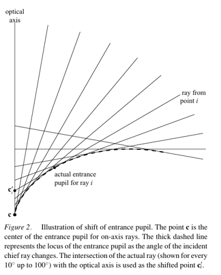
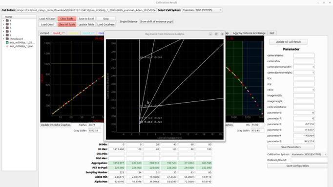

# Entrance-Pupil Shift — Graph Analysis Method

How to read the three graphs on the **Graphs** tab of the Cali Result window, and how to turn them from a picture into a number.

The graphs reconstruct **Figure 2 of Gennery (2006)** from your own measured calibration data. This page explains what they mean, defines a numeric **entrance-pupil-shift estimator** over that same data, and gives criteria for judging whether a lens model is good enough.

<div className="custom-note custom-important">
  <div className="custom-note-title">📄 REFERENCE</div>
  <div>
    D. B. Gennery, <em><a href="https://link.springer.com/article/10.1007/s11263-006-5168-1">Generalized Camera Calibration Including Fish-Eye Lenses</a></em>, International Journal of Computer Vision <strong>68</strong>(3), 239–266, 2006.
  </div>
</div>

---

## 1. Why the Entrance Pupil Moves

An ideal pinhole lens has one fixed **entrance pupil** — the single point the camera "looks from". Every ray, on-axis or not, passes through it. That single point is what makes the pinhole model work.

A fish-eye lens does **not** behave this way. As the off-axis angle of the incoming ray grows, the point the camera effectively looks from *slides along the optical axis*. The lens has no single viewpoint; it has a **locus** of viewpoints.

<Figure id="fig-1" number="1" caption={<>Gennery (2006), Figure 2. <strong>c</strong> is the entrance pupil for on-axis rays; the thick dashed line is the locus of the entrance pupil as the incident chief-ray angle changes. Each ray's intersection with the optical axis is the shifted point <strong>c′<sub>i</sub></strong>.</>}>



</Figure>

Gennery models this as a displacement along the optical-axis direction `o`:

```text
c'(θ) = c + s(θ) · o                      (Gennery Eq. 1)
```

where `c` is the on-axis entrance pupil, `θ` is the off-axis angle of the chief ray, and `s(θ)` is the scalar **shift**. His Eq. 3 expresses that shift in lens-design terms:

```text
s_i = ζ_i − λ_i / tan θ_i                 (Gennery Eq. 3)
```

with `ζ_i` and `λ_i` taken from a ray trace of the lens prescription.

<div className="custom-note custom-warning">
  <div className="custom-note-title">⚠️ EQ. 3 CANNOT BE USED DIRECTLY</div>
  <div>
    It requires the optical prescription of the lens, which we do not have. What we <em>do</em> have is a set of measurements of where the camera looks from at different angles — and the shift can be recovered directly from those. That is the estimator in Section 3.
  </div>
</div>

**Why this matters.** If the shift varies by more than the reprojection tolerance you care about, a single-viewpoint camera model **cannot** fit your lens across the full field — no matter how many polynomial terms you add. The shift is a physical property of the glass, not a fitting artefact. Measuring it tells you whether your residual error is *reducible* or *structural*.

---

## 2. What the System Measures

Each **range** (up to 20, individually enabled) contributes one measured pair:

1. **Capture** — the positive and negative pattern shots are taken and the intersecting nodes are detected per PCT ring and per direction, giving the `ict_*` columns.
2. **Compute** — the core turns those into, per round and layer, the off-axis angle `alpha_*` and the physical pattern-to-pupil distance (the **PCT to Pupil** / `distance` columns).
3. **Aggregate** — per enabled range these become the single pair shown in the range panel: Alpha Min/Max and Distance.

For range `i` the analysis uses:

| Symbol | From the UI | Meaning |
|---|---|---|
| `θ_i` | ½ (Alpha Min + Alpha Max) | Mid off-axis angle of the range, in degrees |
| `d_i` | Distance ("PCT to Pupil") | Pattern-to-pupil distance at that angle |
| `h_i` | ½ (Aggregation Min + Aggregation Max) | Mid image height of the range, in % |

<div className="custom-note custom-important">
  <div className="custom-note-title">📌 THE CRITICAL OBSERVATION</div>
  <div>
    The pattern (PCT) does not move between ranges — it sits at a fixed physical location. So if the measured pattern-to-pupil distance changes from one angle to the next, <strong>the only thing that can have moved is the pupil itself</strong>. That distance is therefore a direct, if offset, reading of the pupil position along the optical axis. This is why the estimator below is so simple: the shift is already in the data.
  </div>
</div>

---

## 3. The Numeric Estimator

### 3.1 Definition

Define the shift relative to the on-axis pupil position:

```text
s(θ_i) = d_0 − d_i
```

where `d_0` is the pattern-to-pupil distance extrapolated to `θ = 0`.

**Sign convention:** a positive shift means the pupil moved *toward the pattern* (forward along `o`), shortening the measured distance; a negative shift means it retreated. The shift at `θ = 0` is zero by construction.

This maps onto Gennery Eq. 1 with `c` as the on-axis pupil and `s(θ)` the same scalar shift — recovered from measurement rather than from a ray trace.

### 3.2 Estimating `d_0`

`θ = 0` is never measured directly: a range at exactly zero off-axis angle covers no image area, so `d_0` has to be extrapolated.

A fish-eye is rotationally symmetric about its optical axis, so the distance must be an **even** function of `θ` — approaching zero from either side gives the same value, and the curve is flat there. Fit an even polynomial:

```text
d(θ) ≈ d_0 + a_1·θ² + a_2·θ⁴            (θ in radians)
```

Two terms are normally enough. Use ordinary least squares over the enabled ranges; `d_0` is the intercept. Then:

```text
s(θ) = −(a_1·θ² + a_2·θ⁴)
```

which is the measured counterpart of Gennery's Eq. 2 — his model of shift versus off-axis angle.

<div className="custom-note custom-warning">
  <div className="custom-note-title">⚠️ DO NOT FIT AN ODD-POWERED OR UNCONSTRAINED POLYNOMIAL</div>
  <div>
    It will produce a non-zero slope at the origin, which is physically impossible for a symmetric lens, and it will bias the extrapolated on-axis distance.
  </div>
</div>

### 3.3 Algorithm

```text
Input : enabled ranges i = 1..N, each with (θ_i in degrees, d_i)
Output: d_0, s(θ), Δs, RMS residual

1. Require N ≥ 3.  (2 points fit a 2-term model exactly, leaving no residual
   and therefore no way to detect a bad measurement.)
2. Convert: θ_i <- θ_i · π / 180
3. Build the design matrix with columns [1, θ_i², θ_i⁴]
4. Solve least squares for [d_0, a_1, a_2] against the vector of d_i
5. s_i  <- d_0 − d_i                   (per-range measured shift)
6. ŝ_i  <- −(a_1·θ_i² + a_2·θ_i⁴)      (fitted shift)
7. Δs   <- max(s_i) − min(s_i)         (total pupil excursion)
8. RMS  <- sqrt( Σ(s_i − ŝ_i)² / N )   (fit quality)
```

The two headline numbers are:

| Number | Meaning |
|---|---|
| **Δs — total entrance-pupil excursion** | How far the viewpoint travels across the measured field. This is the physical quantity of interest. |
| **RMS — residual** | How well a smooth symmetric model describes that travel. |

### 3.4 Interpreting the Two Numbers

They must be read **together** — the interesting cases are the mixed ones.

| Δs | RMS | Reading |
|---|---|---|
| small | small | The lens is near-single-viewpoint over this field. A pinhole-style model will fit well. |
| large | small | The pupil genuinely moves, but smoothly and predictably. Expected for a fish-eye — model it, don't fight it. |
| small | large | **Suspicious.** The pupil is not really moving, so the scatter is measurement noise. Check detection quality, pattern flatness, and range setup before trusting any of it. |
| large | large | Both real shift *and* bad data. Fix the data first; Δs is not trustworthy until RMS comes down. |

<div className="custom-note custom-tip">
  <div className="custom-note-title">💡 JUDGE THEM IN CONTEXT, NOT IN THE ABSTRACT</div>
  <div>
    Judge <strong>Δs against your working distance</strong> — an excursion of a few millimetres is irrelevant when the pattern sits metres away, and serious in close-range work. Judge <strong>RMS against Δs</strong> — a residual that is a large fraction of the excursion means the fit is not describing the movement.
  </div>
</div>

---

## 4. Reading the Three Graphs

<Figure id="fig-2" number="2" caption={<>The <strong>Ray Curve from Distance &amp; Alpha</strong> graph, opened with <strong>Show shift of entrance pupil</strong> — the same ray fan as Figure 1, drawn from measured calibration data. Each ray is labelled with its range's mid-angle and distance.</>}>



</Figure>

### 4.1 Shift of Entrance Pupil

Axes: **Lateral displacement** (x) × **Optical Axis (distance)** (y).

For each enabled range this draws one chief ray, starting on the optical axis at that range's measured distance and leaving at its measured mid-angle:

```text
p0 = (0, d_i)
p1 = (L·sin θ_i,  d_i + L·cos θ_i)          with ray length L = 300
```

This is the ray fan of Gennery's Figure 2 — but every ray's origin and angle come from *your* measured data, so the fan traces the real pupil movement of your lens.

<div className="custom-note custom-important">
  <div className="custom-note-title">📌 THE WHITE SCATTER DOTS ARE THE ANSWER</div>
  <div>
    Each dot sits on the optical axis at that range's distance — the point that range looks from. The dots <em>are</em> the shifted points of Eq. 1, and the dashed entrance-pupil locus of Figure 1 is the curve through them.
    <br /><br />
    So <strong>the vertical spread of the white dots is Δs, read straight off the plot</strong>. A single tight cluster means a stable viewpoint; a spread-out column means the pupil is travelling. Everything in Section 3 is a way of putting a number on the length of that column.
  </div>
</div>

The rays themselves are context — they show which angle produced which dot. It is the dots that carry the measurement.

### 4.2 Distance vs Alpha

Axes: **Alpha Mean (degree)** × **Distance**. Plots each range's angle against its distance, sorted by angle.

This is the estimator's raw input curve — the sampled function from which `d_0` and the shift are derived. It is the most useful of the three for judging data quality, because both failure modes are visible by eye:

- A **smooth monotone or gently curved trend** is real pupil shift. Good.
- **Scatter with no trend**, or points jumping around the curve, is measurement noise — the "small Δs, large RMS" row of the table above.

Flip the axis mentally and this graph *is* the shift function, up to the offset `d_0` and a sign. If it looks like noise here, no amount of fitting will rescue it.

### 4.3 Distance vs IH Range

Axes: **IH Range Mean (%)** × **Distance**.

The same distances plotted against **image height** instead of angle — where the effect lands on the sensor rather than in object space. Use it to see which part of the frame the pupil movement affects, and to spot ranges that cover too little image area to be reliable.

---

## 5. Practical Procedure

1. **Enable the ranges you want to analyse.** Use **at least three**, and spread them across the field — clustering every range at similar angles leaves the fit unconstrained near `θ = 0` and makes `d_0` unreliable.
2. **Make sure each enabled range has its Distance and Alpha Min/Max filled**, via **Update** or **History Distance**. Blank or unparseable fields are silently skipped by all three graphs.
3. **Press "Show shift of entrance pupil"** to draw the ray fan from the current data.
4. **Check Distance vs Alpha first.** If it is noise, stop and fix the capture — the other two graphs will only launder the same bad numbers.
5. **Read Δs off the vertical spread of the white dots** in the shift plot.
6. **Compute `d_0`, the shift, Δs and RMS** per Section 3.3 for the numeric result.

<div className="custom-note custom-warning">
  <div className="custom-note-title">⚠️ BLANK FIELDS FAIL SILENTLY</div>
  <div>
    A range with an empty or unreadable Distance or Alpha value is skipped without a message. If the fan has fewer rays than you enabled ranges, that is why — check the range panel before reading anything into the plot.
  </div>
</div>

---

## 6. Implementation Status

The graphs in Section 4 are implemented. **The estimator in Section 3 is not** — it is specified here, not coded.

| Piece | Status |
|---|---|
| Shift-of-entrance-pupil ray fan | ✅ Implemented |
| Distance vs Alpha | ✅ Implemented |
| Distance vs IH Range | ✅ Implemented |
| Theory dialog (Fig. 2, Eq. 1 / 3) | ✅ Implemented |
| Inputs — alpha and PCT-to-Pupil distance | ✅ Implemented |
| `d_0`, `s(θ)`, Δs, RMS | ❌ **Not implemented** |

Nothing in the application currently computes the shift values or fits Gennery's Eq. 2 — the tooling draws the fan and leaves the axis crossings to visual inspection. Until the estimator is added, **Δs is read by eye from the spread of the white dots**, and the numeric procedure in Section 3.3 has to be done outside the application.

<div className="custom-note custom-tip">
  <div className="custom-note-title">💡 ADDING IT NEEDS NO NEW CAPTURE</div>
  <div>
    The estimator reads the same angle/distance pairs the <strong>Distance vs Alpha</strong> graph already collects — no new columns and no re-shooting. The work is the least-squares fit and somewhere to display Δs and RMS.
  </div>
</div>

---

## Summary

A fish-eye lens has no single viewpoint: its entrance pupil slides along the optical axis as the off-axis angle grows. Because the calibration pattern is fixed in space, any change in the measured **PCT to Pupil** distance between ranges *is* that movement. The **Shift of Entrance Pupil** graph draws it as a ray fan whose axis crossings mark the viewpoint of each range — the vertical spread of those points is the total excursion, **Δs**. A large but smooth excursion is normal for a fish-eye and should be modelled; scatter without a trend means the data, not the lens, is the problem.
