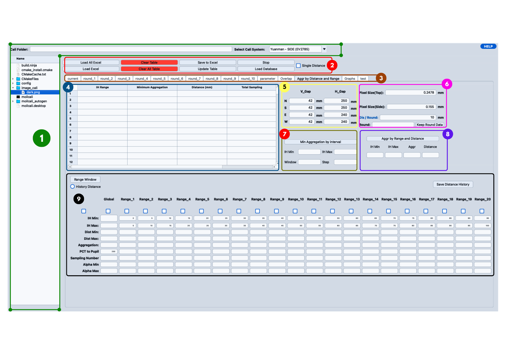
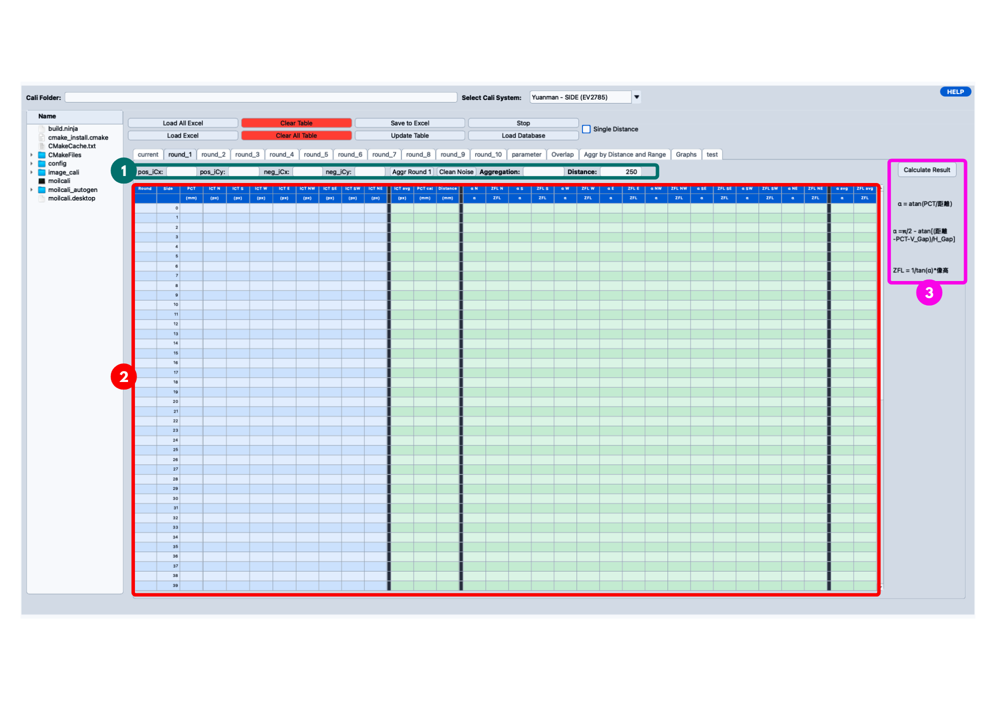
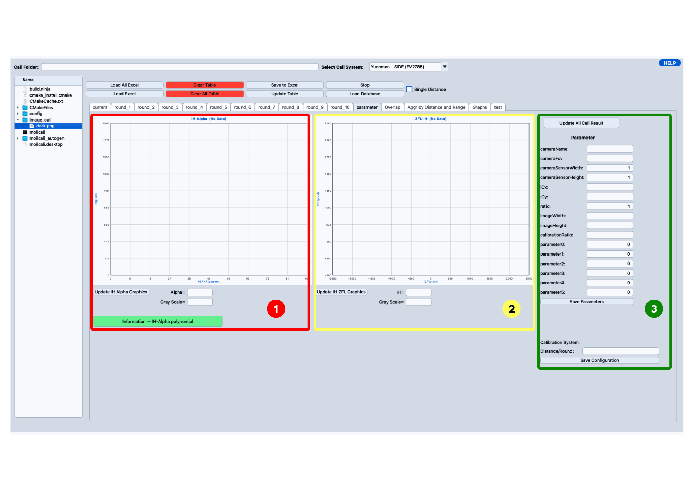
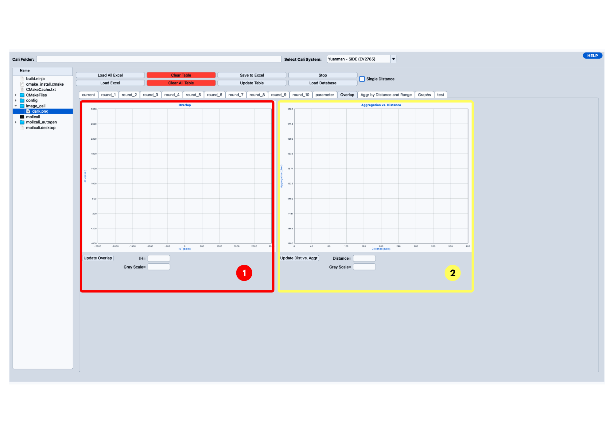

# Main Cali Result Overview

The **Main Cali Result** window is the main workspace for reviewing calibration result data. In this window, the user can load Excel calibration data, check each round, update calculated values, inspect graphs, configure parameters, and calculate aggregation for distance optimization.

This overview is divided into **4 main views** based on the provided UI images.

| No. | Main View | Main Purpose | Figure |
|---:|---|---|---|
| 1 | [Main Window Overview](#1-main-window-overview) | Explains the complete window layout and the 9 main areas in a general way. | [Figure 1](#fig-1) |
| 2 | [Result Table View](#2-result-table-view) | Explains the control input row, result table, and calculation formula panel. | [Figure 2](#fig-2) |
| 3 | [Parameter View](#3-parameter-view) | Explains the IH-Alpha graph, ZFL-IH graph, and camera parameter panel. | [Figure 3](#fig-3) |
| 4 | [Overlap & Aggregation View](#4-overlap--aggregation-view) | Explains the overlap graph and aggregation-vs-distance graph. | [Figure 4](#fig-4) |

---

## 1. Main Window Overview


<Figure id="fig-1" number="1" caption="Main Cali Result window overview with 8 main functional areas.">



</Figure>

The **Main Window Overview** shows the full structure of the Main Cali Result window. This first view should only be understood as a general map of the interface. The detailed explanation for the table, parameters, overlap, and aggregation graphs is provided in the next sections.

The window is divided into **9 main areas**.

Areas **1**, **2**, and **3** are always visible, because they form the frame of the window. Areas **4** to **9** belong to the `Aggr by Distance and Range` tab, which is the tab selected in the screenshot above. Selecting a different tab replaces areas 4 to 9 with that tab's own content.

| No. | Area | General Function |
|---:|---|---|
| **1** | Cali Folder & File Tree | Used to select the calibration folder and calibration system, and to browse the loaded files. |
| **2** | Data Management Buttons | Used to load, clear, update, stop, and save calibration data. |
| **3** | Round & Tab Selection | Used to switch between round tables and analysis pages. |
| **4** | Interval Result Table | Used to display the result of the interval-based minimum aggregation search. |
| **5** | V_Gap & H_Gap | Used to define gap values for the side calculation formula. |
| **6** | Pixel Size & Distance / Round | Used to define pixel size, distance per round, and round distance behavior. |
| **7** | Min Aggregation by Interval | Used to calculate minimum aggregation by moving IH interval windows. |
| **8** | Aggr by Range and Distance | Used to calculate aggregation from a selected IH range and distance. |
| **9** | Range Analysis Matrix | Used to analyze Global / Range_1 to Range_20 and store best distance results. |

### 1.1 Cali Folder & File Tree

The **Cali Folder & File Tree** area is the data entry point of the window. It is used before most other operations, because the table, graphs, parameters, and aggregation results all depend on the data loaded from here.

| UI Item | General Explanation |
|---|---|
| **Cali Folder** | Displays or receives the calibration folder path. It can also receive a URL path for downloaded calibration data. |
| **Select Cali System** | Selects the calibration system configuration, for example `Yuanman - SIDE (EV2785)`. Choosing a system loads that system's pixel sizes and gap values into areas 5 and 6. |
| **Tree View** | Shows the folder/file structure after a calibration folder is selected or loaded. Double-clicking an `.xlsx` file loads it into its round, and double-clicking a folder loads all rounds. |
| **HELP** | Opens the help information for the window. |

In the C++ code, the system selector is `combox_type_of_system`. Changing it calls `applySystemConfig()`, which rewrites the pixel size and gap fields from the selected system's configuration.

### 1.2 Data Management Buttons

The **Data Management Buttons** area holds the load, clear, save, and update controls that act on the round tables.

| UI Item | General Explanation |
|---|---|
| **Load All Excel** | Loads Excel files from multiple round folders, usually round `1` to round `10`. |
| **Load Excel** | Loads one Excel file into the currently selected round table. |
| **Clear Table** | Clears only the current round table. |
| **Clear All Table** | Clears all round tables from round `1` to round `10`. |
| **Save to Excel** | Saves the current table result into an Excel file. |
| **Update Table** | Updates the table from the latest image center, pattern data, ICT data, and calculation result. |
| **Stop** | Requests cancellation for running aggregation or range calculation processes. |
| **Load Database** | Opens the database window for loading calibration data from database records. |
| **Single Distance** | Changes the distance behavior so each round can use its own distance value. |

In the C++ code, these controls are connected to `loadAllExcel()`, `loadExcel()`, `clearTable()`, `clearAllTables()`, `saveToExcel()`, `updateTable()`, `stopSearch()`, and `openDatabase()`.

**Changed in this version.** This area previously also held **Show shift of entrance pupil**, **Show graph Dist vs IH Range**, and **Show graph Dist vs Alpha**. Those three buttons were removed. The same graphs are now embedded in the `Graphs` tab described in section 1.3.

### 1.3 Round & Tab Selection

The **Round & Tab Selection** area is used to choose which data page or analysis page is displayed. The UI includes round tabs and special tabs for graphs, parameters, and aggregation analysis.

The general tab groups are:

| Tab Group | General Explanation |
|---|---|
| `current` | Shows the current table or temporary working table. |
| `round_1` to `round_10` | Shows calibration data for each calibration round. |
| `parameter` | Shows camera parameters and parameter-related graphs. |
| `Overlap` | Shows overlap and aggregation graph visualization. |
| `Aggr by Distance and Range` | Shows range-based aggregation calculation tools. This is the tab shown in the screenshot above. |
| `Graphs` | Shows three embedded graphs: **Shift of Entrance Pupil**, **Distance vs IH Range**, and **Distance vs Alpha**. Each graph has its own Update button, plus an information button that explains the entrance-pupil model. |
| `test` | Used as a test or additional working tab. |

The round tabs are also used as status indicators. When data is loaded or updated, the code can mark a tab with `*` to show that the round contains modified or loaded data.

The code also supports **right-click behavior** on round tabs. The context menu allows the user to turn a round on or off and open graph popups for a specific round. When a round is turned off, it is skipped during calculation and graph updates.

### 1.4 Interval Result Table

The **Interval Result Table** displays the output of the **Min Aggregation by Interval** search described in section 1.7. It stays empty until that search is run.

Each row represents one IH interval that the search moved through:

| Column | General Explanation |
|---|---|
| **IH Range** | The IH percentage window used for this interval. |
| **Minimum Aggregation** | The lowest aggregation value found inside that window. |
| **Distance (mm)** | The distance that produced the minimum aggregation. |
| **Total Sampling** | How many IH-ZFL sample points fell inside the window. |

Because each row pairs an IH window with its best distance, this table is the main place to see whether the best distance stays stable across the field or drifts as IH increases. A drifting distance is the signal that the entrance pupil is moving, which is what the `Graphs` tab visualizes.

The calibration result table for a single round is a different table. It is described in [section 2.2](#22-result-table).

### 1.5 V_Gap & H_Gap

The **V_Gap & H_Gap** area contains vertical gap and horizontal gap values for the four main directions:

```text
N, S, E, W
```
These values are used when calculating **Alpha** for the side area of the calibration result. In the code, the side Alpha formula uses `V_Gap` and `H_Gap` to calculate the angle for side-screen data.

General meaning:

| Field | General Explanation |
|---|---|
| **V_Gap** | Vertical gap value used in side Alpha calculation. |
| **H_Gap** | Horizontal gap value used in side Alpha calculation. |
| **N / S / E / W** | Direction-specific gap values. Each direction can have a different gap setting. |

When the user changes these values and presses Enter, the system updates the calibration result again. Therefore, changing gap values can change Alpha, ZFL, graph shape, and aggregation result.

### 1.6 Pixel Size & Distance / Round

The **Pixel Size & Distance / Round** area defines how pixel data is converted and how distance is applied across rounds.

General meaning:

| Field / Button | General Explanation |
|---|---|
| **Pixel Size (Top)** | Pixel size used for top-area PCT calculation. |
| **Pixel Size (Side)** | Pixel size used for side-area PCT calculation. |
| **Dis / Round** | Distance increment between calibration rounds. |
| **Round** | Target round number used when keeping or copying round data. |
| **Keep Round Data** | Copies or keeps current data into a selected round. |

The code uses pixel size values when calculating `pct_cal`. It uses distance settings when calculating the `distance` column. If **Single Distance** is disabled, distance can be calculated using a base distance and `Dis / Round`. If **Single Distance** is enabled, each round can use its own distance input.

### 1.7 Min Aggregation by Interval

The **Min Aggregation by Interval** area is used to search for the minimum aggregation value using interval-based IH ranges.

General input fields:

| Field | General Explanation |
|---|---|
| **IH Min** | Starting IH percentage for the interval search. |
| **IH Max** | Ending IH percentage for the interval search. |
| **Window** | Maximum window area used for interval movement. |
| **Step** | Step size used to move the IH interval. |
| **Min Aggregation by interval** | Starts the interval-based minimum aggregation process. |

In the code, this feature collects IH data from enabled rounds, converts IH percentage into pixel bounds, searches the best distance for each interval, calculates aggregation, and fills the interval result table. The result can also be saved as CSV.

### 1.8 Aggr by Range and Distance

The **Aggr by Range and Distance** area is used to calculate or search aggregation based on an IH range and distance value.

General input fields:

| Field | General Explanation |
|---|---|
| **IH Min** | Minimum IH percentage for the selected range. |
| **IH Max** | Maximum IH percentage for the selected range. |
| **Aggr** | Aggregation value. It can be calculated or used as a target value. |
| **Distance** | Distance value. It can be used as input or calculated by the system. |
| **Aggr by Range and Distance** | Runs the range-and-distance aggregation calculation. |

The code supports three general behaviors:

| Condition | Behavior |
|---|---|
| Distance is filled | The system calculates aggregation for that distance and IH range. |
| Aggregation is filled but distance is empty | The system searches for a distance that is closest to the target aggregation. |
| Both aggregation and distance are empty | The system searches for the distance that gives the minimum aggregation. |

After calculation, the system can update the **Aggregation vs. Distance** graph using the generated distance and aggregation samples.

### 1.9 Range Analysis Matrix

The **Range Analysis Matrix** is the large bottom area used to analyze multiple IH ranges. It contains `Global` and range fields such as `Range_1` to `Range_20`.

General functions:

| Function | General Explanation |
|---|---|
| **Range Window** | Loads a Range Window JSON file that fills the IH ranges instead of typing them by hand. |
| **History Distance** | A mode toggle, not an action. When it is on, the system uses the distance values already present in the fields. When it is off, the system searches for the distance itself. |
| **Global / Range_1 to Range_20** | Defines the IH percentage ranges used for range-based calculation. |
| **IH Min / IH Max** | Defines the IH range percentage for each range column. |
| **Dist Min / Dist Max** | Defines the allowed search range for distance. |
| **Aggregation** | Displays the best or calculated aggregation value. |
| **PCT to Pupil** | Stores pupil-related distance or PCT reference data. |
| **Sampling Number** | Displays how many IH-ZFL samples are inside the selected range. |
| **Alpha Min / Alpha Max** | Displays the Alpha range for the selected IH range. |
| **Checkboxes** | Enable or disable calculation for each range. |
| **Save Distance History** | Saves range distance results for later reuse. |

The checkboxes are the trigger. Ticking a range checkbox immediately runs that range's search: the code calculates pixel bounds from the IH percentage range, counts valid samples, searches the best distance, calculates aggregation, and highlights the result fields when the calculation succeeds. Ticking the **Global** checkbox toggles all ranges and runs them together.

Editing an **IH Min** or **IH Max** value refreshes that range's sample count and alpha count, and redraws the range bands on the ZFL-IH graph.

This area also supports **right-click on range labels** to open a ZFL-IH graph for a selected range. This helps the user visually check the points inside that IH range.

---

## 2. Result Table View


<Figure id="fig-2" number="2" caption="Result Table View showing the control input row, result table, and calculation formula panel.">



</Figure>

The **Result Table View** is used to inspect one selected round. This view is usually used when the user wants to check the loaded data, verify calculated values, or manually review the calibration result before moving to graphs or aggregation analysis.

This view is divided into **3 sections**.

| No. | Section | Purpose |
|---:|---|---|
| **1** | Control & Input Row | Contains center values, aggregation round, aggregation result, and distance value. |
| **2** | Result Table | Displays raw Excel data and calculated calibration result values. |
| **3** | Calculate Result & Formula Panel | Runs the calculation for the round, and shows the main Alpha and ZFL formulas used by the system. |

### 2.1 Control & Input Row

The **Control & Input Row** is located above the result table. It gives quick access to the main values used by the selected round.

| Field | Explanation |
|---|---|
| `pos_iCx` | Positive image center X value copied from the main calibration window. |
| `pos_iCy` | Positive image center Y value copied from the main calibration window. |
| `neg_iCx` | Negative image center X value copied from the main calibration window. |
| `neg_iCy` | Negative image center Y value copied from the main calibration window. |
| `Aggr Round` | Button used to run the aggregation distance search for the selected round. |
| `Clean Noise` | Opens the noise-cleaning dialog for the selected round. See below. |
| `Aggregation` | Displays the aggregation value calculated from IH-ZFL data. |
| `Distance` | Displays or receives the distance value used for the calculation. |

In the code, each round gets its own `btn_aggr_round_N` and `btn_clean_noise_N` pair, handled by `aggrRound()` and `cleanRoundNoise()`.

#### Clean Noise

**Clean Noise** removes the false measurement points caused by the physical gap between monitors in the calibration rig. When the calibration pattern spans several screens, the bezel between them produces nodes that are not real image data, and those nodes distort the ZFL curve and the aggregation value.

The dialog works on **radial bands**, measured in pixels from the image center:

| Item | Explanation |
|---|---|
| **Group** | The direction groups are handled separately: `N & S`, `W & E`, and the diagonals. Each group gets its own band, because the bezel sits at a different radius in each direction. |
| **Auto-detection** | When the dialog opens, the system proposes a band for each group. The user can accept or adjust it. |
| **min / max** | The two ends of the band, in radial pixels. Both boundaries are kept, and only the nodes strictly inside are removed. |
| **Open end** | Leaving `min` or `max` blank makes that side open. For example `min = 778` with `max` blank removes everything from 778 pixels outward, which suits a bezel that runs to the edge of the field. |
| **Sticky values** | The band the user last used is remembered and offered again for the next round, because the bezel does not move between rounds. |
| **Apply to ALL rounds with data** | Applies the same band to every round that contains ICT data, instead of only the selected round. |

After cleaning, the graphs redraw immediately, but the calibration numbers do not. The dialog reports how many nodes were removed and reminds the user to press **Aggr Round** or **Calculate Result** to recompute the round.

### 2.2 Result Table

The **Result Table** contains both the original calibration data and the calculated calibration result. The table uses fixed column groups defined in the code.

| Column Group | Columns | Explanation |
|---|---|---|
| Basic data | `Round`, `Side`, `PCT` | Stores round number, side marker, and pattern calibration target values. |
| ICT direction data | `N`, `S`, `W`, `E`, `NW`, `SE`, `SW`, `NE` | Stores directional image-height / intersection-point data from calibration. |
| Average ICT | `AVG.` | Stores the average ICT value calculated from valid directional values. |
| PCT calculation | `PCT Cal` | Stores the converted PCT value after applying pixel size. |
| Distance | `Distance` | Stores the distance used for the current calculation. |
| Alpha direction data | `α N`, `α S`, `α W`, `α E`, `α NW`, `α SE`, `α SW`, `α NE` | Stores the Alpha value for each valid direction. |
| ZFL direction data | `ZFL N`, `ZFL S`, `ZFL W`, `ZFL E`, `ZFL NW`, `ZFL SE`, `ZFL SW`, `ZFL NE` | Stores the ZFL value for each valid direction. |
| Average result | `AVG α`, `AVG ZFL` | Stores the average Alpha and ZFL result. |

The calculation sequence in the code is generally:

```text
Update side layer
    ↓
Calculate ICT average
    ↓
Calculate PCT Cal
    ↓
Calculate Distance
    ↓
Calculate Alpha for 8 directions
    ↓
Calculate ZFL for 8 directions
    ↓
Calculate Alpha AVG and ZFL AVG
    ↓
Calculate Aggregation
```
Important calculated values:

| Value | How it is calculated generally |
|---|---|
| `ICT AVG` | Average of valid directional ICT values. Zero or empty values are ignored. |
| `PCT Cal` | Sum of PCT values multiplied by `Pixel Size (Top)` or `Pixel Size (Side)`. |
| `Distance` | Uses base distance and `Dis / Round`, or per-round distance when Single Distance is enabled. |
| `Alpha` | Uses top formula for top area and side formula for side area. |
| `ZFL` | Uses Alpha and ICT to calculate focal-length-related value. |
| `Aggregation` | Sorts IH-ZFL points by IH and sums the distance between neighboring points. |

### 2.3 Calculate Result & Formula Panel

The right-hand panel holds one button and the three formulas used to fill the result table.

**Calculate Result** runs the full calculation pipeline for the selected round using the distance value currently in the `Distance` field. It is the manual counterpart of **Aggr Round**: **Aggr Round** searches for the best distance and then computes, while **Calculate Result** computes at the distance the user chose. In the code it is `btn_calculate_result_N`, handled by `calculateResultRound()`.

The formulas below the button are shown for reference only. They are not editable.

#### Top-area Alpha formula

```text
α = atan(PCT / distance)
```
This formula is used for the top area, before the side layer starts.

#### Side-area Alpha formula

```text
α = π/2 - atan((distance - PCT - V_Gap) / H_Gap)
```
This formula is used for side-area calculation. It uses the direction-specific `V_Gap` and `H_Gap` values.

#### ZFL formula

```text
ZFL = 1 / tan(α) × IH
```
In the code, `IH` is taken from the related ICT direction value. The system calculates ZFL for each valid direction and then calculates the average ZFL value when possible.

---

## 3. Parameter View


<Figure id="fig-3" number="3" caption="Parameter View showing the IH-Alpha graph, ZFL-IH graph, and parameter panel.">



</Figure>

The **Parameter View** is used to check graph results and manage camera parameter values. This view is usually opened from the `parameter` tab.

This view is divided into **3 sections**.

| No. | Section | Purpose |
|---:|---|---|
| **1** | IH-Alpha Graph | Shows the relationship between Alpha and IH. |
| **2** | ZFL-IH Graph | Shows the relationship between IH and ZFL. |
| **3** | Parameter Panel | Shows and saves camera calibration parameters. |

### 3.1 IH-Alpha Graph

The **IH-Alpha Graph** displays the relationship between Alpha and IH. In the code, Alpha values are calculated in radians, then plotted in degrees for easier visual checking.

This graph is used to generally check:

| Purpose | Explanation |
|---|---|
| Alpha distribution | Shows how Alpha changes as IH changes. |
| Curve stability | Helps identify whether the Alpha curve is smooth or abnormal. |
| Round comparison | Displays enabled round data using different round colors. |
| Parameter fitting | The code can use polynomial regression to update parameter fields from the Alpha-IH data. |

Related controls:

| Control | Explanation |
|---|---|
| **Update IH Alpha Graphics** | Refreshes the IH-Alpha graph. |
| **Alpha=** | Shows the X coordinate under the mouse cursor, which is Alpha in degrees. |
| **Gray Scale=** | Shows the Y coordinate under the mouse cursor, which is IH in pixels. The label is kept from an older version and does not describe a gray scale value. |
| **Information — IH-Alpha polynomial** | Opens an explanation of the calibration polynomial. |

#### The IH-Alpha polynomial

The information button explains what this graph actually produces. For a fisheye lens, the image height `IH`, meaning the radial distance of a pixel from the image center in pixels, is a smooth and monotonic function of the ray's off-axis incidence angle `α` in degrees.

The graph plots the measured `(α, IH)` pairs from every round as a colored scatter, then fits one degree-4 least-squares polynomial through them:

```text
IH(α) = c0 + c1·α + c2·α² + c3·α³ + c4·α⁴
```

This polynomial **is** the lens calibration. It defines the mapping between a pixel position and the real-world angle the light came from, which is the basis of the anypoint imaging model described in US Patent 6,985,183 B2.

Pressing **Update IH Alpha Graphics** writes the fitted coefficients into the parameter panel:

| Parameter field | Value |
|---|---|
| `parameter2` | `c4`, the α⁴ coefficient |
| `parameter3` | `c3`, the α³ coefficient |
| `parameter4` | `c2`, the α² coefficient |
| `parameter5` | `c1`, the α coefficient |
| `parameter0`, `parameter1` | Always `0` |

The constant term `c0` is not used, because `IH = 0` on the optical axis where `α = 0`. Together with `cameraFov`, the sensor size, `iCx`, `iCy`, and `ratio`, these coefficients form the intrinsic fisheye camera model.

### 3.2 ZFL-IH Graph

The **ZFL-IH Graph** displays the relationship between IH and ZFL. This graph is important because aggregation is calculated from the IH-ZFL point movement.

This graph is used to generally check:

| Purpose | Explanation |
|---|---|
| ZFL distribution | Shows how ZFL changes across IH values. |
| Calibration smoothness | Helps identify jumps, unstable points, or abnormal round behavior. |
| Round enable/disable effect | Disabled rounds are skipped from graph updates. |
| Range inspection | The same IH-ZFL data is also used by overlap and range graph features. |

Related controls:

| Control | Explanation |
|---|---|
| **Update IH ZFL Graphics** | Refreshes the ZFL-IH graph. |
| **IH=** | Shows the X coordinate under the mouse cursor, which is ICT in pixels. |
| **Gray Scale=** | Shows the Y coordinate under the mouse cursor, which is ZFL in pixels. The label is legacy and does not describe a gray scale value. |

### 3.3 Parameter Panel

The **Parameter Panel** contains camera parameters and configuration controls.

| Parameter | Explanation |
|---|---|
| `cameraName` | Camera name or camera identifier. |
| `cameraFov` | Camera field of view. |
| `cameraSensorWidth` | Camera sensor width value. |
| `cameraSensorHeight` | Camera sensor height value. |
| `iCx` | Image center X coordinate. |
| `iCy` | Image center Y coordinate. |
| `ratio` | Camera ratio value used by the calibration system. |
| `imageWidth` | Image width in pixels. |
| `imageHeight` | Image height in pixels. |
| `calibrationRatio` | Calibration ratio value. |
| `parameter0` to `parameter5` | Camera model parameters used by the calibration calculation. |

Related controls:

| Control | Explanation |
|---|---|
| **Update All Cali Result** | Recalculates calibration results for enabled rounds. |
| **Save Parameters** | Saves camera parameters into a JSON file. |
| **Calibration System** | Selects the calibration system configuration. |
| **Distance / Round** | Defines distance-per-round configuration for the selected calibration system. |
| **Save Configuration** | Saves system type and distance-per-round information into `main.json`. |

In the code, parameter saving is handled by `onclick_btn_save_parameter()`, while system configuration saving is handled by `onclick_btn_save_configuration_system()`.

---

## 4. Overlap & Aggregation View


<Figure id="fig-4" number="4" caption="Overlap & Aggregation View showing the overlap graph and aggregation-vs-distance graph.">



</Figure>

The **Overlap & Aggregation View** is used to visually check calibration consistency and observe how aggregation changes when distance changes.

This view is divided into **2 sections**.

| No. | Section | Purpose |
|---:|---|---|
| **1** | Overlap Graph | Shows IH-ZFL overlap behavior from enabled rounds. |
| **2** | Aggregation vs. Distance Graph | Shows aggregation change across distance samples. |

### 4.1 Overlap Graph

The **Overlap Graph** displays IH-ZFL data from enabled rounds. It is used to visually compare whether different rounds overlap smoothly or show unstable behavior.

General behavior:

| Function | Explanation |
|---|---|
| **Update Overlap** | Refreshes the overlap graph. |
| **IH=** | Shows the X coordinate under the mouse cursor, which is ICT in pixels. |
| **Gray Scale=** | Shows the Y coordinate under the mouse cursor, which is ZFL in pixels. The label is legacy. |
| Round filtering | Disabled rounds are skipped from the overlap graph. |
| Snake line | The code can draw a connected line across round points to make the curve movement easier to see. |

The overlap graph uses the same IH-ZFL point data collected from the result table. Therefore, changes in distance, gap values, pixel size, or disabled rounds can change the overlap graph.

### 4.2 Aggregation vs. Distance Graph

The **Aggregation vs. Distance Graph** displays distance on the X-axis and aggregation on the Y-axis.

General behavior:

| Function | Explanation |
|---|---|
| **Update Dist vs. Aggr** | Refreshes the aggregation-vs-distance graph. |
| **Distance=** | Shows the X coordinate under the mouse cursor, which is distance in pixels. |
| **Gray Scale=** | Shows the Y coordinate under the mouse cursor, which is aggregation in pixels. The label is legacy. |
| Minimum point | The graph can mark the best distance and minimum aggregation result. |
| Samples | The graph uses distance-aggregation samples generated during search or range calculation. |

Aggregation is calculated by sorting IH-ZFL points and summing the point-to-point movement. A lower aggregation value usually means the IH-ZFL result is smoother and more stable.

```text
Sort IH-ZFL points by IH
        ↓
Measure distance between neighboring points
        ↓
Sum all neighboring distances
        ↓
Return aggregation value
```