# Main Window Overview

The **Main Cali Result** window is where you load calibration data, manage the round tables, calculate calibration results, inspect graphs, and search for the best distance based on aggregation values.

The main goal of this window is to find the distance value that produces the lowest aggregation value.
A lower aggregation value usually means the IH-ZFL curve is smoother and the calibration result is more stable.

<Figure id="fig-main-cali-result-overview" number="1" title="Main Cali Result Overview" caption="Main Cali Result window divided into 9 main functional areas.">


</Figure>

---

## Page Structure

| No. | Section | Main Purpose |
|---:|---|---|
| 1 | [Header & Data Management](#1-header--data-management) | Load, update, clear, save, and manage calibration data. |
| 2 | [Round & Tab Selection](#2-round--tab-selection) | Switch between current, round, parameter, overlap, aggregation, graphs, and test pages. |
| 3 | [Result Table View](#3-result-table-view) | Display IH range, minimum aggregation, distance, and total sampling. |
| 4 | [V_Gap & H_Gap Settings](#4-v_gap--h_gap-settings) | Configure physical gap values used for side-screen calculation. |
| 5 | [Pixel Size & Distance / Round](#5-pixel-size--distance--round) | Configure pixel size conversion and round distance interval. |
| 6 | [Min Aggregation by Interval](#6-min-aggregation-by-interval) | Search minimum aggregation over IH percentage intervals. |
| 7 | [Aggr by Range and Distance](#7-aggr-by-range-and-distance) | Calculate aggregation, or search distance, for one selected IH range. |
| 8 | [Range Analysis Matrix](#8-range-analysis-matrix) | Analyze global and range-based distance / aggregation results. |

The screenshot in Figure 1 labels 9 areas, because the header splits into the Cali Folder / tree area (**1**) and the data-management button block (**2**).
The section numbering on this page follows the 8-section grouping above, so screenshot label **N** corresponds to page section **N − 1** from label 3 onward.

---

## Terminology

| Term | Meaning |
|---|---|
| IH / ICT | Image-height or intersection-coordinate value used as the X-axis source for curve analysis. |
| PCT | Pattern calibration target value loaded from the calibration pattern data. |
| PCT_CAL | Converted PCT value after pixel-size conversion. |
| Alpha | Angle value calculated from distance, PCT_CAL, V_Gap, and H_Gap. |
| ZFL | Calculated focal-length related value used in the IH-ZFL curve. |
| Aggr | Aggregation value used to measure IH-ZFL curve smoothness. Lower is usually better. |
| Distance | Distance value used in Alpha and ZFL calculation. |
| Range | IH percentage interval used for aggregation analysis. |

---

## 1. Header & Data Management

<Figure id="fig-header-data-management" number="2" title="Header & Data Management" caption="Header & Data Management area with 5 numbered regions, shown with the Graphs tab open.">

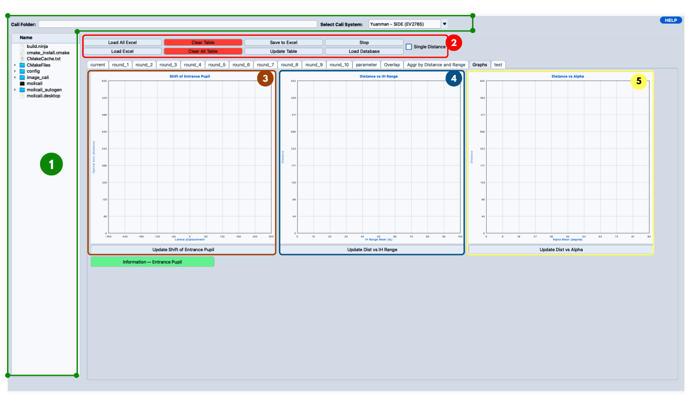

</Figure>

This is the top control section of the window, and the first thing to set up: the result table, the parameter calculation, the aggregation tools, and the graphs all read whatever is loaded here.
The screenshot marks 5 regions:

| No. | Region | Contents |
|---:|---|---|
| 1 | Data source and tree | **Cali Folder** input, **Select Cali System** dropdown, and the **Tree View** file browser. |
| 2 | Data management | The button block and the **Single Distance** checkbox. |
| 3 | Shift of Entrance Pupil | Entrance pupil graph, in the **Graphs** tab. |
| 4 | Distance vs IH Range | Distance versus IH range graph, in the **Graphs** tab. |
| 5 | Distance vs Alpha | Distance versus alpha graph, in the **Graphs** tab. |

Regions **3**, **4**, and **5** used to be three separate popup buttons in the header.
They're now embedded in the **Graphs** tab instead, each redrawn in place by its own **Update** button.

**Suggested workflow:** select the correct **Cali System**, load data (**Cali Folder**, **Tree View**, **Load Excel**, or **Load All Excel**), confirm the round tabs loaded (look for the `*` mark), run **Update Table** whenever the image, centre point, PCT, or ICT data changes, then check the **Graphs** tab and save the result with **Save to Excel**.
Enable **Single Distance** only when each round needs its own distance value.

### 1.1 Loaded Data Example

Once a calibration result folder is loaded, the tree view lists the round folders that were found, the round tabs carry `*` marks for the rounds that actually received data, and the active table fills with PCT, ICT, alpha, and ZFL columns.
Only the rounds present in the folder are starred — in the example below the folder holds rounds `1`, `3`, `5`, `7`, and `9`, so those five tabs are starred and the rest stay empty.

<Figure id="fig-loaded-data-example" number="3" title="Loaded Data Example" caption="Example of loaded calibration data with round tabs and result table.">

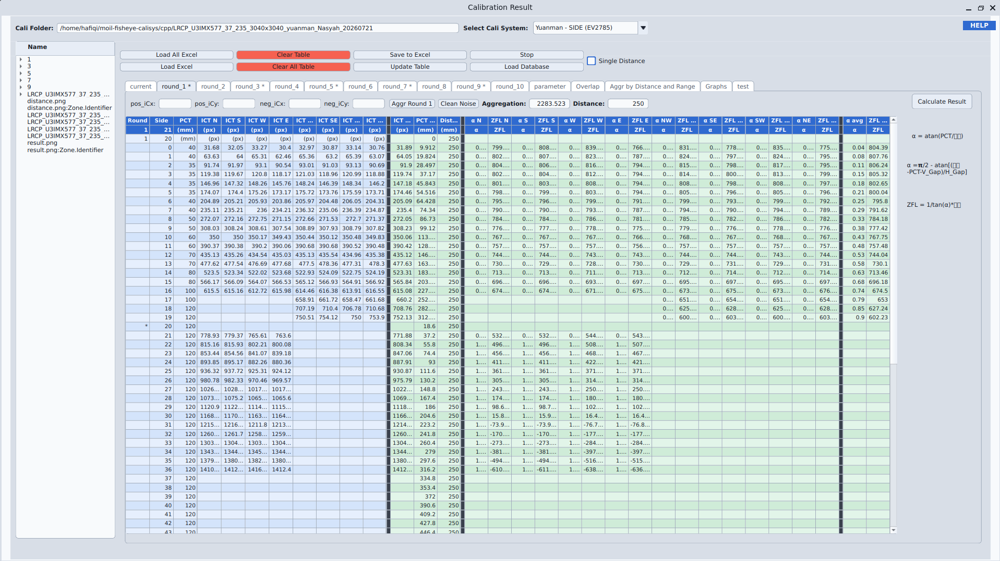

</Figure>

---

### 1.2 Data Source Controls

| Control | What it does |
|---|---|
| **Cali Folder** | Type or paste a local folder path, a local Excel file path, or a remote URL, then press **Enter**. A folder path only updates the tree view root — use **Tree View**, **Load Excel**, or **Load All Excel** to actually load data. A URL downloads to a local cache and the field switches to that cache path once it's ready. |
| **Tree View** | Browses the folder set in Cali Folder. Double-click a `.xlsx` file to load it into the active round table. Double-click a folder to clear all round tables first, then load any Excel files found inside it — save your work before doing this. |
| **Select Cali System** | Selects the calibration system configuration (see [1.8](#18-select-cali-system)). |
| **Load All Excel** | Loads calibration result Excel files from round folders `1` to `10` inside a folder you pick, using the first `.xlsx` file found in each. Loaded round tabs are marked `*` and results are recalculated. Use this when the data is already split into round folders; use **Load Excel** for a single file. |
| **Clear Table** | Clears only the currently active table — the round's `*` mark is removed and the result is recalculated. |
| **Save to Excel** | Exports the active table's `round`, `side`, `pct`, and the eight `ict_*` direction columns to an `.xlsx` file you name. |
| **Load Excel** | Loads one `.xlsx` file into the active round table, clearing whatever was there first. See [1.3](#13-excel-file-requirements) for the required columns. |
| **Clear All Table** | Clears every round table, `round_1` through `round_10`, after a confirmation dialog ("Are you sure you want to delete data from All Tables (Round 1 - 10)?"). Save anything you need before using this. |
| **Update Table** | Refreshes the active table's centre-point values, round number, PCT, and the eight ICT directions from the latest positive/negative calibration images and pattern data, then recalculates the result. |
| **Stop** | Cancels a running aggregation, range-counting, or range-search process. The terminal prints a `canceled before UI update` message once it has stopped — this is a normal cancellation, not an error. The current step may need to finish first, so it won't always stop instantly. |
| **Load Database** | Opens the calibration database (see [1.5](#15-load-database)). |
| **Single Distance** | See [1.6](#16-single-distance). |

### 1.3 Excel File Requirements

Whether loaded through **Load Excel**, **Load All Excel**, or the **Tree View**, an Excel file needs these columns:

| Column | Meaning | Unit / Content |
|---|---|---|
| `Round` | Round or sample index | Number |
| `Side` | Side or row index | Number |
| `PCT` | Pattern/calibration point distance | Usually `(mm)` |
| `N`, `S`, `W`, `E` | ICT values in the four main directions | Pixel `(px)` |
| `NW`, `SE`, `SW`, `NE` | ICT values in the diagonal directions | Pixel `(px)` |

<Figure id="fig-excel-layout-example" number="4" title="Excel Layout Example" caption="Example Excel layout containing Round, Side, PCT, and ICT direction columns.">

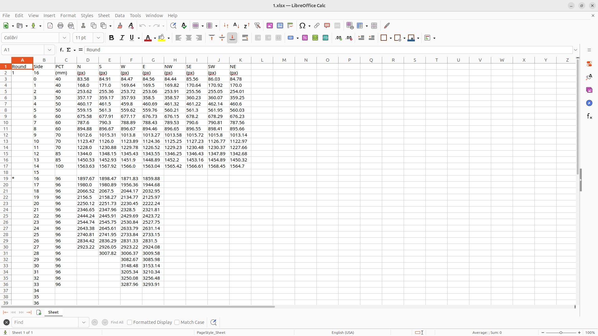

</Figure>

If a workbook doesn't follow this format, or the PCT/ICT values aren't in the right columns, the table may not load correctly.

---

### 1.4 Load All Excel: Required Folder Structure

```text
calibration_result/
├── 1/
│   └── result.xlsx
├── 2/
│   └── result.xlsx
...
└── 10/
    └── result.xlsx
```

After loading, this structure appears in the tree view, and the loaded round tabs are marked with `*`.

---

### 1.5 Load Database

**Load Database** opens the **Calibration Data** window, used to search and select a stored calibration dataset.

<Figure id="fig-calibration-data-window" number="5" title="Calibration Data Window" caption="Database window used to search and select calibration result records.">

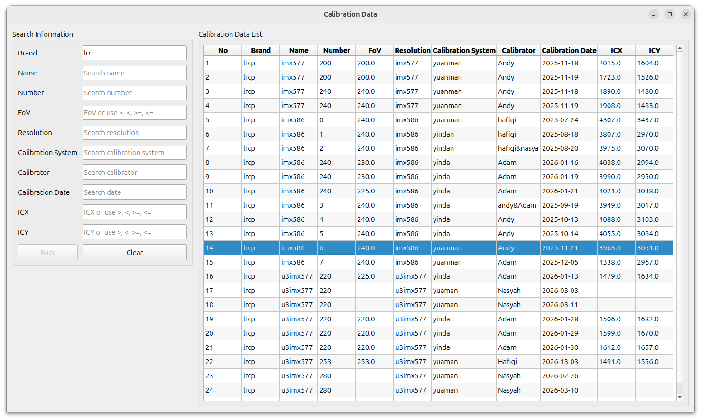

</Figure>

Filter the **Calibration Data List** using the **Search Information** fields (Brand, Name, Number, FoV, Resolution, Calibration System, Calibrator, Calibration Date, ICX, ICY), select the matching row, then right-click it for two actions: **Load to System** loads the data into the application, and **Open URL** opens the dataset's cloud or OneDrive source (the page normally holds the round folders, camera/calibration JSON, and Excel result file — if a record points to more than one source, a dialog asks which one to open).

Use **Load Database** when the result already exists in the database and you'd rather search for it than paste a folder path or URL by hand.

---

### 1.6 Single Distance

The **Single Distance** checkbox changes how the per-round distance value is calculated.

| Mode | Behaviour |
|---|---|
| **Off** (default) | Distance is calculated automatically: `distance = base_distance + dis_per_round × (current_round − first_valid_round)`. Use this when the distance step between rounds is consistent. |
| **On** | Each round uses its own manually entered distance value. Use this when the rounds were measured individually. |

---

### 1.7 Graphs Tab

The **Graphs** tab holds three plots, each built from the values in the **Range Window** and **History Distance** area (IH Min/Max, Aggregation, PCT to Pupil, Sampling Number, Alpha Min/Max, and any saved history distance — see [8. Range Analysis Matrix](#8-range-analysis-matrix)).
Make sure the range values are calculated before pressing a graph's **Update** button.

<Figure id="fig-range-history-source-data" number="7" title="Range Window and History Distance Source Data" caption="Range and history-distance values used by graph and entrance-pupil visualization tools.">

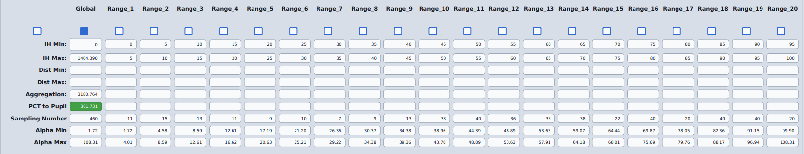

</Figure>

| Graph | Axes | Update button | Notes |
|---|---|---|---|
| **Shift of Entrance Pupil** | X: Lateral displacement · Y: Optical Axis (distance) | Update Shift of Entrance Pupil | Visualizes entrance pupil shift; use it to check pupil stability, round-to-round behaviour, and calibration consistency. The **Information — Entrance Pupil** button opens a dialog explaining Gennery's Figure 2, the model the plot is built on. |
| **Distance vs IH Range** | X: IH Range Mean (%) · Y: Distance | Update Dist vs IH Range | One point per range (`R1`, `R2`, …); use it to check whether the best distance is stable across IH ranges. |
| **Distance vs Alpha** | X: Alpha Mean (degree) · Y: Distance | Update Dist vs Alpha | Uses the same alpha formulas as [Section 4](#4-v_gap--h_gap-settings); use it to check whether alpha changes smoothly as distance changes. |

<Figure id="fig-graphs-info-entrance-pupil" number="6" title="Information — Entrance Pupil" caption="Theory dialog opened from the Shift of Entrance Pupil panel, explaining Gennery's Figure 2.">

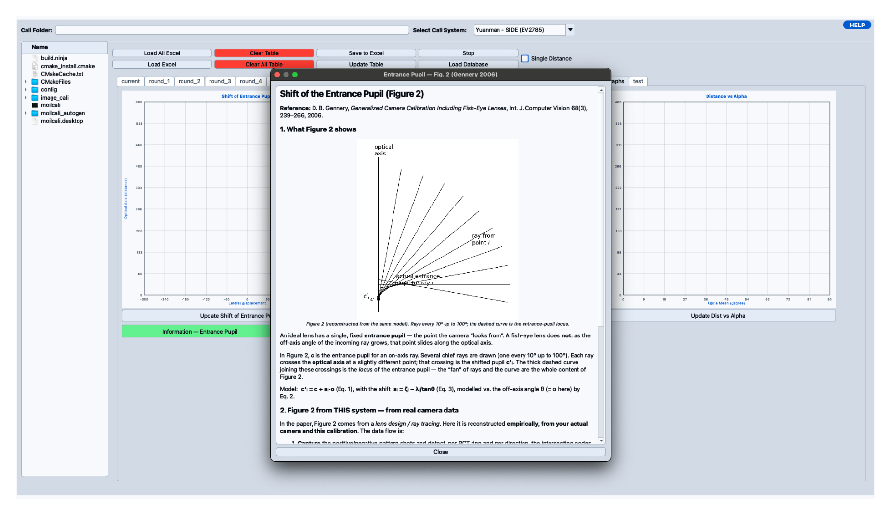

</Figure>

<Figure id="fig-entrance-pupil-ray-curve" number="8" title="Entrance Pupil Ray Curve" caption="Ray curve visualization generated from distance and alpha values.">

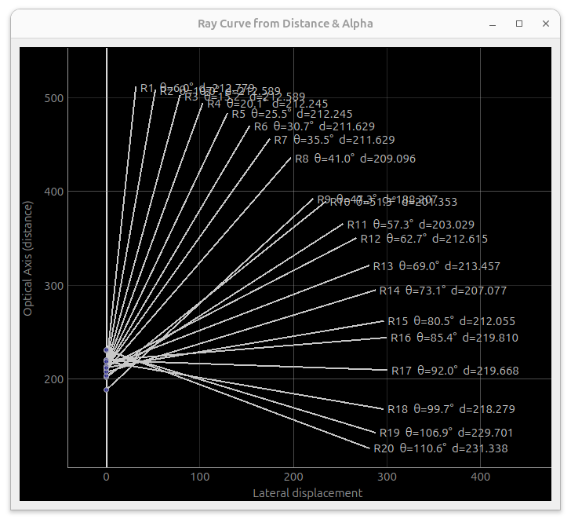

</Figure>

<Figure id="fig-distance-vs-ih-range" number="9" title="Distance vs IH Range Graph" caption="Graph showing distance changes across IH range mean values.">

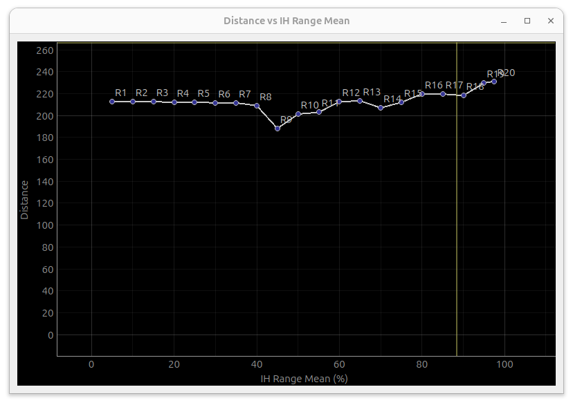

</Figure>

<Figure id="fig-distance-vs-alpha" number="10" title="Distance vs Alpha Graph" caption="Graph showing the relationship between alpha mean and distance.">

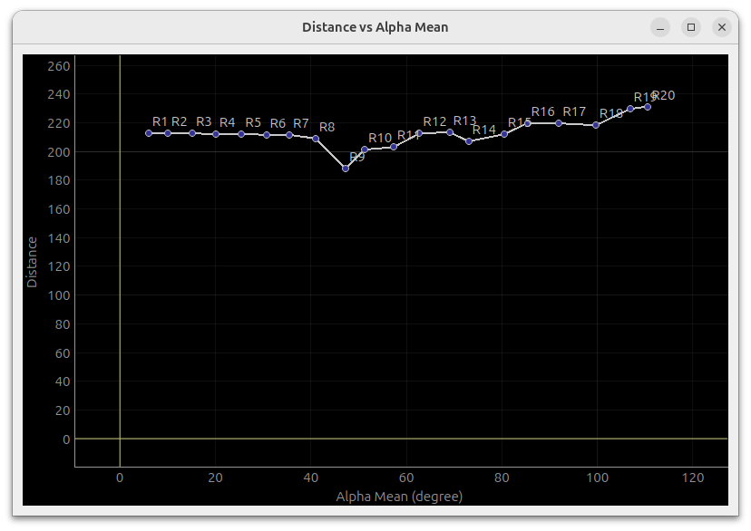

</Figure>

---

### 1.8 Select Cali System

The **Select Cali System** dropdown picks the calibration system configuration, which sets the default calibration geometry.
Choose it first, before touching **V_Gap & H_Gap**, **Pixel Size**, or **Dis / Round** — those four sections form one connected configuration group, and changing the system may change all of them.

Each option loads a configuration file from `cali_system_configuration_json/`:

| Cali System | Configuration File |
|---|---|
| Yuanman - SIDE (EV2785) | `yuanman_ev2785.json` |
| Yuanman - SIDE (EV2730Q) | `yuanman_ev2730q.json` |
| Yinda | `yinda.json` |
| Brodand C++ | `brodand_cpp.json` |

When a full calibration folder is loaded, the system also checks for a `main.json` file and reads `systemType` and `distance_per_round` from it if present; otherwise it defaults to **Yuanman - SIDE (EV2785)** at **10** mm per round.

Because these settings work together, an error in any one of them (system, gap, or pixel size) can throw off the calculated alpha, ZFL, aggregation, and best distance.

---

## 2. Round & Tab Selection

<a id="2-round--tab-selection"></a>

<Figure id="fig-round-tab-selection" number="11" title="Round & Tab Selection" caption="Tab selection area for current, round, parameter, overlap, aggregation, and test pages.">

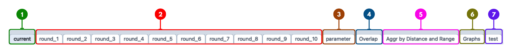

</Figure>

| No. | Tab / Area | Purpose |
|---:|---|---|
| 1 | `current` | Temporary/current working table. |
| 2 | `round_1` – `round_10` | Calibration result tables for each round. |
| 3 | `parameter` | Parameter and graph calculation page. |
| 4 | `Overlap` | Overlap visualization page. |
| 5 | `Aggr by Distance and Range` | Aggregation analysis page. |
| 6 | `Graphs` | Shift of Entrance Pupil, Distance vs IH Range, and Distance vs Alpha graphs (new in the C++ application). |
| 7 | `test` | Testing and validation page. |

A round tab shows `*` once it has loaded calibration data, and `[OFF]` when it has been disabled.
A disabled round is skipped by aggregation, graphs, and **Update Table**, but its data stays stored, not deleted.

Right-click a round tab for three actions: **Turn Off Round**, **Show ZFL-IH Graph**, and **Show Overlap Graph**.

### 2.1 ZFL-IH and Overlap Popups

**Show ZFL-IH Graph** plots IH (X) against ZFL (Y) for the selected round, with calibration samples as red points and a yellow reference line — use it to check curve smoothness and spot unstable or abnormal points.

<Figure id="fig-zfl-ih-popup" number="12" title="ZFL-IH Popup Graph" caption="Popup graph showing IH versus ZFL behavior for one calibration round.">

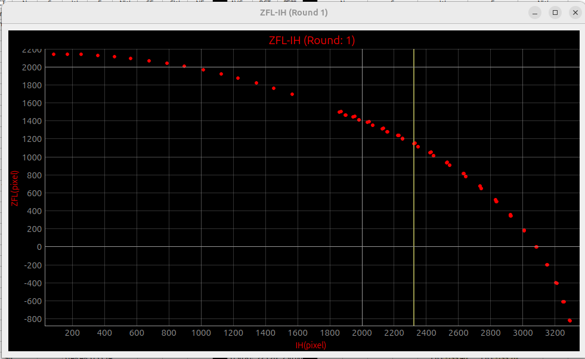

</Figure>

**Show Overlap Graph** plots ICT (X) against ZFL (Y), with the calculated overlap curve in red and a yellow reference line — use it to check overlap continuity and round-to-round consistency.

<Figure id="fig-overlap-popup" number="13" title="Overlap Popup Graph" caption="Overlap graph visualization for one calibration round.">

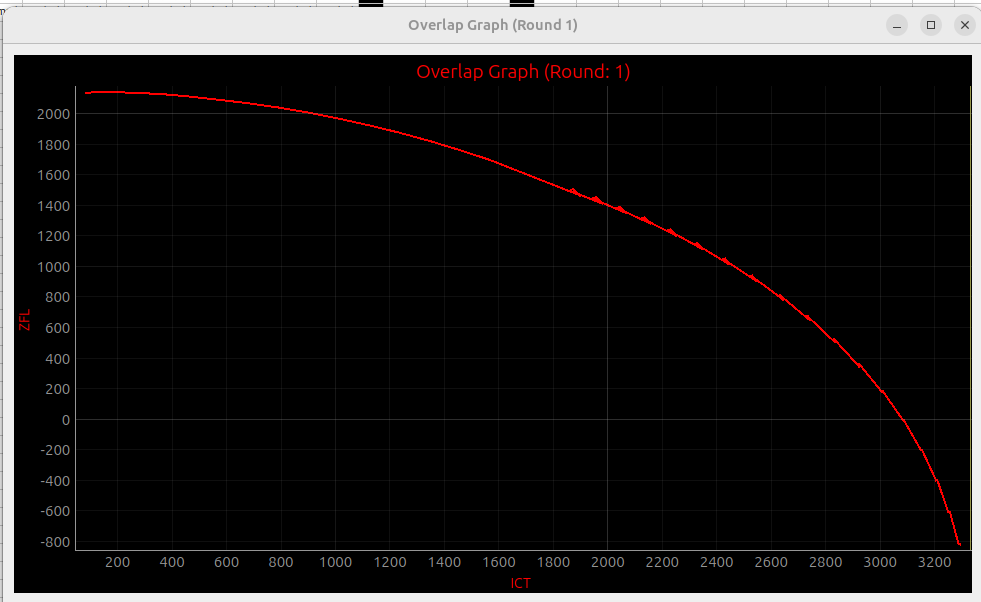

</Figure>

**Suggested workflow:** load data, check which rounds are starred, disable any you don't want included, then use the ZFL-IH and Overlap graphs to check curve smoothness and continuity before moving on to aggregation or range analysis.

---

## 3. Result Table View

<a id="result-table-view"></a>

<Figure id="fig-result-table-view" number="14" title="Result Table View" caption="Summary table showing IH range, minimum aggregation, best distance, and total sampling.">

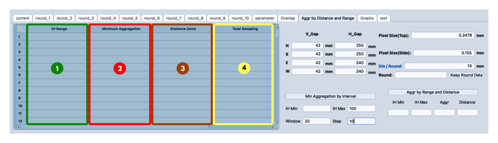

</Figure>

This table is the output of **[Min Aggregation by Interval](#6-min-aggregation-by-interval)**: that section is the setup, this one shows the result.
Running it fills in one row per IH interval, and the same result can be saved as a CSV file.

<Figure id="fig-result-table-after-interval" number="15" title="Result Table Output from Min Aggregation by Interval" caption="Result table filled after the interval aggregation calculation is completed.">

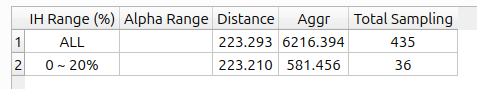

</Figure>

| Column | Description |
|---|---|
| **IH Range (%)** | The interval being analyzed, for example `ALL` or `0 ~ 20%`, generated from `IH Min`, `IH Max`, `Window`, and `Step` in Section 6. |
| **Alpha Range** | The min/max alpha inside that interval, if alpha data is available. |
| **Distance** | The distance that produces the lowest aggregation in that interval. |
| **Aggr** | The aggregation value at that distance. |
| **Total Sampling** | How many valid IH/ZFL data points were used. |

For example:

```text
IH Range (%)    Distance    Aggr      Total Sampling
ALL             223.293     6216.394  435
0 ~ 20%         223.210     581.456   36
```

`ALL` is the global result using every available sample; `0 ~ 20%` uses only the samples inside that IH range, which is why its sampling count is much lower.
A low **Total Sampling** count means the result rests on less data and should be checked carefully — always look at this column before trusting a distance value.

---

## 4. V_Gap & H_Gap Settings

<a id="vgap-hgap-settings"></a>

<Figure id="fig-vgap-hgap-settings" number="16" title="V_Gap & H_Gap Settings" caption="Physical gap settings used together with the selected calibration system.">

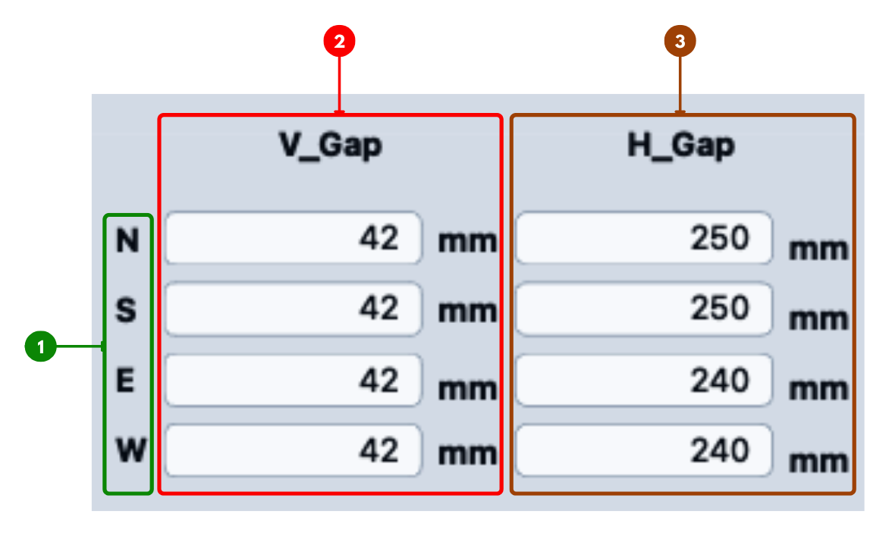

</Figure>

**V_Gap** and **H_Gap** describe the physical gap geometry, in millimetres, for each side direction (**N**, **S**, **E**, **W**) of the selected calibration system.
They belong to the same configuration group as **Select Cali System** and **Pixel Size** — confirm all three together before running the final calculation, since wrong gap values produce wrong alpha and ZFL results for side-screen layers.

For top-screen layers, alpha comes from distance and calibrated PCT alone: `alpha = atan(pct_cal / distance)`.
For side-screen layers, it also uses the gap values: `alpha = π/2 − atan((distance − pct_cal − v_gap) / h_gap)`.
ZFL is then `zfl = 1 / tan(alpha) × ict`.
Pressing **Enter** in any V_Gap or H_Gap field recalculates every enabled round.

---

## 5. Pixel Size & Distance / Round

<a id="pixel-size-distance-round"></a>

<Figure id="fig-pixel-size-distance-round" number="17" title="Pixel Size & Distance / Round" caption="Pixel size and distance settings used together with V_Gap, H_Gap, and the selected calibration system.">

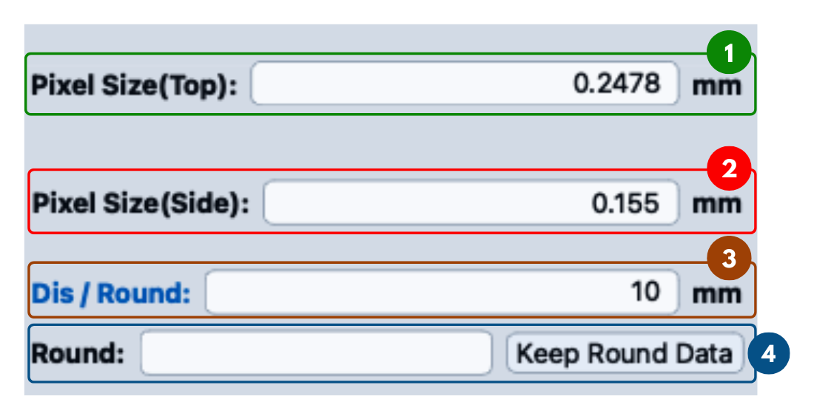

</Figure>

This section, also part of the calibration system configuration group, controls how PCT data converts to millimetres and how distance changes between rounds.

| Field | Description |
|---|---|
| **Pixel Size (Top)** | Pixel size used for top-screen layers. |
| **Pixel Size (Side)** | Pixel size used for side-screen layers. |
| **Dis / Round** | Distance increment between rounds, used in the automatic distance formula from [1.6](#16-single-distance). |
| **Round** + **Keep Round Data** | Copies the current table's data into the round number you enter. |

The system picks top or side pixel size based on the layer position, then converts PCT: `pct_cal = sum(PCT values) × selected_pixel_size`.
That `pct_cal` feeds into the alpha and ZFL formulas in [4](#4-v_gap--h_gap-settings) together with distance, V_Gap, and H_Gap — so treat **Select Cali System**, **V_Gap/H_Gap**, and **Pixel Size** as one configuration to check together, not three independent settings.

---

## 6. Min Aggregation by Interval

<a id="min-aggregation-by-interval"></a>

<Figure id="fig-min-aggregation-by-interval" number="18" title="Min Aggregation by Interval" caption="Interval settings used to search minimum aggregation across IH percentage ranges.">

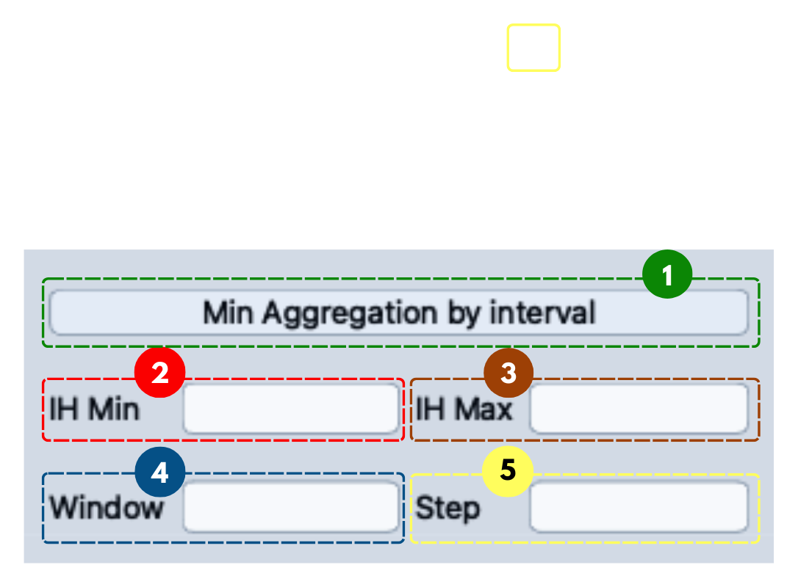

</Figure>

This panel is the setup for **[Result Table View](#3-result-table-view)**: it defines a set of overlapping IH intervals, then searches each one for the distance with the lowest aggregation.

| Field | Description |
|---|---|
| **IH Min / IH Max** | The overall IH percentage range to search. |
| **Window** | The width of each interval. |
| **Step** | How far each interval shifts from the last. |

For example, `IH Min = 0`, `IH Max = 100`, `Window = 20`, `Step = 10` generates the intervals `0~20%`, `10~30%`, `20~40%`, … up to `80~100%`.

<Figure id="fig-min-aggregation-input-example" number="19" title="Min Aggregation by Interval Input Example" caption="Example settings using IH Min = 0, IH Max = 100, Window = 20, and Step = 10.">

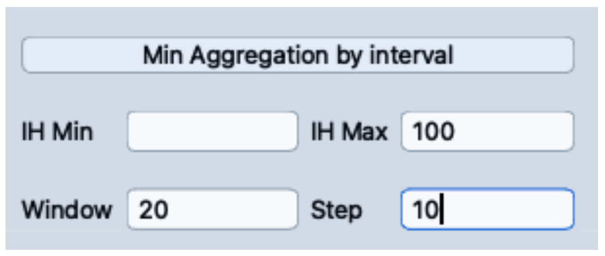

</Figure>

Running it converts each interval to actual IH pixel bounds, searches the best distance and minimum aggregation for it, counts the total sampling, fills **Result Table View**, and offers to save the result as a CSV (`interval.csv` by default) with the same columns as the table.
If none of the enabled rounds have valid IH/ZFL data, the calculation can't produce a reliable result — load and update calibration data first.

---

## 7. Aggr by Range and Distance

<a id="aggr-by-range-and-distance"></a>

<Figure id="fig-aggr-by-range-distance" number="20" title="Aggr by Range and Distance" caption="Main calculation panel used to calculate aggregation from IH range and distance.">

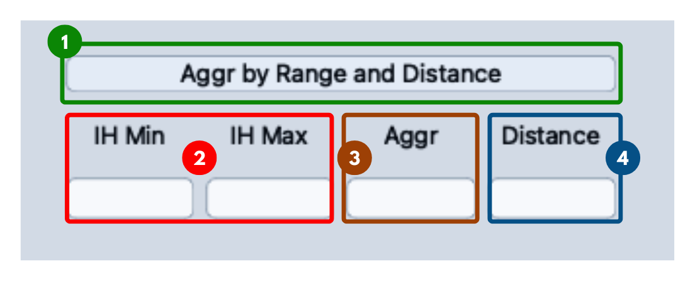

</Figure>

Where [Min Aggregation by Interval](#6-min-aggregation-by-interval) sweeps many intervals automatically, this panel calculates the aggregation for **one** IH range and **one** distance value you enter, using **IH Min**, **IH Max**, and **Distance** as inputs and **Aggr** as the output.
Use it to manually check a specific distance, or to compare aggregation across a few chosen IH ranges by re-running it with different bounds.

<Figure id="fig-aggr-range-distance-example" number="21" title="Aggr by Range and Distance Example" caption="Example showing aggregation result calculated from IH range and distance.">

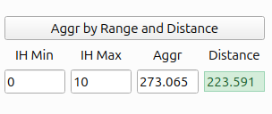

</Figure>

For example, `IH Min = 0`, `IH Max = 10`, `Distance = 223.591` gives `Aggr = 273.065`: the aggregation of the 0–10% IH range at that distance.
A lower aggregation means a smoother, more stable IH-ZFL curve; a higher one means larger jumps between points.
Since changing distance changes ZFL, and ZFL shapes the IH-ZFL curve, this panel is often used alongside the **ZFL-IH** and **Overlap** graphs to numerically confirm what those curves show.

The result depends on having valid IH-ZFL data, correct distance and gap configuration, and the right rounds enabled — if the calibration data is incomplete, treat the aggregation value with caution.

---

## 8. Range Analysis Matrix

<a id="range-analysis-matrix"></a>

<Figure id="fig-range-analysis-matrix" number="22" title="Range Analysis Matrix" caption="Matrix used to calculate global and range-based distance and aggregation results.">

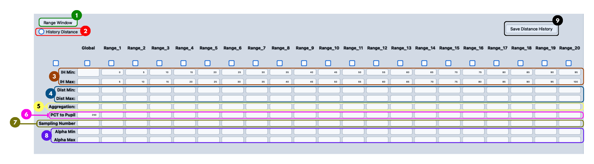

</Figure>

This is the main area for finding the best distance and minimum aggregation across a grid of IH ranges: **Global** (all data, no IH filter) plus `Range_1` to `Range_20`, normally 5% IH slices each (`Range_1 = 0~5%`, `Range_2 = 5~10%`, … `Range_20 = 95~100%`).

| Field | Description |
|---|---|
| **Enable checkbox** | Turns processing for that range on or off. |
| **IH Min / IH Max** | IH percentage bounds for the range. |
| **Dist Min / Dist Max** | Distance search limits for the range. |
| **Aggregation** | Output: the minimum aggregation found. |
| **PCT to Pupil** | Output: the reference PCT-to-pupil value. |
| **Sampling Number** | Output: how many samples fell inside the range. |
| **Alpha Min / Alpha Max** | Output: the alpha range, in degrees. |

Enabling a range makes the system convert its IH percentage to a pixel range, then search for the best distance and calculate the minimum aggregation, sampling count, and alpha range.

**History Distance** lets a range reuse a previously saved best-distance result instead of searching from scratch, but only when its IH Min and IH Max exactly match the saved history — otherwise the system searches fresh.
**Save Distance History** stores the current best-distance results for reuse later; do this only once you've confirmed the distances are correct, since bad history data will carry into future range calculations.

