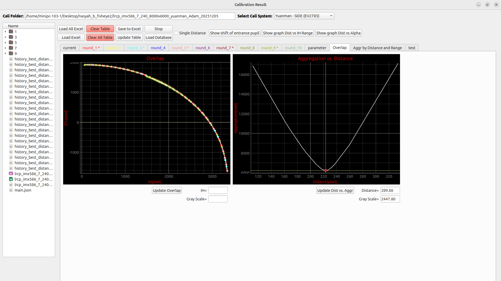

# Overlap and Aggregation View

This page covers the **Overlap** tab in the Calibration Result window.
It holds two graphs side by side: the **Overlap Graph**, which checks whether the ZFL-IH data from your calibration rounds line up smoothly, and the **Aggregation vs. Distance Graph**, which helps you find the distance value that gives the best result.

---

## Overview Images

<Figure id="fig-1" number="1" caption="Empty Overlap and Aggregation View with area labels.">

</Figure>

<Figure id="fig-2" number="2" caption="Overlap and Aggregation View after calibration data is loaded and updated.">

</Figure>

| No. | Area | Function |
|---:|---|---|
| 1 | **Overlap Graph** | Displays the ZFL-IH overlap result from enabled calibration rounds. |
| 2 | **Aggregation vs. Distance Graph** | Displays the relationship between distance and aggregation value. |

---

## 1. Overlap Graph

The **Overlap Graph** is the left graph in this tab.
It plots the ZFL-IH points from every enabled calibration round, so you can see at a glance whether the rounds agree with each other and form a smooth curve.

| Axis | Label | Meaning |
|---|---|---|
| X-axis | **ICT (pixel)** | Image height / intersection height value from calibration data. `ICT` and `IH` refer to the same measurement in this window. |
| Y-axis | **ZFL (pixel)** | Calculated ZFL value from the calibration result. |

| Component | Explanation |
|---|---|
| **Overlap graph area** | Main graph that displays overlap data. |
| **Update Overlap** | Refreshes the graph using the latest calculated round data. |
| **IH= field** | Shows the IH value under the mouse cursor. |
| **Gray Scale field** | Shows the corresponding graph value under the mouse cursor. |
| Cursor lines | A vertical and horizontal line follow the mouse to help you read coordinates off the graph. |

The graph draws its points differently depending on whether a row is top-screen or side-screen data, since the two are measured differently:

| Layer Position | Data Used |
|---|---|
| Before the side layer | Average values: ICT average and ZFL average. |
| After the side layer | Directional values: north, south, west, east, and their matching ZFL values. |

Click **Update Overlap** any time you change loaded data, the calibration system, pixel size, distance, V_Gap or H_Gap, which rounds are enabled, or after recalculating the table.

A smooth, compact curve usually means the calibration rounds are consistent.
A scattered curve can point to an incorrect distance, wrong center point, wrong gap value, or unstable calibration data, and large separation between rounds may mean one of them should be rechecked or disabled from the tab's right-click menu.

---

## 2. Aggregation vs. Distance Graph

The **Aggregation vs. Distance Graph** is the right graph in this tab.
It shows how the aggregation value changes as the distance value changes, which helps you pick the distance that gives the smoothest result.

| Axis | Label | Meaning |
|---|---|---|
| X-axis | **Distance (pixel)** | Distance value used during calibration calculation. |
| Y-axis | **Aggregation (pixel)** | Aggregation value calculated from the ZFL-IH curve. |

| Component | Explanation |
|---|---|
| **Aggregation vs. Distance graph area** | Main graph for showing the aggregation trend by distance. |
| **Update Dist vs. Aggr** | Redraws the graph using the stored distance-aggregation samples. |
| **Distance field** | Displays the selected or inspected distance value. |
| **Gray Scale field** | Displays the related graph value under the mouse cursor. |
| Cursor lines | A vertical and horizontal line follow the mouse to help you read distance and aggregation values off the graph. |

Aggregation is a single number that measures how smooth the ZFL-IH curve is: the system collects the IH-ZFL points, sorts them by IH, and sums the movement between neighboring points.
A lower value means a smoother, more stable curve; a higher value means bigger jumps or scattered points.

Distance matters because it feeds directly into the Alpha calculation, and Alpha feeds into ZFL.
So changing distance changes the ZFL-IH curve, which changes the aggregation value.
The system tries a range of distance values, calculates the aggregation for each, and this graph shows which distance gives the lowest one, the best distance for calibration.

Click **Update Dist vs. Aggr** after running a minimum aggregation search or after changing distance-related settings.

---

## 3. Minimum Aggregation Search

Instead of checking distance values by hand, the system can search for the best one automatically.
If no custom range is set, it searches between **1.0 and 500.0**.

The search evaluates aggregation across that range, narrows in on whichever section gives a lower value, and repeats until it converges or reaches its iteration limit.
The best distance and its aggregation value are then written to the fields on this tab, and the graph updates with the sampled points and a marker on the lowest one.

| Output | Meaning |
|---|---|
| **Distance** | Best distance found by the search. |
| **Aggregation** | Minimum aggregation value at that distance. |
| **Graph samples** | Distance-aggregation points used to draw the graph. |
| **Minimum marker** | The lowest aggregation point on the graph. |

---

## Recommended Workflow

1. Load calibration data using **Load Excel** or **Load All Excel**.
2. Select the correct **Cali System**.
3. Check **Pixel Size**, **Distance / Round**, **V_Gap**, and **H_Gap**.
4. Click **Update Table** or **Update All Cali Result**.
5. Open the **Overlap** tab and click **Update Overlap** to check whether the ZFL-IH points are smooth.
6. Run a minimum aggregation search, then click **Update Dist vs. Aggr** to inspect the distance-aggregation relationship.
7. Use the distance with the lowest aggregation as the recommended calibration distance.

---

## Troubleshooting

| Problem | Possible Cause | What to Check |
|---|---|---|
| Overlap graph is empty | No valid round data. | Load Excel data and run Update Table. |
| Points are very scattered | Wrong center point, distance, gap, or pixel size. | Recheck center position, distance, V_Gap, H_Gap, and pixel size. |
| Aggregation graph is empty | No distance-aggregation samples available. | Run a minimum aggregation search first. |
| Aggregation value is very high | ZFL-IH curve is unstable. | Check loaded data, disabled rounds, and calibration system selection. |
| Best distance looks wrong | Distance search range may be unsuitable. | Check the distance min/max settings in the aggregation range tools. |
