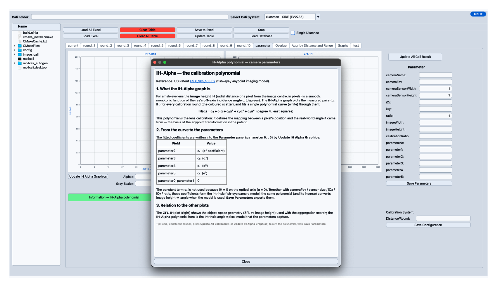
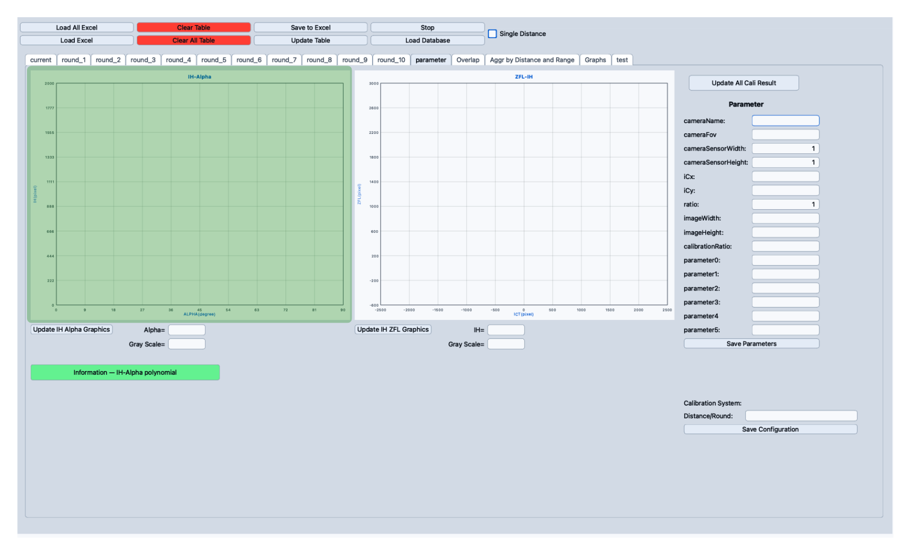
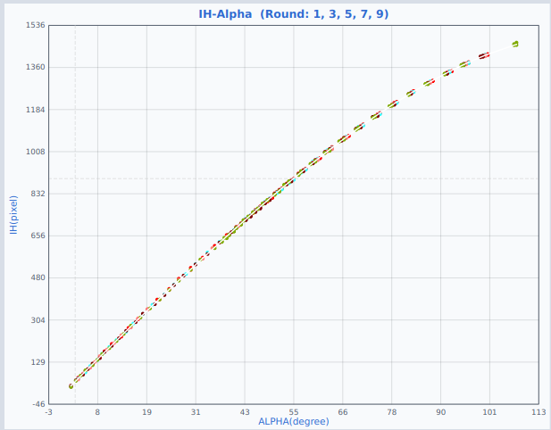
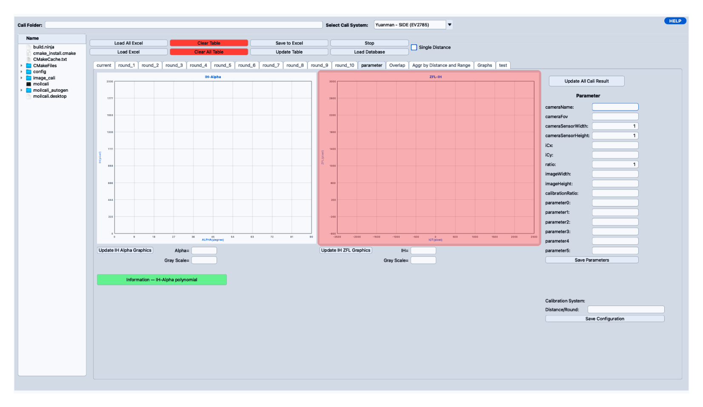
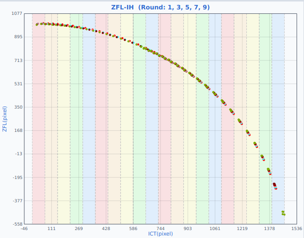
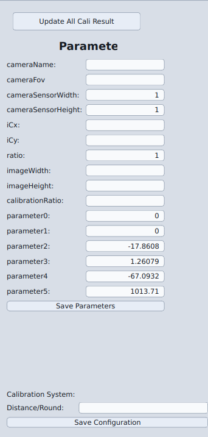

# Parameter View

This page covers the **Parameter View** in the **Main Cali Result** window.
Use it to check the two calibration graphs, recalculate results, edit camera parameters, choose the calibration system, and save your setup.

---

## Parameter View Overview

<Figure id="fig-1" number="1" caption="Parameter View overview.">


</Figure>

The Parameter View has three main areas:

| No. | Area | Main Function |
|---:|---|---|
| 1 | **IH-Alpha Graph** | Displays the relationship between Alpha and IH. Also holds the **Information — IH-Alpha polynomial** button. |
| 2 | **ZFL-IH Graph** | Displays the relationship between IH and ZFL. |
| 3 | **Parameter Panel** | Stores and manages camera parameters, calibration system, and distance configuration. |

---

## The IH-Alpha Curve

For a fisheye lens, the image height `IH`, meaning how far a pixel sits from the image center in pixels, changes smoothly and predictably as the incoming ray's angle `α` changes.
The IH-Alpha graph fits a curve through the measured `(α, IH)` points:

```text
IH(α) = c0 + c1·α + c2·α² + c3·α³ + c4·α⁴
```

This curve is the lens calibration itself, based on the model in US Patent 6,985,183 B2.
Pressing **Update IH Alpha Graphics** writes the curve's coefficients straight into the parameter panel:

| Parameter field | Value |
|---|---|
| `parameter2` | `c4`, the α⁴ coefficient |
| `parameter3` | `c3`, the α³ coefficient |
| `parameter4` | `c2`, the α² coefficient |
| `parameter5` | `c1`, the α coefficient |
| `parameter0`, `parameter1` | Always `0` |

The constant term `c0` isn't used, since `IH` is `0` right on the optical axis, where `α` is `0`.
Together with `cameraFov`, sensor size, `iCx`, `iCy`, and `ratio`, these coefficients make up the camera model that **Save Parameters** exports.

<Figure id="fig-2" number="2" caption="The Information dialog, opened from the green button below the IH-Alpha graph.">



</Figure>

Want the underlying theory? The green **Information — IH-Alpha polynomial** button below the graph opens a short explanation of this curve.

---

## How the Numbers Flow

```text
Loaded calibration data
   ↓
ICT / IH values
   ↓
PCT_CAL calculation
   ↓
Distance calculation
   ↓
Alpha calculation
   ↓
ZFL calculation
   ↓
IH-Alpha graph and ZFL-IH graph
   ↓
Aggregation quality analysis
```

Each step feeds the next.
If a graph looks wrong, work backward through this chain to find where the numbers went off.

---

## 1. IH-Alpha Graph

<Figure id="fig-3" number="3" caption="IH-Alpha graph area.">



</Figure>

<Figure id="fig-4" number="4" caption="IH-Alpha graph example after calibration data is loaded and updated.">



</Figure>

The graph plots **Alpha** on the X-axis and **IH** on the Y-axis.
Once data is loaded, each enabled round draws in its own color, so five enabled rounds give five overlapping lines.
A smooth curve means Alpha changes consistently as IH increases, and lines that sit on top of each other mean the rounds agree with each other.

| Component | Explanation |
|---|---|
| **IH-Alpha Graph** | Main graph area that displays Alpha and IH points. |
| **Update IH Alpha Graphics** | Refreshes the graph using the latest calculated table values. |
| **Alpha** | Shows the current Alpha value from the mouse cursor or nearest graph point. |
| **Gray Scale / IH** | Shows the current IH value from the mouse cursor or nearest graph point. |

Clicking **Update IH Alpha Graphics** redraws the graph from every available round, current plus round 1 through round 10, skipping any round turned off from the tab's right-click menu.
For top-screen data, it plots each round's averaged Alpha and IH.
Once side-screen data starts, it switches to per-direction values (N, S, E, W, and the four diagonals), dropping the diagonals since they don't produce valid readings on the side screen.

Hover over the graph to read the nearest Alpha and IH values in the fields below it.

---

## 2. ZFL-IH Graph

<Figure id="fig-5" number="5" caption="ZFL-IH graph area.">



</Figure>

<Figure id="fig-6" number="6" caption="ZFL-IH graph example after selected rounds are plotted.">



</Figure>

The graph plots **IH** on the X-axis and **ZFL** on the Y-axis.
Colored points are the enabled rounds' data, and the shaded vertical bands mark the IH ranges used for aggregation analysis.
A smooth curve here usually means a stable result with lower aggregation.

| Component | Explanation |
|---|---|
| **ZFL-IH Graph** | Displays IH and ZFL points. |
| **Update IH ZFL Graphics** | Refreshes the ZFL-IH graph. |
| **IH** | Shows the selected IH value from the graph. |
| **Gray Scale / ZFL** | Shows the selected ZFL value from the graph. |

ZFL is calculated as:

```text
zfl = 1 / tan(alpha) × ict
```

If Alpha or ICT is invalid for a point, that ZFL value is simply left blank rather than guessed.

**Update IH ZFL Graphics** collects data the same way as the IH-Alpha graph: every enabled round, switching from averaged top-screen values to per-direction side-screen values once the side layer begins.
Hover over the graph to read the nearest IH and ZFL values.

---

## 3. Parameter Panel

<Figure id="fig-7" number="7" caption="Parameter panel.">



</Figure>

The **Parameter Panel** is where you update calibration results, edit camera parameters, choose the calibration system, set distance-per-round behavior, and save everything.

| Component | Explanation |
|---|---|
| **Update All Cali Result** | Recalculates all enabled calibration rounds and refreshes graphs. |
| **Camera Parameters** | Stores fisheye camera model values. |
| **Save Parameters** | Saves camera parameter values. |
| **Calibration System** | Selects the active calibration system JSON configuration. |
| **Distance/Round** | Defines the distance increment between rounds. |
| **Save Configuration** | Saves calibration system and distance configuration. |

---

## 4. Update All Cali Result

The **Update All Cali Result** button recalculates every enabled round, skips disabled ones, and refreshes the IH-Alpha, ZFL-IH, and Overlap graphs together.

Use it after changing any of the following: loaded calibration data, calibration system, distance value or distance per round, pixel size, V_Gap or H_Gap, camera parameters, or a round's enabled/disabled status.

---

## 5. Camera Parameters

| Field | Meaning |
|---|---|
| **cameraName** | Name of the camera or calibration profile. |
| **cameraFov** | Camera field of view. |
| **cameraSensorWidth** | Sensor width value. |
| **cameraSensorHeight** | Sensor height value. |
| **iCx** | Fisheye image center X coordinate. |
| **iCy** | Fisheye image center Y coordinate. |
| **ratio** | Ratio used by the calibration model. |
| **imageWidth** | Image width in pixels. |
| **imageHeight** | Image height in pixels. |
| **calibrationRatio** | Ratio used in calibration conversion. |
| **parameter0** – **parameter5** | Polynomial parameter coefficients. |

`iCx` and `iCy` mark the fisheye optical center, so getting this position right matters.
If the center point is wrong, ICT/IH extraction shifts, Alpha and ZFL become unstable, the ZFL-IH graph turns uneven, and aggregation rises.

`parameter0` through `parameter5` define the angle-to-radius relationship described earlier under [The IH-Alpha Curve](#the-ih-alpha-curve).
Type them in manually, or let **Update IH Alpha Graphics** fill them in for you.

---

## 6. Calibration System

The **Calibration System** dropdown selects the active calibration system configuration, for example `Yuanman - SIDE (EV2785)`.
Each entry corresponds to a saved JSON configuration file, and changing the dropdown updates the related fields and values.

When a calibration folder is loaded, the app looks for a `main.json` file inside it and, if found, reads the system type and distance-per-round values from it automatically.
If the file is missing or invalid, it falls back to the default system, `Yuanman - SIDE (EV2785)`, with a default distance of `10`.

---

## 7. Distance / Round

The **Distance/Round** field controls how much distance changes between rounds:

```text
distance = base_distance + dis_per_round × (current_round - first_valid_round)
```

| Term | Meaning |
|---|---|
| `base_distance` | Base distance from the distance range field. |
| `dis_per_round` | Distance increment from **Distance/Round**. |
| `current_round` | Current round number. |
| `first_valid_round` | First round that contains valid IH/ICT data. |

Turning on **Single Distance** mode lets each round use its own distance value, typed directly into that round's field.
With it off, the app calculates distance from the base distance and the **Distance/Round** increment above.

---

## 8. Where the Numbers Come From

Recalculating a round follows the flow shown earlier: ICT average, then PCT_CAL, distance, Alpha, ZFL, and finally the graphs and aggregation.

Alpha uses one of two formulas, depending on whether a point sits on the top screen or the side screen:

```text
Top screen:  alpha = atan(pct_cal / distance)
Side screen: alpha = π/2 - atan((distance - pct_cal - v_gap) / h_gap)
```

The app decides where the top screen ends and the side screen begins by looking for the first round layer marked with `*`.
If no layer is marked, layer `40` is used as the default boundary.

PCT_CAL is the summed PCT values multiplied by the pixel size for that screen area, top or side, so the **Pixel Size (Top)** and **Pixel Size (Side)** fields directly affect this step.

**Aggregation** measures how smooth the ZFL-IH curve is: the app sorts the IH-ZFL points by IH and sums the distance between neighboring points.
A lower aggregation value means a smoother, more stable curve.
See the [Overlap & Aggregation View](./overlap-and-aggregation-view) for the full explanation and the distance search that uses this value.

---

## 9. Saving Your Work

Click **Save Parameters** after editing the camera calibration values.
It saves `cameraName`, `cameraFov`, `cameraSensorWidth`, `cameraSensorHeight`, `iCx`, `iCy`, `ratio`, `imageWidth`, `imageHeight`, `calibrationRatio`, and `parameter0` through `parameter5`.

Click **Save Configuration** to save the rest of the setup: the selected calibration system, the distance per round, and the system configuration values.

The two buttons save separately, so remember to click both once you're happy with the result.

---

## Recommended Workflow

1. Load calibration data first.
2. Select the correct **Calibration System**.
3. Check camera parameter values.
4. Check **Distance/Round**.
5. Click **Update All Cali Result**.
6. Inspect the **IH-Alpha Graph** and the **ZFL-IH Graph**.
7. If a graph looks unstable, recheck `iCx`, `iCy`, distance, pixel size, V_Gap, H_Gap, and `parameter0`–`parameter5`.
8. Click **Save Parameters** once the camera parameters are correct.
9. Click **Save Configuration** once the calibration system setup is correct.

---

## Troubleshooting

| Problem | Possible Cause | Solution |
|---|---|---|
| IH-Alpha graph is empty | No valid Alpha or IH data. | Load data and click **Update All Cali Result**. |
| ZFL-IH graph is empty | No valid ZFL or IH data. | Check ICT, Alpha, and distance values. |
| ZFL-IH graph is not smooth | Wrong center, distance, pixel size, or gap values. | Check iCx/iCy, Distance, Pixel Size, V_Gap, and H_Gap. |
| Alpha value is empty | ICT, PCT_CAL, or distance is invalid. | Check table data and distance configuration. |
| ZFL value is empty | Alpha or ICT is invalid. | Check Alpha calculation and ICT values. |
| Disabled round does not appear in graph | Round status is OFF. | Enable the round again from the round tab context menu. |
| Cursor does not snap to graph point | Mouse is too far from a plotted point. | Move closer to the plotted point. |
