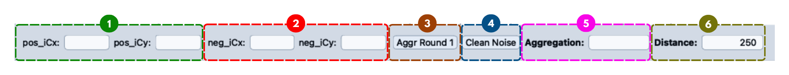
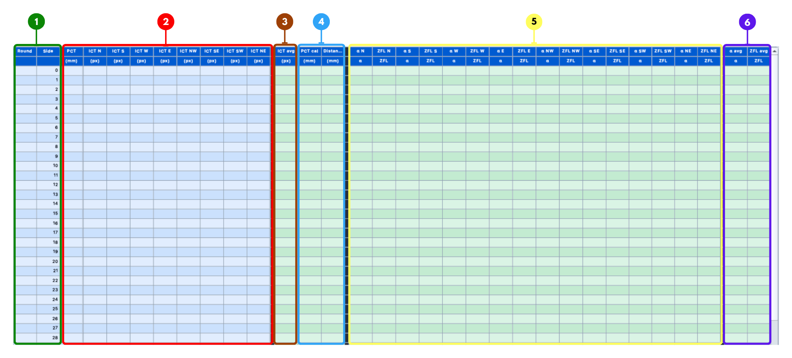
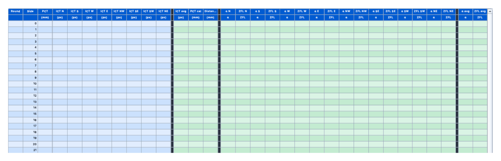
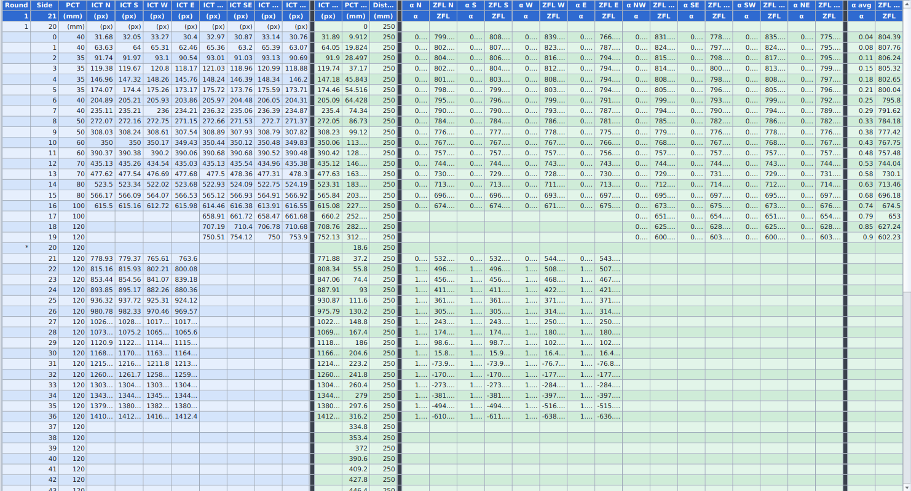

# Result Table View

The **Main Cali Result** window is where calibration data gets turned into a finished result.
It reads calibration data from Excel, stores it per round, and calculates **ICT / IH**, **PCT_CAL**, **Distance**, **Alpha**, **ZFL**, and **Aggregation** from it.
Those calculated values are then used to check how smooth the ZFL-IH curve is.
A lower aggregation value means the curve is smoother and the calibration result is more stable.

This page walks through the result table itself: its layout, its columns, how each column gets calculated, and the tools used to find the best distance.

---

## 1. Main Window Layout

<Figure id="fig-1" number="1" caption="Main Cali Result Window.">


</Figure>

The window has three main areas.

| No. | Area | Purpose |
|---:|---|---|
| 1 | **Control & Input Row** | Center position values, the selected round's aggregation and distance, and the **Aggr Round** / **Clean Noise** buttons. |
| 2 | **Result Table** | Raw calibration data plus the calculated columns: ICT average, PCT_CAL, Distance, Alpha, and ZFL. |
| 3 | **Calculate Result & Formula Panel** | The **Calculate Result** button, plus the Alpha and ZFL formulas the table uses. |

The result table sits at the center of the window.
The control row above it feeds in the input values, and the table calculates a result for every layer.
The formula panel on the right is there so you can see why Alpha and ZFL change whenever distance, PCT, V_Gap, H_Gap, or ICT changes.

---

## 2. Control & Input Row

<Figure id="fig-2" number="2" caption="Control and Input Row.">



</Figure>

| No. | UI Component | Explanation |
|---:|---|---|
| 1 | **Positive / Negative Center Position** | The fisheye center from the positive and negative calibration images, copied in from the main window when **Update Table** is pressed. |
| 2 | **Aggr Round** | Searches for the distance that gives the lowest aggregation for this round, writes it into **Distance**, and recalculates the table. |
| 3 | **Clean Noise** | Opens a dialog that removes false intersection nodes caused by the bezel gap between calibration monitors. |
| 4 | **Aggregation** | The aggregation value calculated from the round's IH-ZFL points. |
| 5 | **Distance** | The distance value used in the Alpha formula for this round. |

### 2.1 Center Positions

The positive and negative center positions are copied from the main window's center-detection result as soon as **Update Table** is clicked.
They matter because the 8-direction ICT values are extracted from the calibration images using this center point, so a wrong center point means wrong ICT values in every direction.

Once both center positions are in place, the controller extracts the intersection nodes from the positive and negative images and fills in the eight direction columns: N, S, W, E, NW, SE, SW, NE.

### 2.2 Aggr Round

**Aggr Round** searches a distance range, by default 1.0 to 500.0, for the value that gives the smallest aggregation for the selected round.
It recalculates the table at each candidate distance, collects the resulting IH-ZFL points, and keeps whichever distance produced the lowest aggregation.

### 2.3 Clean Noise

Calibration rigs that span several monitors have a bezel gap between screens.
That gap produces intersection nodes that are not real image data, and those false nodes bend the ZFL curve and inflate the aggregation value.
**Clean Noise** removes them before the round is calculated.

The dialog removes nodes by **radial band**, measured in pixels from the image center.

| Item | Explanation |
|---|---|
| **Group** | `N & S`, `W & E`, and the diagonals each get their own band, since the bezel sits at a different radius in each direction. |
| **min / max** | The two ends of the band. Both boundaries are kept, and only nodes strictly inside are removed. Leave one side blank to make that side open-ended. |
| **Auto-detection** | The dialog proposes a band per group when it opens, as long as there are at least four gap samples in that group. Otherwise the values must be typed in by hand. |
| **Apply to ALL rounds with data** | Applies the same band to every round that has ICT data, not just the selected one. |

The band you last entered is offered again for the next round, since the bezel doesn't move between rounds.

:::caution
Cleaning redraws the graphs, but it does **not** recalculate the table on its own.
Press **Aggr Round** or **Calculate Result** afterward, or the Alpha and ZFL columns will still hold values from the removed nodes.
:::

### 2.4 Aggregation and Distance Fields

The aggregation value comes from the round's IH-ZFL points: sort them by IH, measure the distance between each neighboring pair, and add those distances up.
A lower total means the curve is smoother; a higher total means it has bigger jumps or unstable transitions.

Distance is one of the most important values on the page, because it feeds directly into the Alpha formula:

```text
alpha = atan(pct_cal / distance)
```

Changing distance changes Alpha for the same PCT_CAL, which changes ZFL, which changes aggregation.

---

## 3. Result Table Columns

<Figure id="fig-3" number="3" caption="Calibration Result Table Column Structure.">



</Figure>

The table is organized into a few column groups, separated visually by plain black columns that carry no data of their own.

| Group | Columns | Meaning |
|---|---|---|
| Basic Info | Round, Side, PCT | Round number (or `*` marking the side layer row), layer number, and the raw pattern PCT value. |
| ICT 8 Directions | N, S, W, E, NW, SE, SW, NE | ICT / IH value measured in each direction. |
| ICT Summary | AVG | Average of the valid ICT directions. |
| PCT & Distance | PCT (calibrated), Distance | PCT_CAL after applying pixel size, and the distance used for this row's calculation. |
| Alpha & ZFL | N α / ZFL … NE α / ZFL | Alpha and ZFL calculated for each of the 8 directions. |
| Summary | AVG α, AVG ZFL | Average Alpha and ZFL, used for top-screen rows. |

### Before and After Calculation

<Figure id="fig-4" number="4" caption="Empty Calibration Result Table.">



</Figure>

Before any data is loaded, the table already has its row numbers and side numbers filled in, and it's ready to receive data.

<Figure id="fig-5" number="5" caption="Filled Calibration Result Table.">



</Figure>

Once data is loaded or calculated, every column has a value: Round and Side identify the row, PCT and ICT hold the raw measurements, and PCT_CAL, Distance, Alpha, ZFL, and the averages hold the calculated results described in the sections below.

---

## 4. Getting Data Into the Table

There are two ways to fill the table: click **Update Table** to pull fresh data from the current images and patterns, or load it from an Excel file.

### 4.1 Update Table

Clicking **Update Table** runs through these steps in order:

1. Clear the current table.
2. Copy the positive and negative center positions from the main window.
3. Update the round number.
4. Update the PCT column from the Pattern Generator data (concentric layers use `radius`, stripeline layers use `interval`).
5. Extract the 8-direction ICT values from the positive and negative calibration images.
6. Run the full calculation and mark the tab with `*`.

### 4.2 Loading from Excel

**Load Excel** loads one `.xlsx` file into the currently selected round.
It fills only the raw columns, Round, Side, PCT, and the 8 ICT directions, then runs the full calculation to fill in everything else.

**Load All Excel** does the same thing for a whole folder of rounds at once.
It expects a folder structured like this, with one Excel file per round subfolder:

```text
main_folder/
├── 1/result.xlsx
├── 2/result.xlsx
...
└── 10/result.xlsx
```

After loading, it also loads `main.json` if one exists in the folder.

### 4.3 Calculate Result

The **Calculate Result** button, on the formula panel, runs the full calculation for the selected round using whatever distance is currently in the **Distance** field.
It's the manual counterpart to **Aggr Round**: **Aggr Round** searches for the best distance first and then calculates, while **Calculate Result** calculates at whatever distance you've already set.

Either way, a full calculation follows the same order: update the side layer and round number, calculate ICT average, calculate PCT_CAL, update distance, calculate Alpha and ZFL for all 8 directions, calculate the Alpha and ZFL averages, update the round's aggregation, and refresh the ZFL-IH, IH-Alpha, and overlap graphs.

---

## 5. Side Layer

The **side layer** decides which formula a row uses: the simpler top-screen formula, or the side-screen formula.

The controller looks for the first row in the Round column marked with `*`.
If none is found, it falls back to a default side layer of `40`.

| Layer Condition | Formula Used |
|---|---|
| Before the side layer | Top-screen formula, using the average Alpha and average ZFL. |
| At or after the side layer | Side-screen formula, using each direction's own Alpha and ZFL. Diagonal directions (NW, SE, SW, NE) are left blank, since the side-screen geometry doesn't use them. |

If the `*` marker is missing or placed on the wrong row, the whole table will calculate with the wrong formula from that point on, so it's worth double-checking.

---

## 6. How Each Value Is Calculated

### 6.1 ICT Average

The ICT average is the mean of the valid (non-zero) values among the 8 directions for a row.
If none of the directions have a valid value, the average is left empty.

### 6.2 PCT_CAL

```text
PCT_CAL = sum(PCT values in the section) × pixel size
```

Which pixel size and which section of rows gets summed depends on the side layer:

| Layer Condition | Pixel Size | Section Summed |
|---|---|---|
| Before the side layer | Pixel Size (Top) | From layer 0 up to the current layer. |
| At or after the side layer | Pixel Size (Side) | From the side layer up to the current layer. |

### 6.3 Distance

```text
distance = base_distance + dis_per_round × (current_round - first_valid_round)
```

`base_distance` and `dis_per_round` come from the Distance/Round settings, and `first_valid_round` is the first round that has valid ICT data.

If **Single Distance** is enabled, this formula is skipped entirely, and each round instead uses its own distance value, edited directly in that round's distance field.

### 6.4 Alpha

Which formula applies depends on the side layer, same as everywhere else on this page.

**Before the side layer:**

```text
α = atan(PCT_CAL / Distance)
```

**At or after the side layer:**

```text
α = π/2 - atan((Distance - PCT_CAL - V_Gap) / H_Gap)
```

`V_Gap` and `H_Gap` are the vertical and horizontal gap values for the direction being calculated, set on the parameter panel.
This formula only applies to the four main directions (N, S, E, W); the diagonals are left blank after the side layer.

### 6.5 ZFL

```text
ZFL = 1 / tan(α) × ICT
```

If Alpha or ICT is missing or invalid for a direction, ZFL is left empty for that direction too.
Calculated ZFL cells are highlighted so they're easy to spot in the table.

### 6.6 Alpha and ZFL Averages, and IH-ZFL Points

The AVG α and AVG ZFL columns are only calculated for rows before the side layer, since side-screen rows already use direction-specific values instead.

This same split decides how points are collected for the IH-ZFL curve:

- **Before the side layer**, each row contributes one point using `(ICT average, ZFL average)`.
- **At or after the side layer**, each row contributes one point per direction, using `(ICT, ZFL)` for that direction.

---

## 7. Aggregation and Finding the Best Distance

Aggregation measures how smooth the IH-ZFL curve is.
It's calculated by sorting the collected IH-ZFL points by IH, measuring the distance between each pair of neighboring points, and summing those distances:

```text
aggregation = sum of sqrt((x1 - x2)² + (y1 - y2)²) over neighboring points
```

Lower aggregation means a smoother, more stable curve.

Aggregation can also be calculated for one specific IH range instead of the whole curve, which is what the range-analysis tools on the main window use.

**Finding the best distance** works the same way, but automatically: the search evaluates aggregation at different distance values within a range (1.0 to 500.0 by default), narrows in on whichever section gives the lowest aggregation, and repeats until it converges.
The result is written into the **Distance** and **Aggregation** fields, and the sampled points are plotted on the Aggregation vs. Distance graph.

---

## 8. Managing Round Data

| Action | What it does |
|---|---|
| **Clear Table** | Clears only the currently active round, resets its round number and side column, and removes the `*` marker. |
| **Clear All Table** | Clears every round from 1 to 10, after a confirmation dialog. |
| **Update All Cali Result** | Recalculates every enabled round and refreshes the IH-Alpha, ZFL-IH, and overlap graphs. Run this after changing distance, pixel size, V_Gap, H_Gap, the calibration system, round data, or which rounds are enabled. |
| **Save to Excel** | Saves the round's raw columns (Round through the 8 ICT directions) so the data can be reloaded later. |

Round tabs also have a right-click menu for turning a round off or on, and for opening a single-round ZFL-IH or overlap graph.
A turned-off round is marked `[OFF]`, and it's skipped in every calculation and graph until it's turned back on.

---

## Recommended Workflow

**Normal table calculation**

1. Open **Main Cali Result** and select the correct round tab.
2. Load Excel data, or click **Update Table**.
3. Confirm the center positions and the side layer marker (`*` or the default 40).
4. Confirm pixel size and distance settings.
5. Click **Update All Cali Result**.
6. Check the calculated PCT_CAL, Alpha, and ZFL columns, along with the ZFL-IH and overlap graphs.
7. Use the aggregation tools to find the best distance.

**Checking a single round**

1. Select or load the target round.
2. Enter a distance and press Enter, or click **Aggr Round**.
3. Read the resulting aggregation value.
4. Open the single-round ZFL-IH graph if you need a closer look.

---

## Troubleshooting

| Problem | Likely Cause | What to Check |
|---|---|---|
| Alpha column is empty | ICT, PCT_CAL, or Distance is invalid. | The raw ICT values, PCT values, and distance field. |
| ZFL column is empty | Alpha or ICT is empty or invalid. | Whether Alpha calculated correctly first. |
| Average Alpha / ZFL is empty after the side layer | Expected. Averages only apply before the side layer. | Nothing; this is normal. |
| Diagonal Alpha is empty after the side layer | Expected. NW, SE, SW, NE aren't used in side-screen rows. | Nothing; this is normal. |
| Side layer seems wrong | The `*` marker is missing or on the wrong row. | The Round column. Default side layer is 40. |
| Aggregation is too high | The ZFL-IH points aren't smooth. | Distance, center point, pixel size, V_Gap, H_Gap, and the raw ICT values. |
| Excel loaded, but calculated columns are blank | A required source value is missing or invalid. | Run Update All Cali Result and inspect PCT, ICT, and Distance. |