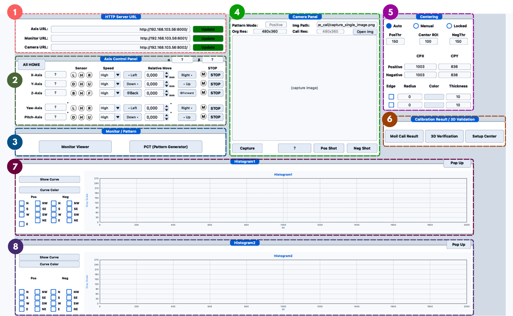
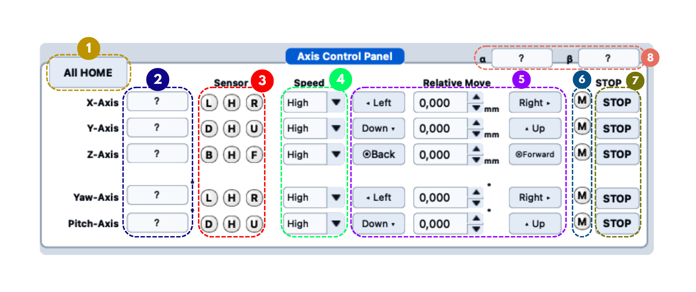
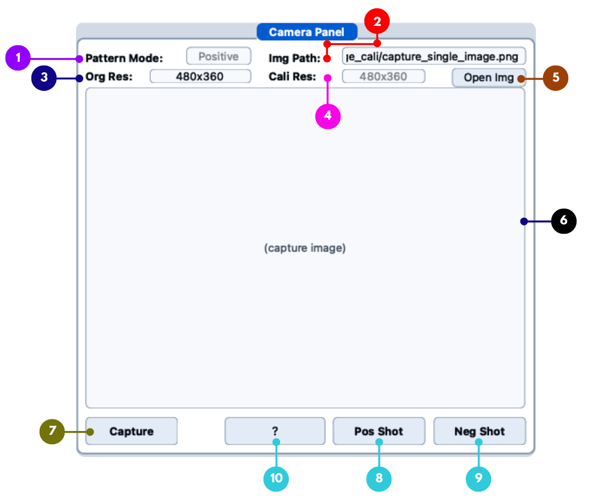
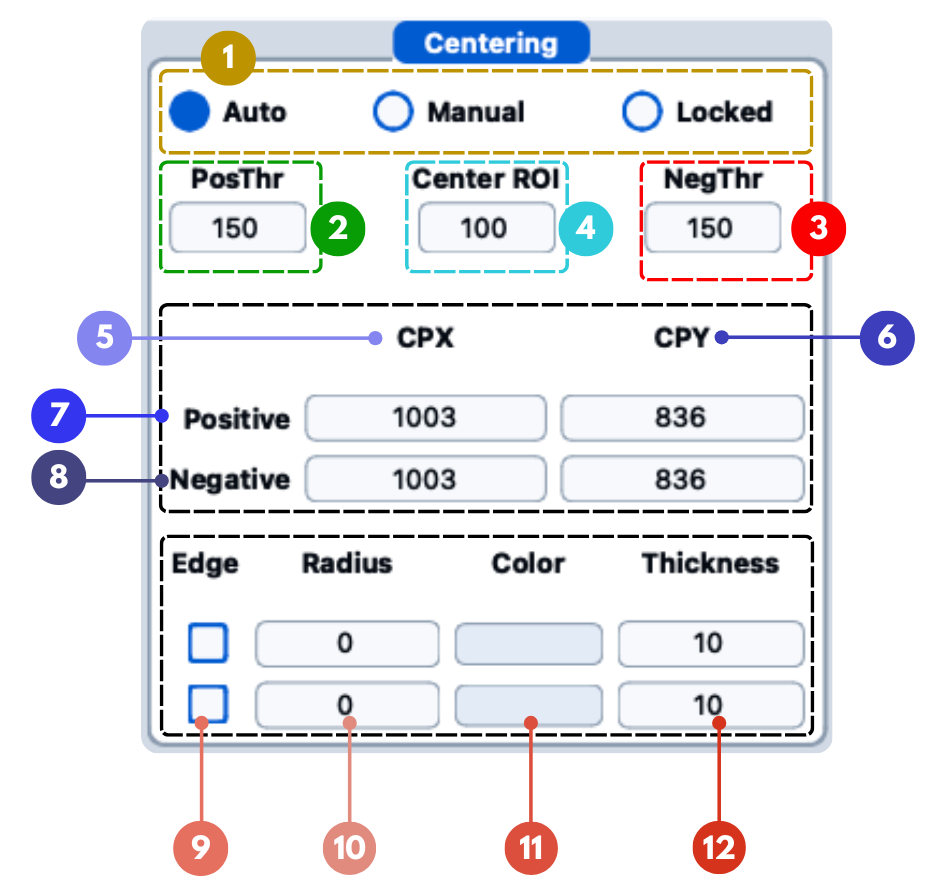
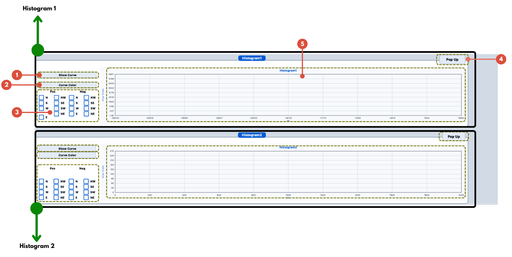

# Camera Calibration

This is **step 2** of the calibration workflow — the capture run itself. You use the **Main Window** to home the axes, put the calibration pattern on the monitors, and take the two images that everything else is computed from: the **positive shot** and the **negative shot**.

<div className="custom-note custom-important">
  <div className="custom-note-title">📖 WHAT THIS PAGE IS</div>
  <div>
    This is the <strong>procedure</strong> — what to do, in order. It names the controls but does not describe them all. For what every field, LED, and button in the Main Window does, see the <a href="/moilcalib_documentation/docs/v1.1/system-overview/main-window"><strong>Main Window Reference</strong></a>.
  </div>
</div>

<div className="custom-note custom-important">
  <div className="custom-note-title">✅ PREREQUISITES</div>
  <ol>
    <li>The <a href="/moilcalib_documentation/docs/v1.1/installation/server">servers</a> are running and reachable, and the <a href="/moilcalib_documentation/docs/v1.1/installation/client">client</a> is built.</li>
    <li>The calibration patterns are prepared in the <a href="/moilcalib_documentation/docs/v1.1/calibration/pct-pattern-generator">PCT Pattern Generator</a> and assigned to the correct directions in the <a href="/moilcalib_documentation/docs/v1.1/calibration/monitor-viewer">Monitor Viewer</a> (step 1).</li>
    <li>The axis stage, monitors, and camera are connected and powered.</li>
  </ol>
</div>

<Figure id="fig-1" number="1" caption="The Main Window — every step on this page happens here.">



</Figure>

For a panel-by-panel reference of this window, see [Main Window Overview](/moilcalib_documentation/docs/v1.1/system-overview/main-window). This page is the **procedure**.

---

## Where the Captured Images Are Saved

This is the question that comes up first, so it is answered first: every capture is written as a PNG into an **`image_cali/`** folder, and the two you need are these:

| Button | File written | What it is |
|---|---|---|
| **Pos Shot** | `image_cali/capture_positive_shot.png` | **The positive image** — the pattern as generated |
| **Neg Shot** | `image_cali/capture_negative_shot.png` | **The negative image** — the same pattern with inverted colours |
| **Capture** | `image_cali/capture_single_image.png` | A plain preview frame, not used by the calibration |

The same folder also holds the patterns that were pushed to the monitors:

```text
image_cali/pattern_circle_<direction>.png    e.g. pattern_circle_top.png, pattern_circle_n.png
image_cali/_tmp_pattern_circle.png           temporary render from the Pattern Generator
```

<div className="custom-note custom-warning">
  <div className="custom-note-title">⚠️ WHERE IS <code>image_cali/</code> EXACTLY?</div>
  <div>
    The path is resolved against the <strong>working directory the application was launched from</strong> — not the folder holding the binary. If you start the client from the project root with <code>./cpp/build/moilcali</code>, the images land in <code>&lt;project root&gt;/image_cali/</code>. Launch it from somewhere else and the folder is created there instead. When in doubt, read the <strong>Img Path</strong> field in the Camera Panel: after every capture it shows the full path of the file that was just written.
  </div>
</div>

<div className="custom-note custom-warning">
  <div className="custom-note-title">⚠️ EACH CAPTURE OVERWRITES THE PREVIOUS ONE</div>
  <div>
    The file names are fixed. The next <strong>Pos Shot</strong> replaces <code>capture_positive_shot.png</code>, and the next <strong>Neg Shot</strong> replaces <code>capture_negative_shot.png</code>. If you need to keep the images of a round — for a report, for re-analysis, or for a different distance — <strong>copy them out of <code>image_cali/</code> before capturing again</strong>.
  </div>
</div>

<div className="custom-note custom-danger">
  <div className="custom-note-title">🛑 RESET DELETES THESE FILES</div>
  <div>
    <strong>Reset</strong> in the menu bar deletes <code>capture_single_image.png</code>, <code>capture_positive_shot.png</code>, <code>capture_negative_shot.png</code>, <code>&#95;tmp_pattern_circle.png</code>, and every <code>pattern_circle_*.png</code> in <code>image_cali/</code>. It asks for confirmation first. Reference sample images and the pattern JSON configurations are left untouched.
  </div>
</div>

---

## 1. Connect to the Servers

In the **HTTP Server URL** panel, enter the three server addresses and press **Update** for each one.

| Field | Local server | Remote rig |
|---|---|---|
| **Axis URL** | `http://127.0.0.1:8000/` | `http://<server-ip>:8000/` |
| **Monitor URL** | `http://127.0.0.1:8001/` | `http://<server-ip>:8001/` |
| **Camera URL** | `http://127.0.0.1:8002/` | `http://<server-ip>:8002/` |

<div className="custom-note custom-tip">
  <div className="custom-note-title">💡 UPDATING THE AXIS URL RE-READS THE SENSORS</div>
  <div>
    Pressing <strong>Update</strong> next to the <strong>Axis URL</strong> re-runs the sensor-initialisation dialog, which probes the origin state of all five axes. Use it if the axis LEDs look wrong or the stage was power-cycled.
  </div>
</div>

---

## 2. Home the Axes

<Figure id="fig-2" number="2" caption="Axis Control Panel.">



</Figure>

Press **All HOME** before the first capture of a session.

A short dialog opens first and probes the origin sensor of all five axes, then closes by itself. Homing then runs in a fixed order — **Yaw → Pitch → X → Y → Z** — skipping any axis the probe found already at its origin, and waiting for a confirmed stop on one axis before starting the next. Each axis reads `0.000` when it finishes.

Two things move while this happens. The **X** and **Y** coordinate fields blink the word `Homing` on and off, and the round **M** lamp on an axis row blinks yellow whenever that axis is running. The three lamps beside it (`L H R`, `D H U`, or `B H F`) are the limit and home sensors and do not blink.

Then move the stage to the position for this round: pick a **Speed**, type the distance into the **Relative Move** box of the axis you want — millimetres for X / Y / Z, degrees for Yaw / Pitch — and press the direction button on either side of it.
The resulting **α / β** values are shown in the panel header, top right, and update live.

<div className="custom-note custom-important">
  <div className="custom-note-title">📌 CONTROLS GREY OUT WHILE AN AXIS MOVES — THIS IS NORMAL</div>
  <div>
    The safety lock disables everything except that axis's <strong>STOP</strong> button until the stage reports it has stopped. Wait, do not click repeatedly. Full description of the sensor LEDs, speed selector, and interlocks: <a href="/moilcalib_documentation/docs/v1.1/system-overview/main-window#2-axis-control-panel">Main Window Reference, Section 2</a>.
  </div>
</div>

---

## 3. Show the Pattern and Check the Camera

<Figure id="fig-3" number="3" caption="Camera Panel.">



</Figure>

Press **Capture** to take a plain preview frame. Use it to confirm three things before the real shots:

1. The camera server answers and an image appears in the preview.
2. The fisheye circle is inside the frame and roughly centred.
3. The monitors are showing the pattern, at a brightness that is neither washed out nor too dark (adjust in the [Monitor Viewer](/moilcalib_documentation/docs/v1.1/calibration/monitor-viewer)).

Everything above the preview is a readout, not a setting: **Pattern Mode** shows which shot the current image came from (blank after a plain **Capture**), **Img Path** shows the file that was just written, **Org Res** is the resolution the camera sent, and **Cali Res** is the resolution of the scaled preview inside the window. There is nothing to configure here. Field-by-field description of this panel: [Main Window Reference, Section 4](/moilcalib_documentation/docs/v1.1/system-overview/main-window#4-camera-panel).

<div className="custom-note custom-tip">
  <div className="custom-note-title">💡 THE <strong>?</strong> BUTTON BETWEEN <strong>Capture</strong> AND <strong>Pos Shot</strong></div>
  <div>
    It is the <strong>direction-difference check</strong>, and it only works once both shots exist. It is described in step 5 below — ignore it for now.
  </div>
</div>

<div className="custom-note custom-tip">
  <div className="custom-note-title">💡 DO NOT RELY ON <strong>Open Img</strong></div>
  <div>
    That button is <strong>not active in version 1.1</strong>. To work on an existing image, capture again, or point a tool that accepts a file — such as <a href="/moilcalib_documentation/docs/v1.1/verification/setup-center">Setup Center</a> — at the PNG in <code>image_cali/</code>.
  </div>
</div>

---

## 4. Take the Positive and Negative Shots

This is the actual measurement. **Pos Shot** and **Neg Shot** are not plain captures — each one runs a small sequence:

```text
Click Pos Shot / Neg Shot
   ↓
Pattern Mode is set to Positive / Negative
   ↓
The matching pattern is pushed to every monitor
   ↓
Short pause (~300 ms) so the screens actually show it
   ↓
A frame is fetched from the camera server
   ↓
Image is saved to image_cali/capture_positive_shot.png
                  or image_cali/capture_negative_shot.png
   ↓
The pattern centre is auto-detected from THIS image → CPX / CPY
   (only when the Centering panel is in Auto mode)
   ↓
The ROI marker, and the edge circle if Edge is ticked, are drawn
   ↓
Both histograms refresh
```

<div className="custom-note custom-important">
  <div className="custom-note-title">📌 WHY BOTH SHOTS ARE NEEDED</div>
  <div>
    The positive and negative captures show the same pattern with inverted colours. The calibration uses the pair together to find the intersection points (ICT) reliably — a single image cannot separate the pattern edges from the background as cleanly.
  </div>
</div>

<div className="custom-note custom-tip">
  <div className="custom-note-title">💡 EACH SHOT CENTRES ITSELF</div>
  <div>
    The positive and negative shots detect their centres <strong>independently</strong> — the positive centre goes to the <strong>Positive CPX / CPY</strong> fields and the negative centre to the <strong>Negative CPX / CPY</strong> fields. They are not expected to be identical.
  </div>
</div>

The captured pair looks like this — the concentric pattern in the middle and the stripline patterns on the four sides:

<Figure id="fig-4" number="4" caption={<>Positive shot — <code>image_cali/capture_positive_shot.png</code>.</>}>


</Figure>

<Figure id="fig-5" number="5" caption={<>Negative shot — <code>image_cali/capture_negative_shot.png</code>, the same layout with inverted colours.</>}>


</Figure>

---

## 5. Check and Correct the Centre

<Figure id="fig-6" number="6" caption="Centering Panel.">



</Figure>

The centre point is the most important value in this step — everything downstream inherits an error in it. Each shot has already filled its own CPX / CPY; your job here is to confirm them, and to fix them if they are wrong.

The panel reads as a grid: the **CPX** and **CPY** columns hold the horizontal and vertical centre in original-image pixels, and the **Positive** and **Negative** rows hold the pair detected from each of the two shots. **Center ROI** is the radius of the ROI box drawn around the centre on the preview — raise it if the marker box is too small to judge.

**Confirm.** Double-click the preview to open the zoomable viewer and check that the marked centre really sits on the middle of the concentric pattern. Tick **Edge** and set a **Radius** to draw a circle overlay and compare the centre against the outer edge of the fisheye circle. The overlay block has one row per pattern mode, so the positive and negative circles can be given their own **Color** and **Thickness**.

**If the centre is wrong**, choose one of these fixes:

| Situation | Do this |
|---|---|
| Auto-detection landed close but not exactly right | Set **PosThr** (for the positive image) or **NegThr** (for the negative image), then click once on the preview while the panel is in **Auto**. The centre is refined from its current value with that threshold, repeated until it stops moving. |
| Auto-detection is far off — wrong lobe of the pattern entirely | Switch to **Manual** and click the correct centre on the preview. The clicked point becomes CPX / CPY exactly as clicked, and the panel switches itself back to **Auto**. Click again to refine from there. |
| The centre is correct and you do not want captures to move it | Switch to **Locked**. Clicks are ignored and later shots leave the values alone. |

Do this for **both** images — the positive and negative centres are independent and are corrected separately.

<div className="custom-note custom-tip">
  <div className="custom-note-title">💡 CLICKING ONLY WORKS AFTER A POS / NEG SHOT</div>
  <div>
    The click-to-set-centre gesture requires a pattern mode. After a plain <strong>Capture</strong>, Pattern Mode is empty and clicks are ignored.
  </div>
</div>

<div className="custom-note custom-important">
  <div className="custom-note-title">📌 THE THRESHOLDS DO NOT AFFECT THE SHOT ITSELF</div>
  <div>
    The centre detected right after a <strong>Pos Shot</strong> or <strong>Neg Shot</strong> comes from a gradient fit on the concentric rings, which does not read <strong>PosThr</strong> or <strong>NegThr</strong> at all. Those two values are used by the click-refine described above, and as a fallback when the gradient fit fails. Changing a threshold therefore does nothing until you click the preview.
  </div>
</div>

### The `?` Button: Direction Difference

Once both shots exist, the **?** button in the Camera Panel gives a numeric check on the centre. It detects the intersection nodes (ICT) along all eight directions of the latest positive and negative shots, then compares the opposite pairs — **N - S**, **W - E**, **NW - SE**, **SW - NE** — node by node.

A dialog lists each pair's nodes with the two values and their difference, and prints the mean and maximum difference per pair. A well-centred capture is symmetric, so the differences sit near zero; the dialog paints any difference of **5 px or more** in red. Large differences point back at a wrong centre, so fix the centre and take the shots again.

If the button reports that it needs a positive and a negative shot first, take both, then try again.

Full description of every field and mode in this panel: [Main Window Reference, Section 5](/moilcalib_documentation/docs/v1.1/system-overview/main-window#5-centering-panel).

---

## 6. Read the Histograms

<Figure id="fig-7" number="7" caption="Histogram panel.">



</Figure>

Both histograms refresh automatically after a positive or negative shot. This is the quality gate for the capture — read them before you move on.

There are two identical panels, **Histogram1** and **Histogram2**, each with its own set of tick boxes, so you can keep two different comparisons on screen at once. In either one, tick directions in the **Pos** and **Neg** columns (eight each: N, S, W, E, NW, SE, SW, NE) and press **Show Curve**. The plot draws grey level up the vertical axis against distance from the centre along that direction, and rescales to fit whatever is drawn.

**How the plot is drawn depends on what you tick, and this matters:**

| What you tick | What you get |
|---|---|
| The **same direction in both** the Pos and Neg columns | **Comparison mode.** Only that one direction is drawn: the positive curve in red, the negative in green, and a white vertical line at every intersection node (ICT) between them. If several directions qualify, only the first is drawn and the rest are ignored. |
| Directions in one column only, or different directions in each | One curve per ticked direction, each in its own colour, positives first and then negatives. No intersection lines. |

To compare the positive and negative of one direction, tick that direction in both columns. To compare several directions against each other, keep to one column.

<div className="custom-note custom-warning">
  <div className="custom-note-title">⚠️ <strong>Pop Up</strong> DOES NOTHING IN VERSION 1.1</div>
  <div>
    The <strong>Pop Up</strong> button at the top right of each histogram is present but not connected to anything — there is no larger window behind it. Read the curves in place, or enlarge the main window. <strong>Curve Color</strong> does open its own window of colour slots, but the curves themselves are drawn from a fixed palette.
  </div>
</div>

<div className="custom-note custom-important">
  <div className="custom-note-title">📌 THE DECISION: ACCEPT OR RE-CAPTURE</div>
  <div>
    <ul>
      <li><strong>Clear swings between light and dark</strong> — good, move on to the next round.</li>
      <li><strong>Flat tops</strong> — the monitor is too bright and the stripe edges are lost. Lower the brightness in the <a href="/moilcalib_documentation/docs/v1.1/calibration/monitor-viewer">Monitor Viewer</a> and capture again.</li>
      <li><strong>Barely any swing</strong> — too dark. Raise the brightness and capture again.</li>
      <li><strong>In comparison mode, the red and green curves for the same direction differ a lot, or the white intersection lines are few and irregular</strong> — suspect a wrong centre or the wrong pattern on that monitor. Fix the cause, then capture again.</li>
    </ul>
    Do not try to compensate for a bad capture later in the analysis — re-capture.
  </div>
</div>

Description of the controls and how the curves are built: [Main Window Reference, Section 7](/moilcalib_documentation/docs/v1.1/system-overview/main-window#7-histogram-panel).

---

## 7. Repeat for Each Round

A calibration set is built from several rounds, moving the stage between them. For each round:

1. Move the axes to the next position.
2. Take the **Pos Shot**.
3. Take the **Neg Shot**.
4. Confirm the centre, run the **?** direction-difference check, and read the histograms.
5. **Copy the two PNGs out of `image_cali/`** if you need to keep them — the next round overwrites them.

---

## Before Moving On

| Check | |
|---|---|
| All five axes homed successfully | ☐ |
| Patterns visible on every monitor direction | ☐ |
| `capture_positive_shot.png` written and looks correct | ☐ |
| `capture_negative_shot.png` written and looks correct | ☐ |
| Positive CPX / CPY sit on the centre of the concentric pattern | ☐ |
| Negative CPX / CPY sit on the centre of the concentric pattern | ☐ |
| Direction differences from the **?** check are small, with nothing in red | ☐ |
| Histogram curves swing clearly, no flat tops | ☐ |
| Images copied out of `image_cali/` if this round must be kept | ☐ |

Next: open **Moil Cali Result** to compute and inspect the values — see [3. Calibration Result](/moilcalib_documentation/docs/v1.1/calibration/cali-result).

---

## Troubleshooting

| Problem | Cause | Solution |
|---|---|---|
| "No image received from camera server" | The camera server is not running or the URL is wrong. | Check the Camera URL, confirm the camera server is up (`http://<server-ip>:8002/docs`), then press **Update**. |
| "Received data could not be decoded as an image" | The server replied, but not with a usable image. | Check the camera driver selection on the server and that the camera is connected. |
| The capture is black or shows no pattern | The pattern was not pushed to the monitors, or brightness is at zero. | Re-send the pattern from the [Monitor Viewer](/moilcalib_documentation/docs/v1.1/calibration/monitor-viewer) and raise the brightness. |
| Auto-detected centre is clearly wrong | The threshold does not suit this image. | Adjust **PosThr** / **NegThr**, or switch to **Manual**, click the correct centre, and let Auto refine it. |
| The centre keeps changing between captures | Auto mode re-detects on every shot — this is expected. | Use **Locked** once you are satisfied with the centre. |
| Clicking the image does nothing | Pattern Mode is empty (a plain Capture). | Take a **Pos Shot** or **Neg Shot** first. |
| No `image_cali/` folder anywhere | It is created relative to the launch directory. | Read the full path from the **Img Path** field, or relaunch the client from the project root. |
| The images disappeared | **Reset** was used. | Reset deletes the cached captures and patterns. Capture again — and copy files out before resetting next time. |
| Controls are greyed out | An axis is still moving; the safety lock is active. | Wait for the axis to stop, or press its **STOP** button. |

---

## Summary

Camera calibration is the capture run: connect to the servers, home the axes, put the pattern on the monitors, then take a **positive** and a **negative** shot. Each shot pushes its own pattern, saves a PNG into `image_cali/`, detects the pattern centre from that image, and refreshes the histograms. The two files —

```text
image_cali/capture_positive_shot.png
image_cali/capture_negative_shot.png
```

— together with the PCT values from the Pattern Generator, are the input to the calibration result calculation in step 3.

---

_The panel screenshots on this page are version 1.1 captures. The two example shots ([Figure 4](#fig-4) and [Figure 5](#fig-5)) are still reused from version 1.0 and will be replaced._
