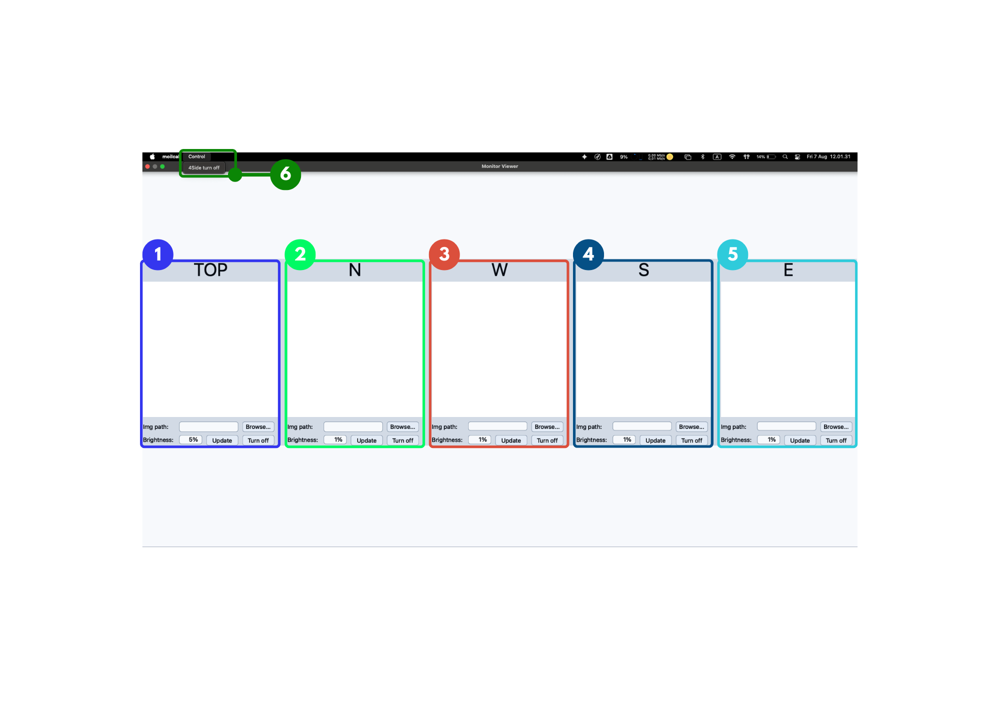
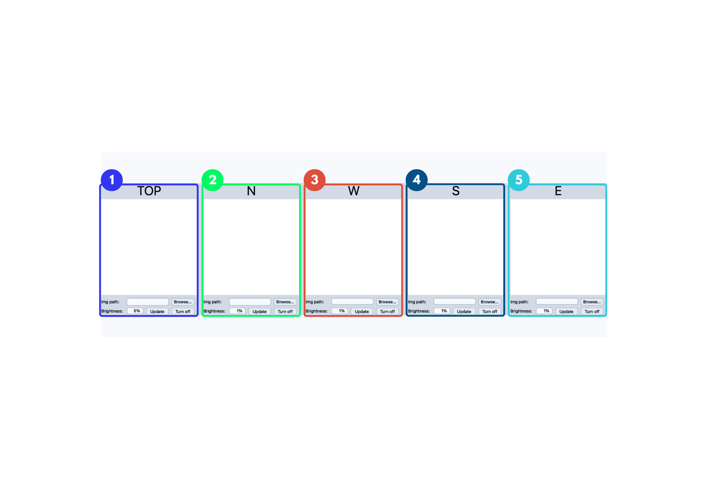
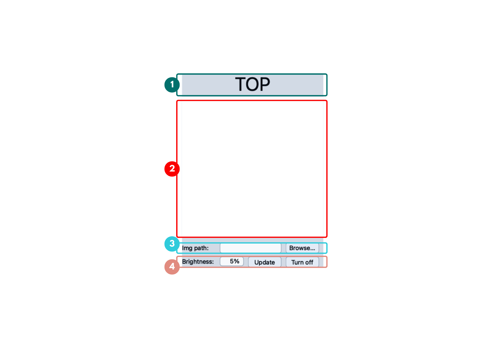
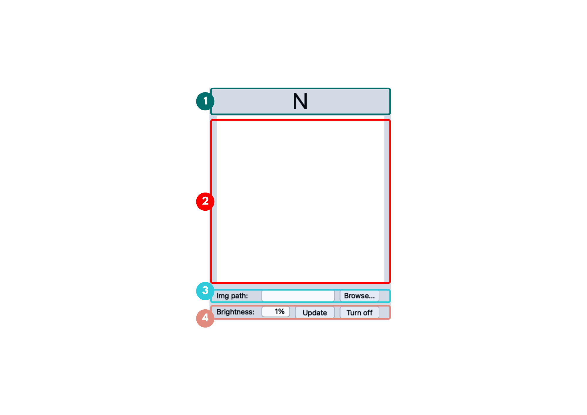
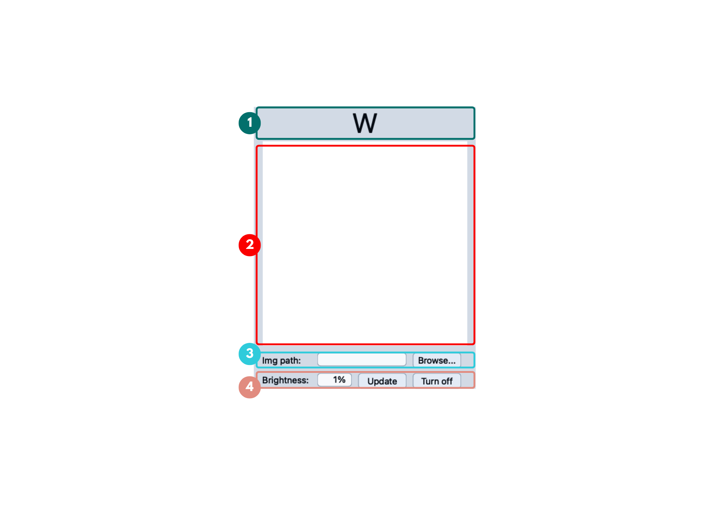
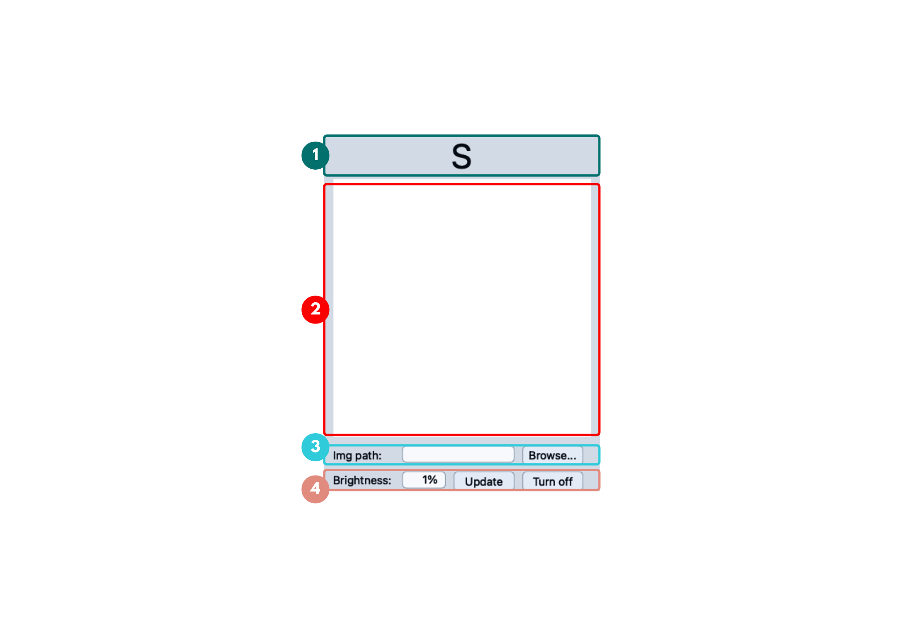
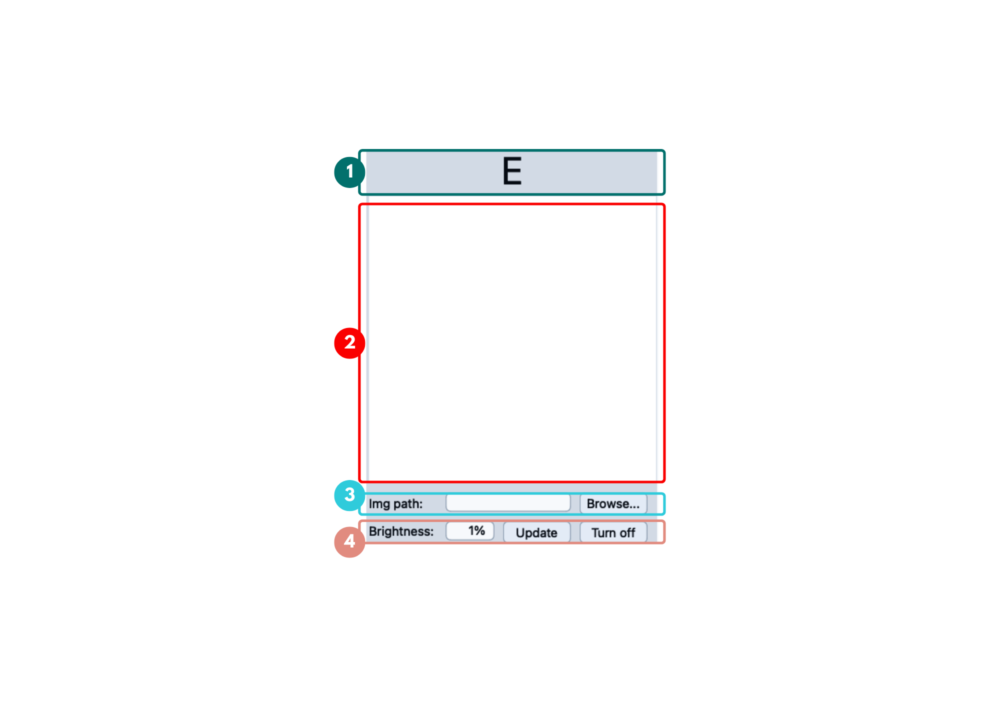

# Monitor Viewer

The **Monitor Viewer** window is used to manage calibration pattern images displayed on the monitor setup. It provides five monitor sections: **TOP**, **N**, **W**, **S**, and **E**. Each section has its own preview area, image path field, browse button, brightness setting, update button, and turn-off button.

This window is normally used together with the **PCT Pattern Generator**. The Pattern Generator creates the calibration images, while the Monitor Viewer loads and displays those images on the correct monitor direction.

---

## 1. Monitor Viewer Overview

<Figure id="fig-1" number="1" caption="Monitor Viewer main window overview.">



</Figure>

The Monitor Viewer contains five display panels arranged from left to right, plus a **Control** menu in the menu bar.

| No. | Area | Purpose |
|---:|---|---|
| 1 | **TOP** | Displays the pattern for the top monitor. This area commonly uses the concentric pattern. |
| 2 | **N** | Displays the pattern for the north monitor direction. |
| 3 | **W** | Displays the pattern for the west monitor direction. |
| 4 | **S** | Displays the pattern for the south monitor direction. |
| 5 | **E** | Displays the pattern for the east monitor direction. |
| 6 | **Control menu** | Contains the **4Side turn off** action, which turns off the four side monitors in one step. See [section 8.5](#85-4side-turn-off). |

The panels appear in the order **TOP**, **N**, **W**, **S**, **E** from left to right.
Note that this is not the same as compass order, so read the direction header on each panel rather than relying on position alone.

When the window is first opened, every preview area is empty and every **Img path** field is blank.
The TOP panel starts at `5%` brightness while the four side panels start at `1%`.

<div className="custom-note custom-important">
  <div className="custom-note-title">Main Goal</div>
  <p>The main goal of the Monitor Viewer is to make sure every calibration pattern is sent to the correct monitor direction before calibration images are captured.</p>
</div>

---

## 2. Common Panel Layout

All five monitor panels use exactly the same layout.
Only the direction header and the brightness value differ between them.

<Figure id="fig-2" number="2" caption="The five monitor panels side by side, showing the shared panel structure.">



</Figure>

Each direction panel contains four stacked areas, numbered **1** to **4** in the per-direction figures that follow.

| No. | Area | Function |
|---:|---|---|
| 1 | **Direction Header** | Shows the monitor direction this panel controls: `TOP`, `N`, `W`, `S`, or `E`. |
| 2 | **Image Preview Area** | Displays the selected calibration image before or after it is sent to the monitor. It is empty until an image is chosen. |
| 3 | **Img path and Browse...** | Shows the selected image file path and opens a file dialog to choose the image. |
| 4 | **Brightness / Update / Turn off** | Sets the brightness percentage, sends the image to the monitor, or turns off that monitor output. |

Because the layout is identical everywhere, the sections below repeat the same four areas for each direction.
The only value worth checking per direction is the brightness percentage.

---

## 3. TOP Monitor Panel

<Figure id="fig-3" number="3" caption="TOP monitor panel.">



</Figure>

The **TOP** panel is the leftmost panel and controls the top monitor.
In the calibration setup, this panel is commonly used to show the central concentric pattern.

| No. | Component | Function |
|---:|---|---|
| 1 | **TOP header** | Indicates that this panel controls the top monitor section. |
| 2 | **Preview area** | Shows the selected TOP calibration image. |
| 3 | **Img path / Browse...** | Shows the selected image path and opens a file dialog to choose an image for the TOP monitor. |
| 4 | **Brightness / Update / Turn off** | Sets the brightness percentage, sends the image to the top monitor, or turns that output off. |

The TOP panel defaults to `5%` brightness, which is higher than the four side panels.
The top monitor is normally further from the camera, so it needs more intensity to produce the same contrast in the captured image.

---

## 4. North Monitor Panel

<Figure id="fig-4" number="4" caption="North monitor panel.">



</Figure>

The **N** panel is the second panel from the left and controls the north monitor direction.

| No. | Component | Function |
|---:|---|---|
| 1 | **N header** | Indicates that this panel controls the north monitor direction. |
| 2 | **Preview area** | Shows the selected image for the north monitor. |
| 3 | **Img path / Browse...** | Shows the selected image path and opens a file dialog to choose an image for the north monitor. |
| 4 | **Brightness / Update / Turn off** | Sets the brightness percentage, sends the image to the north monitor, or turns that output off. |

The N panel defaults to `1%` brightness.

---

## 5. West Monitor Panel

<Figure id="fig-5" number="5" caption="West monitor panel.">



</Figure>

The **W** panel is the middle panel and controls the west monitor direction.

| No. | Component | Function |
|---:|---|---|
| 1 | **W header** | Indicates that this panel controls the west monitor direction. |
| 2 | **Preview area** | Shows the selected image for the west monitor. |
| 3 | **Img path / Browse...** | Shows the selected image path and opens a file dialog to choose an image for the west monitor. |
| 4 | **Brightness / Update / Turn off** | Sets the brightness percentage, sends the image to the west monitor, or turns that output off. |

The W panel defaults to `1%` brightness.

---

## 6. South Monitor Panel

<Figure id="fig-6" number="6" caption="South monitor panel.">



</Figure>

The **S** panel is the fourth panel from the left and controls the south monitor direction.

| No. | Component | Function |
|---:|---|---|
| 1 | **S header** | Indicates that this panel controls the south monitor direction. |
| 2 | **Preview area** | Shows the selected image for the south monitor. |
| 3 | **Img path / Browse...** | Shows the selected image path and opens a file dialog to choose an image for the south monitor. |
| 4 | **Brightness / Update / Turn off** | Sets the brightness percentage, sends the image to the south monitor, or turns that output off. |

The S panel defaults to `1%` brightness.

---

## 7. East Monitor Panel

<Figure id="fig-7" number="7" caption="East monitor panel.">



</Figure>

The **E** panel is the rightmost panel and controls the east monitor direction.

| No. | Component | Function |
|---:|---|---|
| 1 | **E header** | Indicates that this panel controls the east monitor direction. |
| 2 | **Preview area** | Shows the selected image for the east monitor. |
| 3 | **Img path / Browse...** | Shows the selected image path and opens a file dialog to choose an image for the east monitor. |
| 4 | **Brightness / Update / Turn off** | Sets the brightness percentage, sends the image to the east monitor, or turns that output off. |

The E panel defaults to `1%` brightness.

---

## 8. Main Functions

### 8.1 Browse Image

The **Browse...** button is used to select a calibration image from the computer. After an image is selected, its path is shown in the **Img path** field.

Typical usage:

```text
Click Browse...
   ↓
Select calibration pattern image
   ↓
Image path appears in Img path field
   ↓
Preview area shows the selected image
```

### 8.2 Update Monitor Display

The **Update** button sends or refreshes the selected image for that monitor direction.

Typical usage:

```text
Select image file
   ↓
Set brightness value
   ↓
Click Update
   ↓
Monitor displays the selected pattern
```

### 8.3 Brightness Control

The **Brightness** field controls the monitor brightness percentage for each direction. In the UI examples, most side directions use `1%`, while the TOP direction can use a different value such as `5%`.

| Brightness Value | Meaning |
|---|---|
| Low value, for example `1%` | Reduces display intensity and may help avoid overexposure. |
| Higher value, for example `5%` | Increases display intensity and may help if the pattern is too dark. |

<div className="custom-note custom-tip">
  <div className="custom-note-title">Brightness Tip</div>
  <p>Use the lowest brightness that still gives clear black-white pattern contrast in the captured fisheye image. Too much brightness can make the pattern overexposed and reduce calibration accuracy.</p>
</div>

### 8.4 Turn Off Monitor

The **Turn off** button disables the selected monitor output. This is useful when testing one monitor direction at a time or when stopping the pattern display after calibration capture.

Each panel has its own **Turn off** button, so this affects one direction only.

### 8.5 4Side Turn Off

The **Control** menu in the menu bar contains a single action, **4Side turn off**.
It is marked as area **6** in [Figure 1](#fig-1).

This action turns off the four side monitors, **N**, **W**, **S**, and **E**, in one step, instead of clicking four separate **Turn off** buttons.

| Action | Scope |
|---|---|
| **Turn off** button on a panel | Turns off that one direction. |
| **Control → 4Side turn off** | Turns off the four side directions together. |

<div className="custom-note custom-tip">
  <div className="custom-note-title">Isolating the TOP Monitor</div>
  <p>Use <strong>4Side turn off</strong> when you want to check the TOP concentric pattern on its own. Clearing the four side patterns in one step makes it easier to confirm that the concentric pattern is centered before the side stripline patterns are added back.</p>
</div>

---

## 9. Pattern Display Workflow

Use the following workflow when preparing the monitor display for calibration.

```text
Open Monitor Viewer
   ↓
Select image for TOP, N, W, S, and E
   ↓
Set brightness for each monitor section
   ↓
Click Update for each section
   ↓
Check that all monitor patterns are visible
   ↓
Capture calibration image from the fisheye camera
```

Recommended order:

1. Open **PCT Pattern Generator** and generate the needed pattern images.
2. Open **Monitor Viewer**.
3. Use **Browse...** to select the correct image for each direction.
4. Set brightness values.
5. Click **Update** for each direction.
6. Confirm the patterns are displayed correctly on the physical monitors.
7. Capture the calibration image from the main camera window.

---

## 10. Integration with PCT Pattern Generator

The Monitor Viewer is closely related to the PCT Pattern Generator.

| Window | Role |
|---|---|
| **PCT Pattern Generator** | Creates and saves pattern images such as concentric and stripline patterns. |
| **Monitor Viewer** | Loads those generated pattern images and displays them on the correct monitor direction. |
| **Main Window** | Captures the positive or negative calibration image after the patterns are displayed. |

A common calibration setup is:

| Monitor Direction | Common Pattern Type |
|---|---|
| **TOP** | Concentric pattern. |
| **N** | Stripline pattern. |
| **W** | Stripline pattern. |
| **S** | Stripline pattern. |
| **E** | Stripline pattern. |

<div className="custom-note custom-important">
  <div className="custom-note-title">Important</div>
  <p>The selected pattern image must match the physical monitor direction. If the wrong image is sent to the wrong direction, the captured calibration image may not match the expected pattern layout.</p>
</div>

---

## 11. Technical Notes

| Item | Description |
|---|---|
| **Monitor sections** | TOP, N, W, S, and E. |
| **Image source** | Pattern images generated by the PCT Pattern Generator or selected manually from local files. |
| **Image path field** | Stores the selected image location for each direction. |
| **Preview area** | Shows the selected image before display update. |
| **Brightness value** | Controls display intensity for each monitor section. |
| **Update action** | Sends the selected image to the monitor output. |
| **Turn off action** | Disables the selected monitor output. |
| **Panel order** | Left to right: TOP, N, W, S, E. |
| **Default brightness** | `5%` for TOP, `1%` for N, W, S, and E. |
| **Control menu** | Provides **4Side turn off**, which disables the N, W, S, and E outputs together. |

---

## 12. Troubleshooting

| Problem | Possible Cause | Solution |
|---|---|---|
| Preview image does not appear | Image path is empty or invalid. | Click **Browse...** again and select a valid image file. |
| Monitor does not update | Monitor server connection is not active. | Check the Monitor URL in the Main Window and reconnect. |
| Wrong pattern appears on monitor | Image was selected for the wrong direction. | Recheck TOP, N, W, S, and E image paths. |
| Pattern is too bright | Brightness value is too high. | Reduce the brightness value and click **Update** again. |
| Pattern is too dark | Brightness value is too low. | Increase the brightness value gradually and click **Update** again. |
| Calibration result looks unstable | Pattern direction or brightness may be incorrect. | Verify monitor direction, pattern visibility, and captured fisheye image quality. |
| All four side monitors went dark at once | **Control → 4Side turn off** was used. | Reselect the image for each side direction and click **Update** on each panel. |
| Pattern went to the wrong side monitor | The panels are ordered TOP, N, W, S, E, which is not compass order. | Read the direction header on the panel instead of counting panel positions. |

---

## Summary

The **Monitor Viewer** controls the display of calibration pattern images across five monitor directions: **TOP**, **N**, **W**, **S**, and **E**.
Each direction has its own preview, image path, browse button, brightness setting, update button, and turn-off button, and every panel uses the same four-area layout.
The **Control** menu adds a **4Side turn off** action for clearing the four side monitors together.
This window should be used after generating patterns in the PCT Pattern Generator and before capturing calibration images in the main calibration workflow.