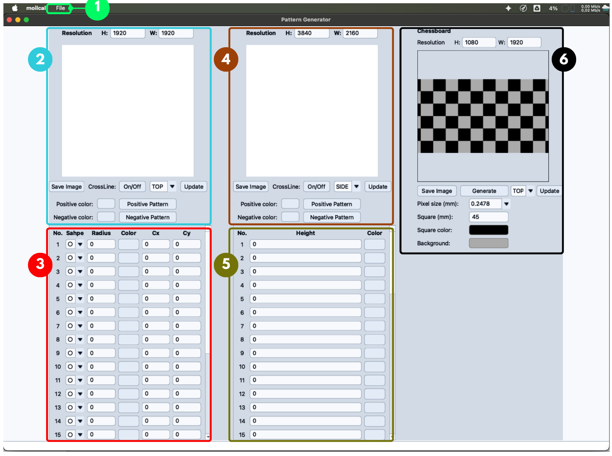
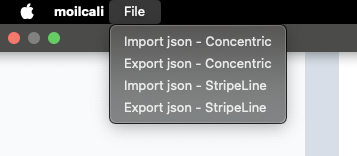
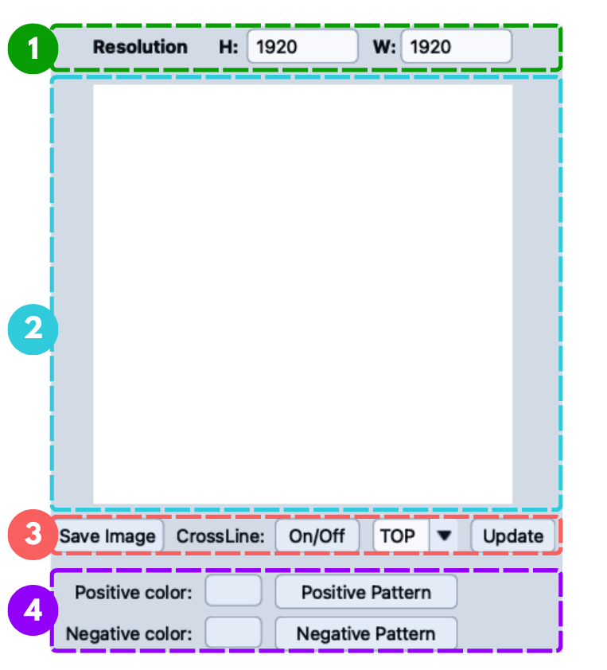
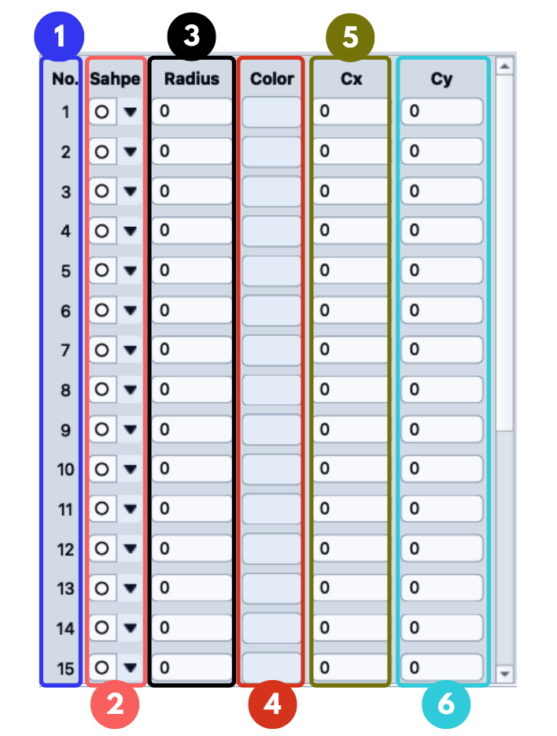
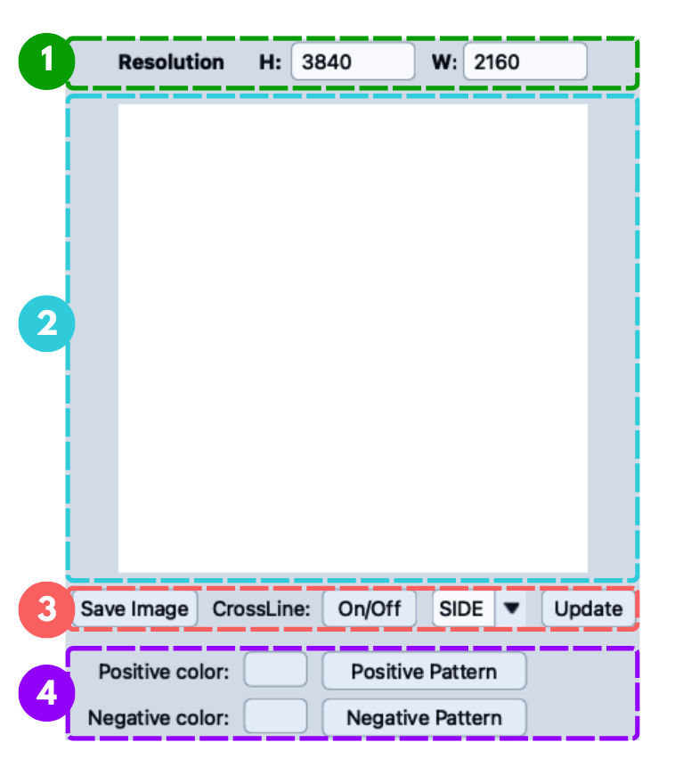
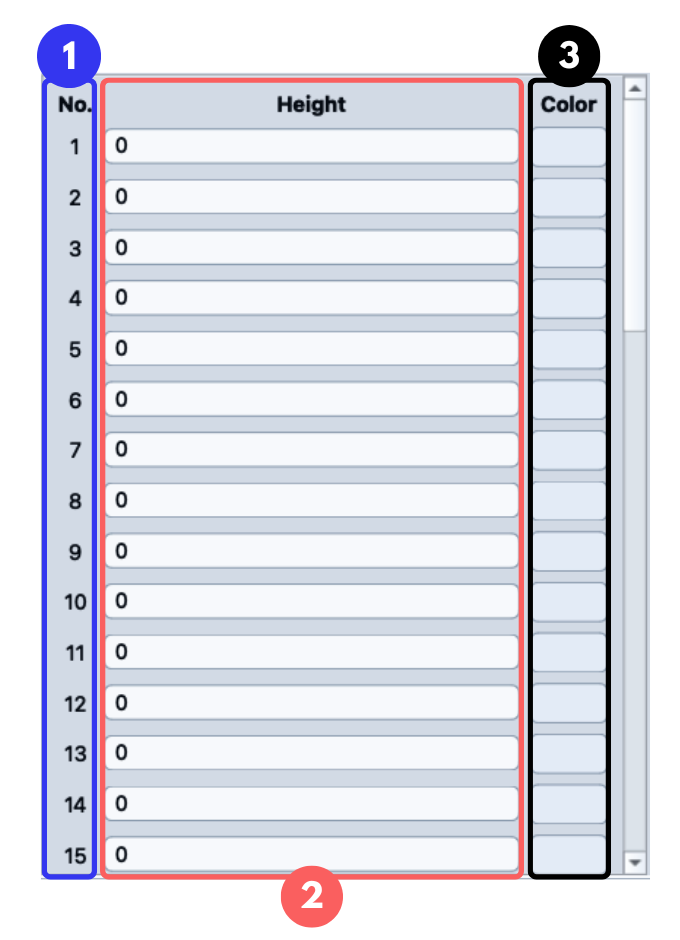
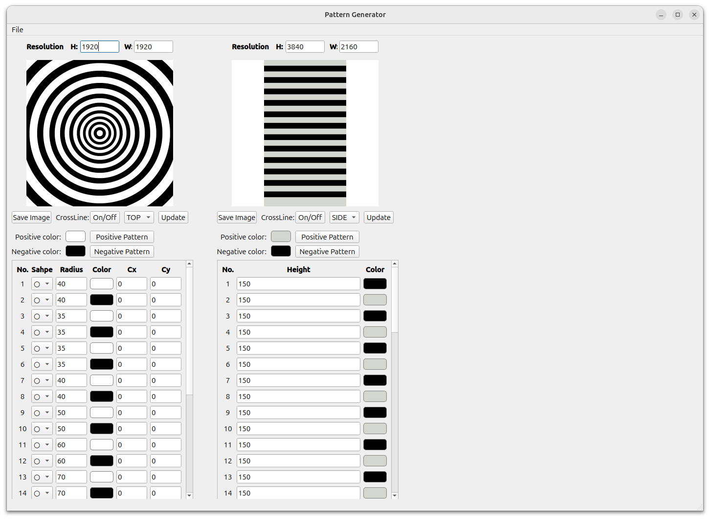

# PCT Pattern Generator

The **PCT Pattern Generator** is where you create, preview, edit, import, export, and send calibration patterns to the monitor viewer.
It manages three pattern types: **Concentric** (circular layers), **Stripline** (horizontal or vertical stripes), and **Chessboard** (a square grid used for standard camera calibration).
Concentric and stripline patterns are stored as JSON and are reused later by the calibration result window as PCT reference data.
The chessboard pattern does not feed into PCT calibration.

---

## 1. Window Overview

<Figure id="fig-1" number="1" caption="PCT Pattern Generator main window overview.">

</Figure>

The window is divided into six main areas.

| No. | Area | Purpose |
|---:|---|---|
| 1 | **File Menu** | Imports and exports pattern JSON files for concentric and stripline patterns. |
| 2 | **Concentric Preview & Controls** | Sets resolution, previews the pattern, picks the monitor direction, saves the image, toggles crossline, and applies pattern colors. |
| 3 | **Concentric Table** | Configures each concentric layer: shape, radius, color, and center position. |
| 4 | **Stripline Preview & Controls** | The same set of controls as the concentric area, applied to the stripline pattern. |
| 5 | **Stripline Table** | Configures each stripline layer: height and color. |
| 6 | **Chessboard Generator** | Sets resolution, physical pixel and square size, colors, and generates a square grid pattern for camera calibration. |

When the window first opens, both previews are empty and every layer value is `0`.
Fill in the layer values and press **Update** to see the pattern.
Getting these values right matters: the concentric radius values and stripline interval values become the PCT data used later in the calibration result calculation.

---

## 2. File Menu

Use the **File** menu to import and export pattern JSON files.

| Menu Action | Description |
|---|---|
| **Import JSON Concentric** | Loads a concentric JSON file, fills in the UI fields, and updates the preview. |
| **Export JSON Concentric** | Saves the current concentric configuration to a `.json` file. |
| **Import JSON Stripline** | Loads a stripline JSON file, fills in the UI fields, and updates the preview. |
| **Export JSON Stripline** | Saves the current stripline configuration to a `.json` file. |

Importing a file updates the resolution fields, the positive and negative color buttons, the crossline state, and every layer value and color.
Concentric and stripline files are different pattern types, so use the import action that matches: a stripline file imported through the concentric action, or the reverse, will not load correctly.

---

## 3. Concentric Pattern

<Figure id="fig-2" number="2" caption="Concentric Pattern Preview & Control area.">

</Figure>

**Resolution (H / W)** sets the pattern's height and width in pixels.
The concentric pattern is normally square, for example `1920 × 1920`.
Editing either field redraws the preview.

The **preview area** shows the pattern rendered from the current layer values, and is written to the calibration image folder each time it updates.

| Control | Description |
|---|---|
| **Save Image** | Saves the current pattern image. |
| **CrossLine: On/Off** | Shows or hides a crossline overlay, useful for checking alignment and center position. |
| **Direction combo box** | Selects which monitor direction (TOP, SIDE, etc.) this pattern belongs to. |
| **Update** | Re-renders the pattern and sends the selected direction to the connected monitor viewer. |

**Positive color** and **Negative color** open a color picker.
**Positive Pattern** applies the positive color to odd layers and the negative color to even layers; **Negative Pattern** swaps the two colors first.
This alternating fill applies across all 25 concentric layers.

### 3.1 Layer Table

<Figure id="fig-3" number="3" caption="Concentric Pattern Table.">

</Figure>

The table configures each of the pattern's 25 layers.
The list scrolls, so not all layers are visible at once.

| Column | Description |
|---|---|
| **Shape** | Circle (the usual choice) or square. |
| **Radius** | The layer's size. Larger values produce a larger ring. This is the value that later becomes concentric PCT data. |
| **Color** | Opens a color picker for that layer, for full manual control instead of Positive/Negative Pattern. |
| **Cx / Cy** | The layer's center X and Y position. Leave at `0` to use the pattern's default center. |

---

## 4. Stripline Pattern

<Figure id="fig-4" number="4" caption="Stripline Pattern Preview & Control area.">

</Figure>

The stripline preview and controls mirror the concentric ones above.
**Resolution (H / W)** is commonly set wider for a side monitor, for example `3840 × 2160`.
**Save Image**, **CrossLine**, the direction combo box, and **Update** all behave the same way as their concentric counterparts.
**Positive Pattern** and **Negative Pattern** apply alternating colors across all 50 stripline layers.

### 4.1 Layer Table

<Figure id="fig-5" number="5" caption="Stripline Pattern Table.">

</Figure>

The table configures each of the pattern's 50 stripe layers.
The list scrolls, so not all layers are visible at once.

| Column | Description |
|---|---|
| **Height** | The stripe's height/spacing. This becomes stripline PCT data. The UI calls this **Height**, but it is stored internally as `interval` — the same value under two different names. |
| **Color** | Opens a color picker for that layer. |

---

## 5. Chessboard Pattern

The **Chessboard** panel is area **6** in [Figure 1](#fig-1).
It generates a black-and-white square grid for standard camera calibration, not for PCT calibration.
Unlike the other two patterns, it is not built from a layer table or stored as JSON.

| Control | Description |
|---|---|
| **Resolution H / W** | The chessboard image size in pixels, for example `H = 1080`, `W = 1920`. |
| **Pixel size (mm)** | The physical size of one monitor pixel, for example `0.2478`. |
| **Square (mm)** | The physical size of one chessboard square, for example `45`. |
| **Square color / Background** | Colors for the filled squares and the surrounding area (default black and grey). |
| **Generate** | Redraws the preview from the current field values. |
| **Update** | Sends the generated pattern to the monitor for the selected direction. |
| **Save Image** | Saves the current chessboard image. |

The chessboard is defined in real-world millimeters, not pixels.
The generator converts the square size to pixels using the pixel size: `square size in pixels = Square (mm) / Pixel size (mm)`.
For the example values above, `45 / 0.2478 ≈ 182` pixels per square.
Because of this, the **Pixel size (mm)** value must match the actual monitor that will display the pattern.
An incorrect value produces squares of the wrong physical size and throws off the camera calibration.

**Generate** only redraws the preview inside this window; the pattern isn't sent to the monitor until you click **Update**.

---

## 6. Generated Pattern Example

<Figure id="fig-6" number="6" caption="Example after concentric and stripline values are filled and rendered.">

</Figure>

Once the concentric and stripline tables are filled in and updated, the concentric pattern renders on the left and the stripline pattern on the right, using whatever colors were applied through the positive/negative buttons.

After the pattern is sent to the monitor and captured by the fisheye camera, the concentric pattern appears at the center of the captured image, with the stripline patterns along the top, bottom, left, and right sides.

<Figure id="fig-7" number="7" caption="Captured positive pattern: concentric pattern at the center and stripline patterns at the four sides.">

</Figure>

<Figure id="fig-8" number="8" caption="Captured negative pattern: same layout as the positive pattern with inverted colors.">

</Figure>

The positive and negative captures are used together in the calibration process to detect intersection points (ICT) and extract calibration data.

---

## 7. Relationship with Calibration Result

The Pattern Generator isn't only a drawing tool; its values feed directly into the calibration result calculation.
The calibration result window reads the 25 concentric radius values and the 50 stripline interval values, for 75 PCT values in total, and uses them to calculate PCT calibration, alpha, ZFL, and aggregation results.
If any radius or height/interval value is wrong, those downstream results will be wrong too, so double-check the tables before capturing calibration images.

Rendered pattern images are saved to the calibration image folder using the selected direction, for example `image_cali/pattern_circle_top.png`.
Both concentric and stripline output currently use this same `pattern_circle_{direction}` naming pattern, so when checking generated files, confirm both the pattern type and the direction you selected.

---

## Recommended Workflow

### Create a Concentric Pattern

1. Open **PCT Pattern Generator**.
2. Set the concentric resolution, usually `1920 × 1920`.
3. Fill in the **Radius** values in the concentric table.
4. Select each layer's shape if needed.
5. Choose positive and negative colors, then click **Positive Pattern** or **Negative Pattern**.
6. Select the monitor direction, for example **TOP**.
7. Click **Update** and check the preview.
8. Export the JSON if the configuration needs to be reused later.

### Create a Stripline Pattern

1. Set the stripline resolution, for example `3840 × 2160`.
2. Fill in the **Height** values in the stripline table.
3. Choose positive and negative colors, then click **Positive Pattern** or **Negative Pattern**.
4. Select the monitor direction, for example **SIDE**.
5. Click **Update** and check the preview.
6. Export the JSON if the configuration needs to be reused later.

### Create a Chessboard Pattern

1. Set the chessboard resolution to match the target monitor, for example `1920 × 1080`.
2. Enter the monitor's **Pixel size (mm)**.
3. Enter the **Square (mm)** size you want.
4. Adjust **Square color** and **Background** if the defaults don't suit.
5. Click **Generate** and check the preview.
6. Select the monitor direction, for example **TOP**, then click **Update**.
7. Click **Save Image** if you need to keep the pattern file.

### Use an Imported JSON

1. Open the **File** menu and choose the import action that matches your pattern type.
2. Confirm the preview updates, and check the resolution, colors, and layer values.
3. Click **Update** to send the pattern to the monitor viewer.

---

## Troubleshooting

| Problem | Possible Cause | Solution |
|---|---|---|
| Pattern preview does not change | The edited field wasn't confirmed yet. | Press Enter or click outside the field. |
| Imported JSON does not load | Wrong JSON type, or an invalid file. | Use the import action that matches the pattern type. |
| Pattern colors are swapped | Positive and negative colors were reversed. | Click the opposite pattern button, or set layer colors manually. |
| Stripline table says Height but the JSON says interval | This is expected; they are the same value under two names. | Treat Height and interval as the same parameter. |
| Monitor does not update | The direction wasn't sent, or the monitor viewer isn't connected. | Select the correct direction and click Update again. |
| Calibration result PCT values look wrong | A radius or stripline height/interval value is incorrect. | Recheck every concentric and stripline value before updating. |
| Preview is empty when the window opens | All layer values default to `0`. | Fill in the radius or height values, then click Update. |
| Chessboard squares are the wrong physical size | The Pixel size (mm) doesn't match the monitor in use. | Enter the correct pixel size, then click Generate again. |
| Chessboard preview didn't change | Generate wasn't clicked after editing the fields. | Click Generate, then Update to send it to the monitor. |

---

## Summary

The **PCT Pattern Generator** manages three calibration pattern types: concentric, stripline, and chessboard.
Concentric uses up to 25 radius-based layers and stripline uses up to 50 height/interval layers; both feed PCT data into the calibration result calculation.
The chessboard pattern is defined by resolution, physical pixel size, and square size instead of a layer table, and is used for standard camera calibration rather than PCT calibration.
