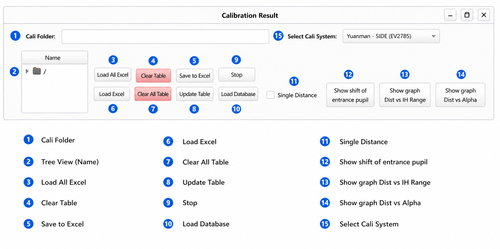
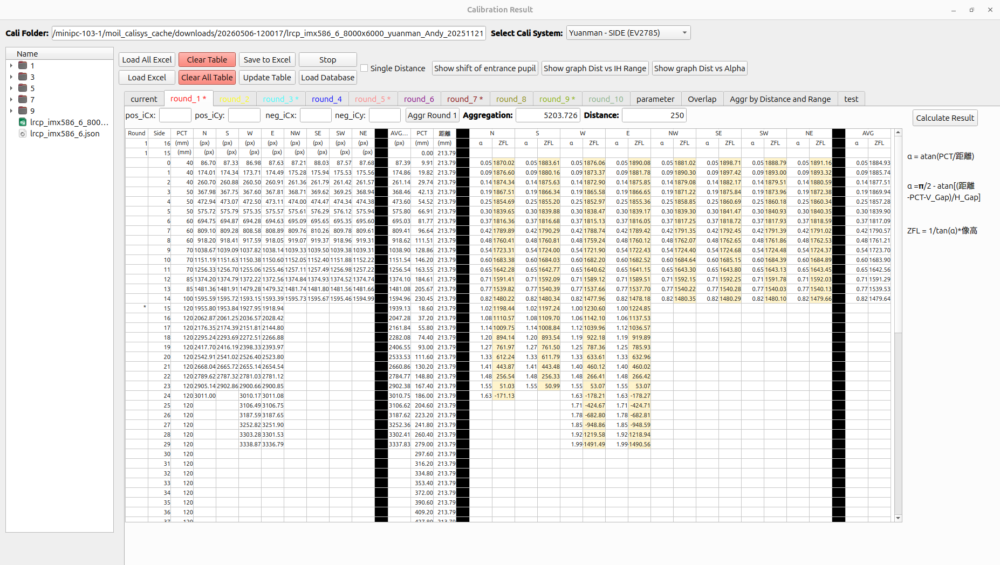

# Reload Calibration Data

This page describes how to bring **previously saved calibration data** back into the **Moil Cali Result** window — so you can re-analyse a set without repeating the capture run.

<div className="custom-note custom-important">
  <div className="custom-note-title">📖 WHAT THIS PAGE IS</div>
  <div>
    This is the <strong>procedure</strong> for loading saved data. For what each button and field in the Cali Result window does, see <a href="/moilcalib_documentation/docs/v1.1/calibration/cali-result">3. Calibration Result</a> and its <a href="/moilcalib_documentation/docs/v1.1/calibration/cali-result/main-window-overview">full window reference</a>.
  </div>
</div>

---

## When You Need This

| Situation | What to load |
|---|---|
| Re-analysing a finished calibration set | The whole main folder → **Load All Excel** |
| Fixing or replacing one round | That round's `.xlsx` → **Load Excel** |
| Comparing an old set with a new one | Load one, note the values, load the other |
| Continuing work after closing the application | The whole main folder → **Load All Excel** |
| Looking up which calibrations exist | **Load Database** (metadata only — see below) |

<div className="center">

<a id="fig-1"></a>



<p><em><a href="#fig-1"><strong>Figure 1.</strong></a> The Header & Data Management area — every load control lives here.</em></p>

</div>

---

## Expected Folder Layout

**Load All Excel** only finds your data if the folder is arranged like this:

```text
<main folder>/
  main.json              ← systemType + distance_per_round (optional)
  1/   <anything>.xlsx   ← round 1
  2/   <anything>.xlsx   ← round 2
  3/   <anything>.xlsx
  …
  10/  <anything>.xlsx   ← round 10
```

| Rule | Detail |
|---|---|
| **Subfolder names** | Must be the plain round numbers `1` … `10`. |
| **File names** | Free — the **first** `.xlsx` in each round folder is used. |
| **Missing rounds** | Simply skipped; only the rounds that exist are loaded. |
| **Selected level** | Select the **main folder**, not a round subfolder. |

<div className="custom-note custom-warning">
  <div className="custom-note-title">⚠️ THE MOST COMMON MISTAKE</div>
  <div>
    Selecting a round subfolder (or the folder that <em>contains</em> the main folder) instead of the main folder itself. When nothing matches, the application reports <em>"No round subfolders (1..10) with .xlsx found in: …"</em> — check the level you picked before anything else.
  </div>
</div>

---

## 1. Load a Complete Set — Load All Excel

This is the normal path.

1. Open **Moil Cali Result** from the main window.
2. Press **Load All Excel**.
3. Select the **main calibration folder** (the one containing the numbered round folders).
4. Wait for the tables to fill.

What happens for each round `1`…`10`:

```text
Open <main folder>/<round>/
   ↓
Read the first .xlsx found there
   ↓
Locate the header row — the row containing a cell "pct" or "(mm)"
   ↓
Load every non-empty row below it (columns round … ict_ne)
   ↓
Mark that round's tab with a star
   ↓
(after all rounds) Recompute everything, then apply main.json
```

<div className="custom-note custom-tip">
  <div className="custom-note-title">💡 THE STAR MARKERS TELL YOU WHAT LOADED</div>
  <div>
    Only the round tabs that actually received data are starred. Stars from a previous load are cleared first, so what you see always reflects the current load. If a round you expected is unstarred, its folder was missing, empty, or had no recognisable header row.
  </div>
</div>

<div className="center">

<a id="fig-2"></a>



<p><em><a href="#fig-2"><strong>Figure 2.</strong></a> The window after a successful load — round tabs and the result table filled.</em></p>

</div>

---

## 2. Load a Single Round — Load Excel

Use this to replace one round without touching the others.

1. **Select the round tab first** — the file is loaded into whichever tab is currently active.
2. Press **Load Excel** and choose the `.xlsx`.
3. The current table is cleared, then filled from the file.

The file is read from a sheet named `Sheet`; if that sheet does not exist, the first sheet in the workbook is used. Data is taken from **row 3 onward, columns A–K** (`round` … `ict_ne`).

<div className="custom-note custom-warning">
  <div className="custom-note-title">⚠️ SINGLE-FILE LOAD DOES NOT APPLY <code>main.json</code></div>
  <div>
    <strong>Type of System</strong> and <strong>Distance per Round</strong> are only restored by <strong>Load All Excel</strong>. After a single-file load, check those two fields yourself.
  </div>
</div>

---

## 3. Load from the Folder Tree

Once a folder is loaded, the tree view lets you re-load without going through the dialogs again:

| Action | Result |
|---|---|
| **Double-click an `.xlsx`** in the tree | Loads it into the round guessed from its path. |
| **Double-click a folder** in the tree | Loads all rounds from that folder, as if you had pressed **Load All Excel**. |
| **Type a path** into the **Cali Folder** field and press Enter | A folder loads all rounds; a single `.xlsx` loads into its guessed round. |

### How the Round Number Is Guessed

When you load a file directly rather than through **Load All Excel**, the round is taken from the path in this order:

1. A number `1`–`10` in the **file name**.
2. Otherwise, a path segment that is a number `1`–`10` (for example `.../3/result.xlsx` → round 3).
3. Otherwise, **round 1**.

<div className="custom-note custom-tip">
  <div className="custom-note-title">💡 IF A FILE LANDS IN THE WRONG ROUND</div>
  <div>
    The guess follows the path, not the file's contents. Either place the file in its numbered round folder, or select the correct round tab and use <strong>Load Excel</strong>, which always loads into the active tab.
  </div>
</div>

<div className="custom-note custom-warning">
  <div className="custom-note-title">⚠️ CLOUD LINKS ARE NOT SUPPORTED IN THIS BUILD</div>
  <div>
    Entering an <code>http://</code> or <code>https://</code> address into the <strong>Cali Folder</strong> field returns <em>"Remote (cloud) links are not supported in this build. Enter a local folder or .xlsx path."</em> Download the calibration folder to the local disk first, then load it.
  </div>
</div>

---

## 4. What `main.json` Restores

If a `main.json` sits in the main folder, **Load All Excel** applies it after loading the rounds:

| Key | Restores |
|---|---|
| `systemType` | The **Type of System** selection. |
| `distance_per_round` | The **Distance per Round** value. |

If the file is missing, the rounds still load — only these two settings are left as they were. `main.json` is written by **Save Configuration System**.

---

## 5. Load Database

**Load Database** opens the calibration record browser over `cali_system_v2.db`. The application looks for the file in this order, and asks you to locate it if none is found:

```text
mvc_controller/database/cali_system_v2.db
database/cali_system_v2.db
cali_system_v2.db
```

<div className="custom-note custom-important">
  <div className="custom-note-title">📌 THE DATABASE IS METADATA-ONLY</div>
  <div>
    The database stores <strong>references</strong> to calibration files rather than the round values themselves — the actual round data lives in cloud storage. You can browse and search the records here, but you <strong>cannot load rounds from the database</strong> in this build. To re-analyse a set, obtain its folder and use <strong>Load All Excel</strong>.
  </div>
</div>

---

## 6. Verify the Loaded Data

Work down this list before trusting the results:

| Check | Where |
|---|---|
| The expected round tabs are **starred** | Round tab bar |
| Each round table has values, not blanks | [Result Table View](/moilcalib_documentation/docs/v1.1/calibration/cali-result/result-table-view) |
| **Type of System** and **Distance per Round** are correct | Header area |
| Camera parameters look sane | [Parameter View](/moilcalib_documentation/docs/v1.1/calibration/cali-result/parameter-view) |
| The graphs redrew and are not empty | [Overlap & Aggregation View](/moilcalib_documentation/docs/v1.1/calibration/cali-result/overlap-and-aggregation-view) |

<div className="custom-note custom-tip">
  <div className="custom-note-title">💡 RECOMPUTING IS AUTOMATIC IN VERSION 1.1</div>
  <div>
    Both <strong>Load Excel</strong> and <strong>Load All Excel</strong> run the full recompute themselves as their last step, so the tables and graphs are already up to date when the load finishes. You only need <strong>Update All Cali Result</strong> after editing values by hand.
  </div>
</div>

---

## Saving, So You Can Reload Later

Reloading only works if the data was saved in the layout above.

| Button | Writes |
|---|---|
| **Save to Excel** | The **current round tab** — 2 header rows plus 75 layer rows, columns `round` … `ict_ne`. Save it into that round's numbered folder. |
| **Save Configuration System** | `main.json` — `systemType` and `distance_per_round`. |
| **Save Parameter** | The camera parameters. |
| **Save History Distance** | The distance history entry. |

<div className="custom-note custom-important">
  <div className="custom-note-title">📌 SAVE ONE ROUND AT A TIME</div>
  <div>
    <strong>Save to Excel</strong> writes only the round tab that is currently open. To store a complete set, select each round tab in turn and save it into its own numbered folder.
  </div>
</div>

---

## Troubleshooting

| Problem | Cause | Solution |
|---|---|---|
| *"No round subfolders (1..10) with .xlsx found"* | The selected folder is not the main folder, or the subfolders are not named `1`–`10`. | Select the folder that directly contains the numbered round folders, and check the folder names. |
| *"No data read (is this a Calibration Result file?)"* | The workbook has no `Sheet` sheet and the first sheet is empty or not a calibration result. | Confirm the file was produced by **Save to Excel**, and that it is not empty or corrupted. |
| A round loads empty although the file exists | No header row was found — no cell equal to `pct` or `(mm)`. | Open the file and confirm the header row is intact; re-save it with **Save to Excel** if needed. |
| The file loaded into the wrong round | The round is guessed from the path. | Put the file in its numbered folder, or select the round tab and use **Load Excel**. |
| **Type of System** / **Distance per Round** did not change | `main.json` is missing, or a single-file load was used. | Use **Load All Excel** on the main folder, or set the two fields manually. |
| A cloud link is rejected | Remote paths are not supported in this build. | Download the folder locally first. |
| The database window does not open | `cali_system_v2.db` was not found at any known location. | Locate the file manually in the dialog. |
| Records are visible but no rounds load from the database | Expected — the database is metadata-only. | Use **Load All Excel** with the calibration folder instead. |
| Graphs are still empty after loading | The rounds loaded, but the calculation inputs are incomplete. | Check the round tables and the parameter values, then press **Update All Cali Result**. |

---

## Summary

Calibration data is reloaded from **Excel files on disk**, not from the database. The normal path is **Load All Excel** on a main folder containing round subfolders `1`–`10`, which fills every round table, stars the tabs that received data, recomputes automatically, and applies `main.json`. **Load Excel** replaces a single round in the active tab. The folder tree and the **Cali Folder** field offer the same two operations for local paths, and **Load Database** is a metadata browser only.

---

_Screenshots on this page are reused from version 1.0 and will be replaced with version 1.1 captures._
