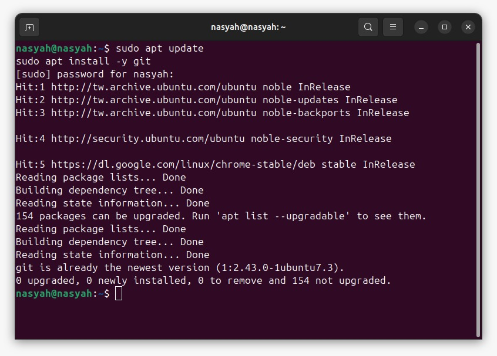
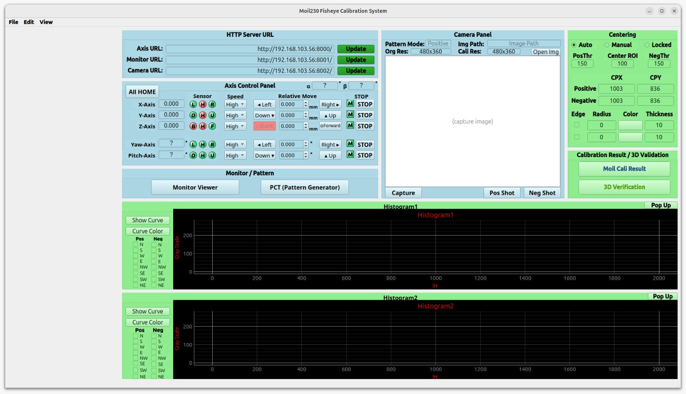

# Calibration System Client Installation Guide (C++ / Qt6)

This guide explains how to build and run the **Calibration System Client** for version 1.1. The client is the desktop calibration application, now written in **C++ / Qt6** (with OpenCV and Eigen) instead of Python / PyQt6. It talks to the axis, monitor, and camera HTTP servers.

Follow the section for **your platform** — Linux and Windows differ in the build layout, and mixing the two sets of paths is the most common source of errors.

---

<div className="custom-note custom-tip">
  <div className="custom-note-title">📷 ABOUT THE SCREENSHOTS</div>
  <div>
    The screenshots on this page are temporarily reused from the version 1.0 documentation. They are still accurate for the steps they illustrate (Git, cloning, submodules), but the application window will be replaced with a version 1.1 capture later.
  </div>
</div>

---

## Before You Start

Before beginning the installation, make sure you have the following:

| Requirement | Description |
|---|---|
| **Operating System** | Ubuntu 22.04 / 24.04 (or another recent Debian-based distribution), **or** Windows 10 / 11 with MSVC |
| **Internet Connection** | Required to install packages and clone the project repository |
| **GitHub Access** |  Required to download the project repository|
| **GitHub Username** | Used when GitHub asks for login |
| **Personal Access Token** | Used as the GitHub password during authentication |
| **Disk Space** | Roughly 5 GB for the toolchain, Qt, and OpenCV |

<div className="custom-note custom-important">
  <div className="custom-note-title">📌 READ FIRST</div>
  <div>
    Version 1.1 no longer uses Python, a virtual environment, or <code>requirements.client</code>. Everything is compiled with <strong>CMake</strong>. The application needs Qt6 <strong>Widgets, Network, SerialPort, Concurrent, Sql, and OpenGLWidgets</strong>, plus <strong>OpenCV</strong> and <strong>Eigen3</strong>. <code>CMakeLists.txt</code> only calls <code>find_package</code> — it never downloads anything, so every dependency must be installed <em>before</em> configuring.
  </div>
</div>

<div className="custom-note custom-warning">
  <div className="custom-note-title">⚠️ PLATFORM DIFFERENCE — READ THIS ONCE</div>
  <div>
    Linux uses a <strong>single-config</strong> generator, so the binary lands at <code>cpp/build/moilcali</code>. Windows uses the <strong>multi-config</strong> Visual Studio generator, so the binary lands at <code>cpp/build/<strong>Release</strong>/moilcali.exe</code>. There is no <code>cpp\build\moilcali.exe</code> on Windows. Do not mix the two paths.
  </div>
</div>

---

## 1. Install Git

Git is required to download the project from GitHub.

**Ubuntu / Debian** — open a terminal and run:

```bash
sudo apt update
sudo apt install -y git
```

<Figure id="fig-1" number="1" caption="Install Git.">



</Figure>

**Windows** — install Git with:

```powershell
winget install Git.Git
```

### 1.1 Check the Installation

Run:

```bash
git --version
```

If Git is installed correctly, the terminal will show the Git version.

---

## 2. Install the Build Dependencies (one-time)

This is the step that replaces "install Python 3.8.10" from version 1.0.

### 2.1 Ubuntu / Debian

```bash
sudo apt update
sudo apt install -y \
    build-essential cmake \
    qt6-base-dev qt6-base-dev-tools qt6-serialport-dev \
    libqt6sql6-sqlite \
    libopencv-dev libeigen3-dev
```

<div className="custom-note custom-tip">
  <div className="custom-note-title">💡 NOTE</div>
  <div>
    If <code>qt6-serialport-dev</code> is not found on your distribution, try <code>libqt6serialport6-dev</code> instead.
  </div>
</div>

### 2.2 Windows (MSVC)

Install each dependency below. The right-hand column is where the installer puts it — the build step later points CMake at exactly these locations.

| Dependency | How to install | Lands in |
|---|---|---|
| **CMake** | `winget install Kitware.CMake` | `C:\Program Files\CMake\bin` |
| **MSVC build tools** | `winget install Microsoft.VisualStudio.2022.BuildTools --override "--wait --passive --add Microsoft.VisualStudio.Workload.VCTools --includeRecommended"` | — |
| **Qt 6.8.1** | `pip install aqtinstall` then `aqt install-qt windows desktop 6.8.1 win64_msvc2022_64 -m qtserialport -O C:\Qt` | `C:\Qt\6.8.1\msvc2022_64` |
| **OpenCV 4.10.0** | Prebuilt self-extractor from the OpenCV GitHub releases page | `C:\opencv\build` |
| **Eigen 3.4.0** | Download the zip, then `cmake --install` it | `C:\eigen3` |

<div className="custom-note custom-warning">
  <div className="custom-note-title">⚠️ THREE THINGS THAT COST AN HOUR IF MISSED</div>
  <div>
    <ul>
      <li><strong><code>-m qtserialport</code> is mandatory.</strong> Widgets, Network, Sql, Concurrent, and OpenGLWidgets ship inside qtbase, but SerialPort is a separate add-on and <code>find_package</code> fails without it.</li>
      <li><strong>No Developer Command Prompt is needed.</strong> The <code>Visual Studio 17 2022</code> generator locates MSVC by itself — a plain PowerShell window is fine.</li>
      <li><strong>Reopen your editor after each install.</strong> Installers write PATH into the registry, but running processes keep a stale copy. Fully quit and reopen VS Code — a new terminal tab is not enough, or <code>cmake</code> / <code>aqt</code> will read as "not recognized" inside VS Code while working fine in a fresh PowerShell.</li>
    </ul>
  </div>
</div>

---

## 3. Enable Git Credential Cache

This step allows Git to temporarily remember your login credentials, so you do not need to type your GitHub username and token repeatedly.

```bash
git config --global credential.helper cache
```

<div className="custom-note custom-important">
  <div className="custom-note-title">📌 WHAT THIS DOES</div>
  <div>
    Git will remember your credentials for a limited time after the first successful login.
  </div>
</div>

---

## 4. Clone the Project Repository

The C++ client lives on the **`main_development`** branch, in the `cpp/` folder. Clone that branch directly:

```bash
cd ~/Documents/
git clone -b main_development https://github.com/perseverance-tech-tw/moil-fisheye-calisys.git
cd moil-fisheye-calisys
```

<div className="custom-note custom-important">
  <div className="custom-note-title">📌 BRANCH MATTERS</div>
  <div>
    The default branch (<code>main</code>) still holds the version 1.0 Python client. The C++ / Qt6 client is on <a href="https://github.com/perseverance-tech-tw/moil-fisheye-calisys/tree/main_development"><code>main_development</code></a>. If you already cloned the repository, switch with <code>git checkout main_development</code>.
  </div>
</div>

<div className="custom-note custom-tip">
  <div className="custom-note-title">💡 NO SUBMODULES</div>
  <div>
    Unlike version 1.0, this branch has <strong>no Git submodules</strong>. There is no <code>--recurse-submodules</code> flag and no <code>git submodule update</code> step — a plain clone gives you the complete source.
  </div>
</div>

### 4.1 GitHub Authentication

When GitHub asks for authentication, enter:

| Field | What to Enter |
|---|---|
| **Username** | Your GitHub username |
| **Password** | Your GitHub personal access token |

<div className="custom-note custom-warning">
  <div className="custom-note-title">⚠️ IMPORTANT</div>
  <div>
    GitHub no longer accepts normal account passwords for Git operations. Use a <strong>personal access token</strong> as the password.
  </div>
</div>

---

## 5. Build the Client

All commands below are run from the **project root** (`moil-fisheye-calisys`), not from inside `cpp/`.

### 5.1 Build on Linux

```bash
cd ~/Documents/moil-fisheye-calisys      # project root
cmake -S cpp -B cpp/build                # configure (run again after adding files)
cmake --build cpp/build -j2              # compile
```

<div className="custom-note custom-warning">
  <div className="custom-note-title">⚠️ ALWAYS USE <code>-j2</code></div>
  <div>
    A bare <code>-j</code> or <code>-j$(nproc)</code> can exhaust memory and kill the machine (exit code 137). This is a Linux-only concern — ignore it on MSVC.
  </div>
</div>

Clean rebuild if something is stale:

```bash
rm -rf cpp/build && cmake -S cpp -B cpp/build && cmake --build cpp/build -j2
```

### 5.2 Build on Windows (PowerShell)

Configure once, pointing CMake at the hand-installed dependencies:

```powershell
cmake -S cpp -B cpp\build -G "Visual Studio 17 2022" -A x64 `
  -DCMAKE_PREFIX_PATH="C:/Qt/6.8.1/msvc2022_64;C:/eigen3" `
  -DOpenCV_DIR="C:/opencv/build"
```

Then compile:

```powershell
cmake --build cpp\build --config Release
```

<div className="custom-note custom-warning">
  <div className="custom-note-title">⚠️ <code>--config Release</code> IS NOT OPTIONAL</div>
  <div>
    Omit it and MSBuild silently builds Debug instead, leaving you with an executable that will not start. See <a href="#6-run-the-client">Run the Client</a> for the matching error code.
  </div>
</div>

Day to day, rebuild just the app — this is incremental and takes seconds:

```powershell
cmake --build cpp\build --config Release --target moilcali
```

<div className="custom-note custom-tip">
  <div className="custom-note-title">💡 POWERSHELL NOTE</div>
  <div>
    <code>&amp;&amp;</code> does <strong>not</strong> chain commands in Windows PowerShell 5.1 (it arrived in PowerShell 7). Use <code>;</code> between commands, or put them on separate lines. A clean rebuild is <code>Remove-Item -Recurse -Force cpp\build; cmake -S cpp -B cpp\build ...</code>.
  </div>
</div>

### 5.3 Deploy the Runtime DLLs (Windows only)

This is a **one-time** step per configuration. Without it the app cannot launch:

```powershell
C:\Qt\6.8.1\msvc2022_64\bin\windeployqt.exe cpp\build\Release\moilcali.exe
copy C:\opencv\build\x64\vc16\bin\opencv_world4100.dll cpp\build\Release\
```

---

## 6. Run the Client

### 6.1 Run on Linux

```bash
./cpp/build/moilcali
```

### 6.2 Run on Windows

```powershell
.\cpp\build\Release\moilcali.exe
```

The leading `.\` is **required** — without it PowerShell reports `The module 'cpp' could not be loaded`.

Or, in VS Code, press `Ctrl+Shift+D`, pick **"Run moilcali"**, and hit `F5` — `.vscode/launch.json` and `tasks.json` already build then launch Release.

<Figure id="fig-2" number="2" caption="The Calibration System Client main window. (Screenshot from version 1.0 — to be updated for version 1.1.)">



</Figure>

<div className="custom-note custom-important">
  <div className="custom-note-title">✅ SUCCESS CHECK</div>
  <div>
    If the build and deployment steps were successful, the Calibration System Client window should open.
  </div>
</div>

### 6.3 Building the Debug Configuration (Windows, optional)

To build the **Debug** configuration instead, swap `Release` for `Debug` everywhere above. It needs its own DLLs — note the `d` in `opencv_world4100d.dll`:

```powershell
cmake --build cpp\build --config Debug --target moilcali
C:\Qt\6.8.1\msvc2022_64\bin\windeployqt.exe --debug cpp\build\Debug\moilcali.exe
copy C:\opencv\build\x64\vc16\bin\opencv_world4100d.dll cpp\build\Debug\
```

---

## 7. Install as a Desktop App (optional, Linux)

The launcher icon runs `~/.local/bin/moilcali`. After building, update it with:

```bash
cp -f cpp/build/moilcali ~/.local/bin/moilcali
```

<div className="custom-note custom-tip">
  <div className="custom-note-title">💡 WHY NOT <code>cmake --install</code>?</div>
  <div>
    <code>cmake --install cpp/build</code> targets <code>/usr/local/bin</code>, which needs <code>sudo</code> and is <strong>not</strong> where the desktop launcher looks. The <code>cp</code> above is the simple path.
  </div>
</div>

---

## 8. Connect to the Servers

In the app, fill in the server URL fields and click **Update**:

| Field | Local server | Remote rig |
|---|---|---|
| **Axis** | `http://127.0.0.1:8000/` | `http://<rig-ip>:8000/` |
| **Monitor** | `http://127.0.0.1:8001/` | `http://<rig-ip>:8001/` |
| **Camera** | `http://127.0.0.1:8002/` | `http://<rig-ip>:8002/` |

<div className="custom-note custom-important">
  <div className="custom-note-title">📌 GOOD TO KNOW</div>
  <div>
    Changing the <strong>Axis</strong> URL and clicking <strong>Update</strong> re-runs the sensor-init dialog. The servers themselves are started from the <code>cpp_server/</code> project (or its GUI panel) — see the Server Installation Guide.
  </div>
</div>

To change the default server IP that the app starts with, edit `ControllerMain::initUrls()` in `cpp/src/controllers/controller_main.cpp` (and the client header defaults).

---

## 9. Verify the Build with the Tests (optional)

The compute core ships with test binaries. Run them directly.

**Linux:**

```bash
for t in cpp/build/*_test; do echo "== $t =="; "$t" || break; done
# e.g. ./cpp/build/calicompute_test  ./cpp/build/moil3d_test  ./cpp/build/patterngen_test
```

**Windows** — the test executables sit beside `moilcali.exe`, so the deployed DLLs are already found:

```powershell
Get-ChildItem cpp\build\Release\*_test.exe | ForEach-Object {
    Write-Output "== $($_.Name) =="; & $_.FullName; if ($LASTEXITCODE -ne 0) { break }
}
```

---

## 10. Package a Portable Linux `.7z` (optional)

```bash
bash cpp/packaging/make_linux_7z.sh 2.1.1     # -> moilcali-2.1.1-linux.7z
```

The archive is self-contained (it bundles Qt, OpenCV, and the plugins). On the target machine:

```bash
cmake -E tar xf moilcali-2.1.1-linux.7z        # or: 7z x …
cd moilcali-linux && ./run.sh
```

<div className="custom-note custom-warning">
  <div className="custom-note-title">⚠️ NO CROSS-BUILDING</div>
  <div>
    A Windows <code>.exe</code> cannot be built on Linux — build it on Windows following section 5. The Windows installer script is <code>cpp/packaging/moilcali.iss</code> (Inno Setup); there is no CI workflow for it in this repository.
  </div>
</div>

---

## Daily Usage

After the first installation, you do not need to repeat all steps. Rebuild only what changed, then run:

**Linux:**

```bash
cd ~/Documents/moil-fisheye-calisys
cmake --build cpp/build -j2
./cpp/build/moilcali
```

**Windows:**

```powershell
cmake --build cpp\build --config Release --target moilcali
.\cpp\build\Release\moilcali.exe
```

---

## Complete Installation Flow

| Step | Action | Command / Result |
|---|---|---|
| 1 | Install Git | `sudo apt install -y git` / `winget install Git.Git` |
| 2 | Install build dependencies | CMake, Qt6 (incl. SerialPort), OpenCV, Eigen3 |
| 3 | Enable Git credential cache | Git temporarily remembers login credentials |
| 4 | Clone the `main_development` branch | Project is downloaded to `~/Documents/moil-fisheye-calisys` |
| 5 | Configure with CMake | `cmake -S cpp -B cpp/build` |
| 6 | Build | `cmake --build cpp/build -j2` (Windows: `--config Release`) |
| 7 | Deploy DLLs (Windows only) | `windeployqt.exe` + copy `opencv_world4100.dll` |
| 8 | Run the client | Client window opens |

---

## Troubleshooting

### Problem: `find_package` Fails for Qt6 SerialPort

The SerialPort module is a separate add-on and is not part of qtbase.

- **Linux:** install `qt6-serialport-dev` (or `libqt6serialport6-dev`).
- **Windows:** re-run `aqt install-qt` with `-m qtserialport`.

---

### Problem: The Build Is Killed with Exit Code 137 (Linux)

The machine ran out of memory. Always compile with `-j2`:

```bash
cmake --build cpp/build -j2
```

Do not use a bare `-j` or `-j$(nproc)`.

---

### Problem: `LNK1104: cannot open file ...\moilcali.exe` (Windows)

Windows locks a running executable, so the linker cannot overwrite it. Close the app, or run:

```powershell
Stop-Process -Name moilcali -Force
```

Then build again. Unlike Linux, you cannot rebuild over a running binary.

---

### Problem: The Executable Exits Immediately with Code `-1073741515` (Windows)

That code is `0xC0000135`, *DLL not found*. A required runtime DLL is missing from the folder next to the executable. Re-run the deployment pair from section 5.3 for the configuration you are running:

```powershell
C:\Qt\6.8.1\msvc2022_64\bin\windeployqt.exe cpp\build\Release\moilcali.exe
copy C:\opencv\build\x64\vc16\bin\opencv_world4100.dll cpp\build\Release\
```

---

### Problem: `cpp\build\moilcali.exe` Does Not Exist (Windows)

That is the Linux path. The Visual Studio generator is multi-config, so the executable is at:

```powershell
.\cpp\build\Release\moilcali.exe
```

If only a `Debug` folder exists, you forgot `--config Release` when building.

---

### Problem: `cmake` or `aqt` Is "Not Recognized" Inside VS Code

The installer updated PATH in the registry, but the running VS Code process kept a stale copy. **Fully quit and reopen VS Code** — opening a new terminal tab is not enough.

---

### Problem: GitHub Authentication Failed

Check the following:

| Item | Check |
|---|---|
| GitHub username | Make sure it is typed correctly |
| Personal access token | Make sure it is valid and not expired |
| Repository permission | Make sure your GitHub account has access to the repository |
| Network connection | Make sure your computer can access GitHub |

---

### Problem: The App Starts but Cannot Reach the Servers

Check that the axis, monitor, and camera servers are running, and that the URLs in the app match the ports in section 8. On a remote rig, replace `127.0.0.1` with the rig's IP address and click **Update** for each field.

---

## Final Note

The client is a compiled application in version 1.1 — there is no virtual environment to activate. After pulling new changes, rebuild before running:

```bash
cd ~/Documents/moil-fisheye-calisys
git pull origin main_development
cmake --build cpp/build -j2
./cpp/build/moilcali
```

This ensures the running binary matches the current source.
