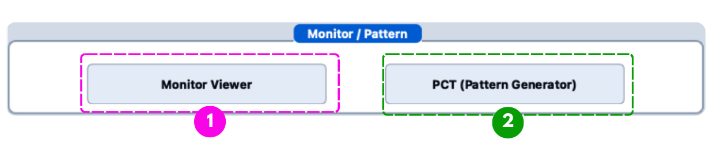
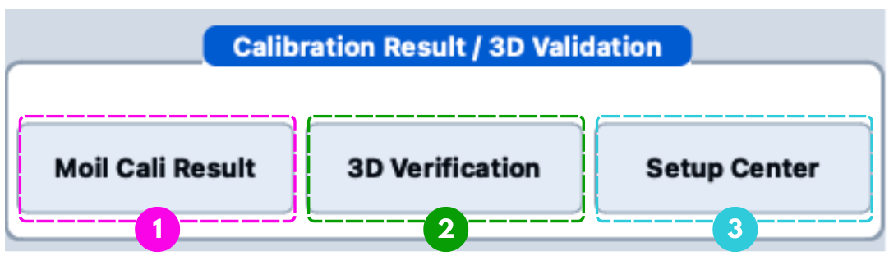

# Main Window Reference

The **Main Window** is the central interface of the calibration system. It brings hardware connectivity, 5-axis motion control, pattern display, image capture, centre-point detection, histogram analysis, and the launchers for result analysis and verification into one window.

  
📖 WHAT THIS PAGE IS

  

    This is a <strong>reference</strong>: it describes <em>what every control does</em>, panel by panel. It does <strong>not</strong> tell you when to press them. For the procedure — the order of operations during a calibration run — see <a href="/moilcalib_documentation/docs/v1.1/calibration/camera-calibration"><strong>2. Camera Calibration</strong></a>.
  

<Figure id="fig-1" number="1" caption="Main Window overview.">

</Figure>

---

## Panel Map

| No. | Panel | Purpose | Used during |
|---:|---|---|---|
| 1 | **HTTP Server URL** | HTTP connections to the Axis, Monitor, and Camera servers. | [Camera Calibration](/moilcalib_documentation/docs/v1.1/calibration/camera-calibration) |
| 2 | **Axis Control Panel** | 5-axis platform movement (X, Y, Z linear; Yaw, Pitch rotational) with sensor monitoring and safety interlocks. | [Camera Calibration](/moilcalib_documentation/docs/v1.1/calibration/camera-calibration) |
| 3 | **Monitor / Pattern** | Launches the Monitor Viewer and the PCT Pattern Generator. | [1. Pattern Setup](/moilcalib_documentation/docs/v1.1/calibration/pct-pattern-generator) |
| 4 | **Camera Panel** | Image capture from the camera server; positive / negative calibration shots. | [Camera Calibration](/moilcalib_documentation/docs/v1.1/calibration/camera-calibration) |
| 5 | **Centering** | Automatic and manual fisheye centre-point detection with ROI and edge overlays. | [Camera Calibration](/moilcalib_documentation/docs/v1.1/calibration/camera-calibration) |
| 6 | **Calibration Result / 3D Validation** | Opens the result analysis window, 3D verification, and Setup Center. | [3. Calibration Result](/moilcalib_documentation/docs/v1.1/calibration/cali-result) · [Verification](/moilcalib_documentation/docs/v1.1/verification/setup-center) |
| 7 | **Histogram1** | First grey-level intensity plot, with its own direction selection. | [Camera Calibration](/moilcalib_documentation/docs/v1.1/calibration/camera-calibration) |
| 8 | **Histogram2** | Second grey-level intensity plot, identical controls, selected independently of Histogram1. | [Camera Calibration](/moilcalib_documentation/docs/v1.1/calibration/camera-calibration) |

The two histograms are separate panels with the same control set, which is why they carry two numbers in Figure 1.
They are functionally identical and stacked one above the other so that two different direction selections can be compared at a glance — see [7.1](#71-why-there-are-two-and-why-they-are-stacked) for the reasoning.

---

## 1. HTTP Server URL Panel

Establishes the HTTP client connections to the three services the client depends on.

| Field | Connected service | What it drives |
|---|---|---|
| **Axis URL** | `AxisHttpClient` | All 5-axis control: sensor reads, homing, position monitoring, stops. |
| **Monitor URL** | `MonitorHttpClient` | Sends calibration patterns to the display monitors. |
| **Camera URL** | `CameraHttpClient` | Image acquisition for calibration shots. |
| **Update** | Client reconnection | Applies the URL to the client object and validates connectivity. |

Pressing **Update** next to the **Axis URL** additionally re-runs the sensor-initialisation dialog, which probes the origin state of all five axes.

  
⚠️ CONNECTION REQUIREMENTS

  

    URL validation happens only when <strong>Update</strong> is pressed. An unreachable service disables the related functionality and shows a warning dialog. The default URLs the application starts with are set in <code>ControllerMain::initUrls()</code>.
  

---

## 2. Axis Control Panel

<Figure id="fig-2" number="2" caption="Axis Control Panel.">

</Figure>

### 2.1 Controlled Axes

| Axis | Motion type | Unit | Role |
|---|---|---|---|
| **X-Axis** | Linear (Left / Right) | mm | Horizontal positioning |
| **Y-Axis** | Linear (Up / Down) | mm | Vertical positioning |
| **Z-Axis** | Linear (Back / Forward) | mm | Distance adjustment |
| **Yaw-Axis** | Rotational (Left / Right) | degrees | Horizontal angular positioning |
| **Pitch-Axis** | Rotational (Down / Up) | degrees | Vertical angular positioning |

### 2.2 Controls

The numbers match the callouts in [Figure 2](#fig-2).
Every column applies to each of the five axis rows.

| No. | Control | Description |
|---:|---|---|
| 1 | **All HOME** | Homes the axes in the order **Yaw → Pitch → X → Y → Z**, skipping any axis already at its origin, and writes position `0` for each axis as it completes. |
| 2 | **Position display** | Live position read from that axis. |
| 3 | **Sensor indicators** | Limit and home state for that axis: `L H R`, `D H U`, or `B H F` depending on the axis (see 2.3). |
| 4 | **Speed** | Movement velocity for the relative move (High / Low). |
| 5 | **Relative Move** + direction buttons | Moves the axis by the entered amount — mm for X/Y/Z, degrees for Yaw/Pitch. The button on each side of the value box gives the direction. |
| 6 | **M (movement indicator)** | Blinks while that axis is running. It sits outside the sensor group because it reports motion, not position. |
| 7 | **STOP** | Stops that axis immediately, then refreshes its sensors and position. |
| 8 | **α / β** | Alpha and beta, computed live from the yaw and pitch positions. They are shown in the panel header and are not part of the per-axis rows. |

### 2.3 Sensor Status Indicators

These are the three lamps inside callout **3**.
Which set an axis shows depends on the direction it travels in.

| Indicator | Axes | Meaning | Behaviour when triggered |
|---|---|---|---|
| **L / R** | X, Yaw | Left / right limit | Movement in that direction is blocked. |
| **D / U** | Y, Pitch | Down / up limit | Movement in that direction is blocked. |
| **B / F** | Z | Back / forward limit | Movement in that direction is blocked. |
| **H** | All | Home (origin) sensor | Used by homing to zero the position. |

### 2.4 Safety Behaviour

| Mechanism | What it does |
|---|---|
| **Axis safety-lock** | While **any** axis is moving, every control except that axis's **STOP** button is disabled — a second command cannot be sent into a running stage. Controls unlock once the axis reports it has stopped. |
| **Limit protection** | A triggered limit sensor blocks further movement in that direction. |
| **Sensor-side lock after stopping** | When an axis stops on a sensor, the button for the sensor side that was touched stays locked. |
| **Blocking homing** | `All HOME` first probes the origin sensors in a short modal dialog that closes itself, then waits for a confirmed stop on each axis before starting the next. |
| **Live axis monitor** | One background task per axis polls limit / origin / moving / position every **20 ms** and updates the LEDs, coordinates, and alpha / beta. It runs off the UI thread, so the window stays responsive, and times out after 60 s. |

  
⚠️ NEVER OVERRIDE THE LIMIT PROTECTION

  

    The interlocks exist to protect the hardware. If controls appear greyed out, an axis is still moving — wait for it to stop, or press its <strong>STOP</strong> button.
  

---

## 3. Monitor / Pattern Panel

<Figure id="fig-3" number="3" caption="Monitor / Pattern Panel.">

</Figure>

| No. | Button | Opens | Documented in |
|---|---|---|---|
| 1 | **Monitor Viewer** | `ControllerMonitor` — per-direction pattern preview and send | [Monitor Viewer](/moilcalib_documentation/docs/v1.1/calibration/monitor-viewer) |
| 2 | **PCT (Pattern Generator)** | `ControllerPatternGenerator` — concentric and stripline pattern creation | [PCT Pattern Generator](/moilcalib_documentation/docs/v1.1/calibration/pct-pattern-generator) |

The two windows are linked: when the Pattern Generator sends **Update to Monitor**, the request is routed through the Monitor Viewer so that both the pattern *and* the brightness are applied.

---

## 4. Camera Panel

<Figure id="fig-4" number="4" caption="Camera Panel.">

</Figure>

### 4.1 Fields and Buttons

The numbers match the callouts in [Figure 4](#fig-4).

| No. | Control | Description |
|---:|---|---|
| 1 | **Pattern Mode** | Current capture state: blank, `Positive`, or `Negative`. Set automatically by the shot buttons. **Read-only.** |
| 2 | **Img Path** | Full path of the image file that was last written. |
| 3 | **Org Res** | Resolution of the captured image, as received from the camera. **Read-only.** |
| 4 | **Cali Res** | Resolution of the scaled preview shown in the window. **Read-only.** |
| 5 | **Open Img** | **Not active in version 1.1** — the handler is still an empty stub. |
| 6 | **Image preview** | The captured frame, scaled to fit. Single-click sets the centre (only in a pattern mode); double-click opens the zoomable viewer (see 4.4). |
| 7 | **Capture** | Takes a single frame with no pattern mode. |
| 8 | **Pos Shot** | Pushes the positive pattern, captures, auto-detects the centre. |
| 9 | **Neg Shot** | Pushes the negative pattern, captures, auto-detects the centre. |
| 10 | **?** (direction difference) | Sits between **Capture** and **Pos Shot**. Detects the ICT nodes along all eight directions of the latest positive and negative shots and opens a dialog comparing the opposite pairs (N-S, W-E, NW-SE, SW-NE) node by node, with the mean and maximum difference per pair. Differences of 5 px or more are shown in red. Requires both shots to exist. |

### 4.2 Image Files

| Image | Written to |
|---|---|
| Positive calibration shot | `image_cali/capture_positive_shot.png` |
| Negative calibration shot | `image_cali/capture_negative_shot.png` |
| Single capture | `image_cali/capture_single_image.png` |

The `image_cali/` folder is resolved against the directory the application was launched from. See [Camera Calibration](/moilcalib_documentation/docs/v1.1/calibration/camera-calibration) for the full explanation and the warnings about overwriting.

### 4.3 What a Shot Button Does

**Pos Shot** and **Neg Shot** run the same sequence, differing only in which pattern is pushed:

| Step | Action |
|---:|---|
| 1 | Sets **Pattern Mode** to `Positive` / `Negative`. |
| 2 | Pushes the matching pattern to every monitor direction. |
| 3 | Waits ~300 ms so the monitors actually display it. |
| 4 | Fetches a frame from the camera server, off the UI thread. |
| 5 | Decodes and saves the PNG. |
| 6 | Auto-detects the pattern centre **from this image** and fills the matching CPX / CPY. |
| 7 | Draws the edge circle overlay. |
| 8 | Refreshes both histograms. |

### 4.4 Image Preview Interaction

| Gesture | Result |
|---|---|
| **Single click** | In **Manual** mode, sets the centre for the active pattern mode exactly where you clicked, then switches the panel back to **Auto**. In **Auto** mode, refines the existing centre using the threshold (the click position is not used). Ignored in **Locked** mode and when Pattern Mode is empty. |
| **Double click** | Opens the capture in a zoomable viewer — wheel to zoom, drag to pan, `F` or double-click to fit, `Esc` / `Q` to close. |

---

## 5. Centering Panel

<Figure id="fig-5" number="5" caption="Centering Panel.">

</Figure>

### 5.1 Fields

The numbers match the callouts in [Figure 5](#fig-5).

| No. | Control | Description |
|---:|---|---|
| 1 | **Auto / Manual / Locked** | Centre-point handling mode (see 5.2). |
| 2 | **PosThr** | Threshold used to detect the centre of the **positive** image. |
| 3 | **NegThr** | Threshold used to detect the centre of the **negative** image. |
| 4 | **Center ROI** | Radius of the ROI box drawn around the centre on the preview. |
| 5 | **CPX** | Column header: the horizontal centre coordinate, in original-image pixels. |
| 6 | **CPY** | Column header: the vertical centre coordinate, in original-image pixels. |
| 7 | **Positive** | The CPX / CPY pair detected from the positive image. |
| 8 | **Negative** | The CPX / CPY pair detected from the negative image. |
| 9 | **Edge** (checkbox) | Draws a circle overlay at the given radius around the centre. One row per pattern mode. |
| 10 | **Radius** | Edge-circle radius. |
| 11 | **Color** | Colour picker for the edge circle. |
| 12 | **Thickness** | Edge-circle line thickness. |

Rows **7** and **8** are **independent** — each shot detects the centre of its own image.
The overlay block (**9** to **12**) likewise has one row per pattern mode, so the positive and negative circles can be styled separately.

### 5.2 Centre Detection Modes

| Mode | Behaviour |
|---|---|
| **Auto** | After a shot, the centre is found by a least-squares fit of the radial gradient lines on the concentric pattern — the thresholds are not used. A click on the preview instead refines the existing centre with **PosThr** / **NegThr**, repeating until it stops moving (maximum 20 iterations); the same threshold path is the fallback when the gradient fit fails. |
| **Manual** | A click on the preview sets CPX / CPY for the active pattern mode to the clicked point; the panel then returns to **Auto**. Nothing is refined until you click again. |
| **Locked** | The centre is frozen and captures no longer change it. |

### 5.3 What Triggers a Re-detection

| Event | Response |
|---|---|
| **Pos Shot** | Detects the centre from the new positive image, fills Positive CPX / CPY, redraws the edge. |
| **Neg Shot** | Same for the negative image and Negative CPX / CPY. |
| **Editing CPX / CPY / Radius / Thickness** | The overlay is redrawn immediately. |
| **Toggling Edge** | Renders or removes the circle overlay. |
| **Clicking the preview** | Converts the click to original-image pixels — accounting for the letterbox offset and the resolution ratio — and sets the centre. |

  
🎯 WHY THE CENTRE MATTERS

  

    The histogram curves are extracted radially from the centre point. A wrong CPX / CPY distorts every curve and every value computed from them. If the centre stored in the camera parameter file itself is in question, use <a href="/moilcalib_documentation/docs/v1.1/verification/setup-center">Setup Center</a>.
  

---

## 6. Calibration Result / 3D Validation Panel

<Figure id="fig-6" number="6" caption="Calibration Result / 3D Validation Panel.">

</Figure>

| No. | Button | Opens | Documented in |
|---:|---|---|---|
| 1 | **Moil Cali Result** | `ControllerCaliResult` — result tables, plots, and the range subsystem | [3. Calibration Result](/moilcalib_documentation/docs/v1.1/calibration/cali-result) |
| 2 | **3D Verification** | `Controller3dMeasurement` — automated 3D distance measurement | [3D Verification](/moilcalib_documentation/docs/v1.1/verification/3d-verification) |
| 3 | **Setup Center** 🆕 | `ControllerCenterSetup` — camera centre (iCx / iCy) verification | [Setup Center](/moilcalib_documentation/docs/v1.1/verification/setup-center) |

**Setup Center** is new in version 1.1. Opening it seeds the tool with the current positive capture automatically, if one exists.

---

## 7 and 8. Histogram Panels

<Figure id="fig-7" number="7" caption={<>The two Histogram panels. The callouts are drawn on <strong>Histogram 1</strong>; <strong>Histogram 2</strong> below it carries the identical set of controls.</>}>

</Figure>

These are the two panels numbered **7** and **8** in [Figure 1](#fig-1).
In version 1.1 they are drawn by a C++ `HistogramPlot` widget; version 1.0 used PyQtGraph.

### 7.1 Why There Are Two, and Why They Are Stacked

**The two panels are functionally identical** — same axes, same default range, same controls.
Neither is the positive plot, the negative plot, or a zoom of the other.
The only thing that tells them apart is which direction checkboxes you tick in each, so the difference is one of **use, not function**.

They exist as a pair because a calibration judgement is rarely about one curve alone; it is about whether one set of directions behaves like another.
With a single plot you would tick a set, read it, untick it, tick a second set, and compare against memory.
Two plots hold both sets on screen at once.

They are **stacked** because both share the same horizontal quantity, IH.
Stacking aligns that axis down the screen, so you can read straight down from a feature in Histogram1 to the same IH position in Histogram2.
Side by side would have halved the width each curve extends along and lost that shared reference.

Useful splits, none of them enforced by the application:

| Split | Histogram1 | Histogram2 |
|---|---|---|
| **Axis pair** | Vertical: N, S | Horizontal: W, E |
| **Cardinal vs diagonal** | N, S, W, E | NW, NE, SW, SE |
| **Reference vs suspect** | A direction known to be good | The direction that looks wrong |

  
💡 A PRACTICAL DEFAULT

  

    Put the <strong>vertical</strong> pair (N, S) in Histogram1 and the <strong>horizontal</strong> pair (W, E) in Histogram2. An opposed pair is what a centre error pulls apart, so keeping each pair whole inside one plot makes that disagreement easy to spot.
  

### 7.2 Controls

The numbers match the callouts in [Figure 7](#fig-7) and apply to both panels.

| No. | Control | Description |
|---:|---|---|
| 1 | **Show Curve** | Clears the plot and redraws the curves for the selected directions. |
| 2 | **Curve Color** | Opens the curve-colour window (`ControllerCurveColor`), a grid of colour slots. The plot itself draws from a fixed palette, so choices made there are not applied to the curves in version 1.1. |
| 3 | **Direction checkboxes** | A **Pos** and a **Neg** column, each with the eight directions listed in 7.3. |
| 4 | **Pop Up** | **Not active in version 1.1** — the button is present but not connected to any handler. |
| 5 | **Plot area** | Grey level on the vertical axis against IH on the horizontal axis. The axis ranges rescale to fit whatever curves are drawn. |

### 7.3 Analysis Directions

| Direction | Abbreviation | Notes |
|---|---|---|
| North | **N** | Vertical, upward from the centre |
| South | **S** | Vertical, downward from the centre |
| West | **W** | Horizontal, left from the centre |
| East | **E** | Horizontal, right from the centre |
| Northwest | **NW** | Diagonal, with √2 scaling |
| Southeast | **SE** | Diagonal, with √2 scaling |
| Southwest | **SW** | Diagonal, with √2 scaling |
| Northeast | **NE** | Diagonal, with √2 scaling |

### 7.4 Curve Rendering

| Selection | Result |
|---|---|
| **Positive only** | Curves from `capture_positive_shot.png`, using the Positive CPX / CPY. One colour per direction, from a fixed eight-colour palette. |
| **Negative only** | Curves from `capture_negative_shot.png`, using the Negative CPX / CPY. |
| **Same direction, both** | **Comparison mode**, and it takes over the whole plot: the positive curve is drawn red, the negative green, and each intersection node (ICT) between them gets a white vertical line. Only the **first** direction ticked in both columns is drawn — every other ticked direction is ignored. |
| **Diagonal directions** | A √2 distance scaling is applied. |

  
🔍 HOW TO READ THE HISTOGRAM

  <ul>
    <li><strong>Clear swings</strong> between light and dark mean the pattern stripes are being resolved properly.</li>
    <li><strong>Flat tops</strong> mean the monitor is too bright and the edges are lost.</li>
    <li><strong>Barely any swing</strong> means it is too dark.</li>
    <li><strong>Large differences between the positive and negative curves</strong> point to a wrong centre, the wrong pattern, or a capture problem.</li>
    <li><strong>Vertical marker lines</strong> appear where positive and negative curves of the same direction intersect.</li>
  </ul>

---

## Menu Bar

The menu bar sits above the panels and is not numbered in [Figure 1](#fig-1).

| Item | Description |
|---|---|
| **Reset** | Returns the application to a fresh state: clears the preview, centres, coordinates, and histograms, resets the server URLs, recreates every sub-window, and **deletes the cached images in `image_cali/`** — the three captures, `&#95;tmp_pattern_circle.png`, and every `pattern_circle_*.png`. It asks for confirmation first. Reference sample images and pattern JSON configurations are left untouched. |

---

## Where to Go Next

| If you want to… | Go to |
|---|---|
| Run a calibration, in order | [2. Camera Calibration](/moilcalib_documentation/docs/v1.1/calibration/camera-calibration) |
| Create or edit the patterns | [PCT Pattern Generator](/moilcalib_documentation/docs/v1.1/calibration/pct-pattern-generator) |
| Put patterns on the monitors | [Monitor Viewer](/moilcalib_documentation/docs/v1.1/calibration/monitor-viewer) |
| Analyse the calibration values | [3. Calibration Result](/moilcalib_documentation/docs/v1.1/calibration/cali-result) |
| Check the camera parameters | [Setup Center](/moilcalib_documentation/docs/v1.1/verification/setup-center) · [3D Verification](/moilcalib_documentation/docs/v1.1/verification/3d-verification) |
