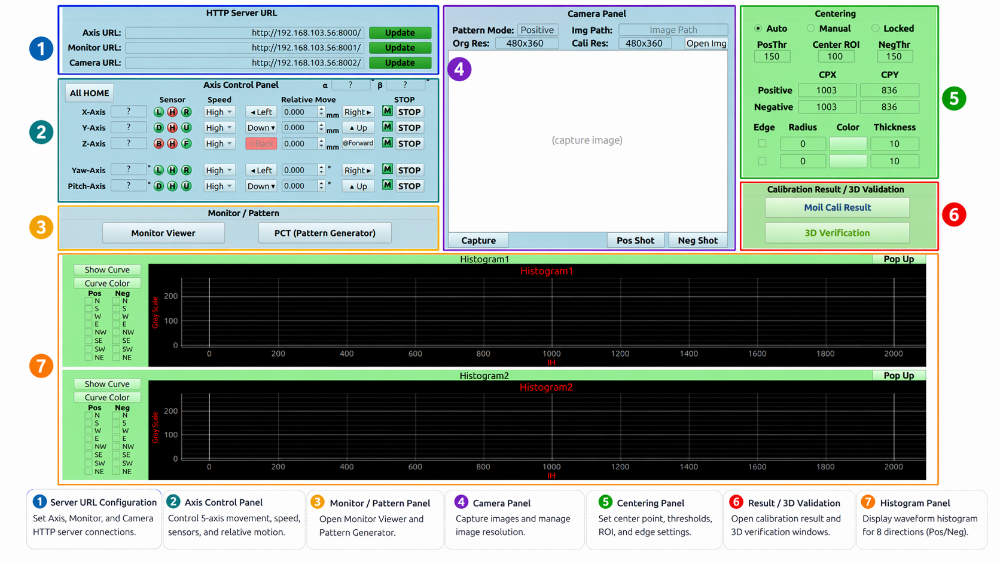
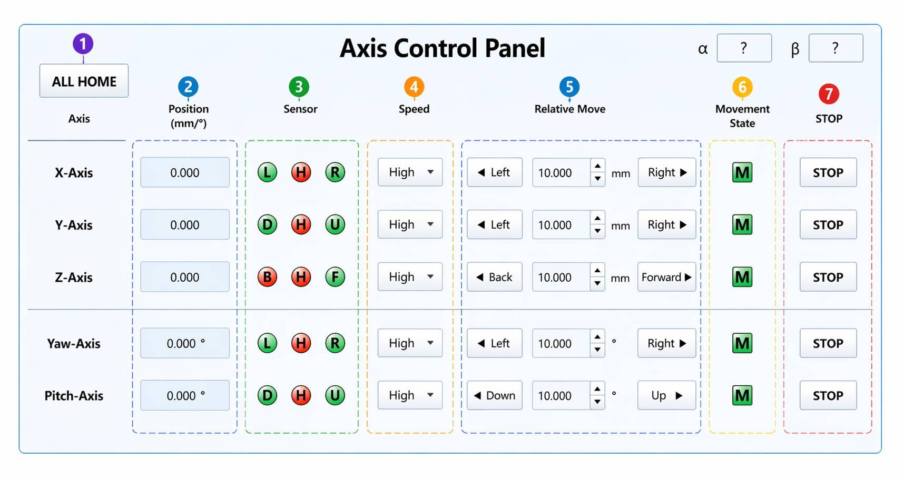
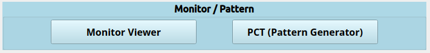
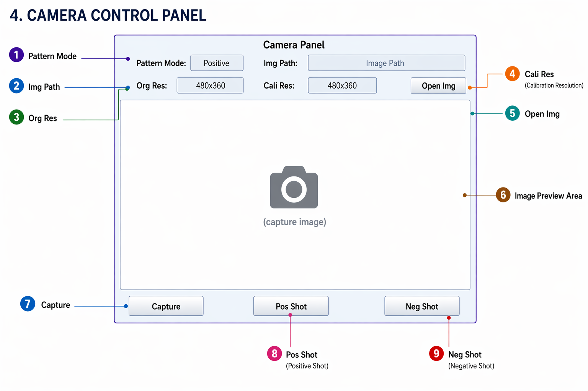
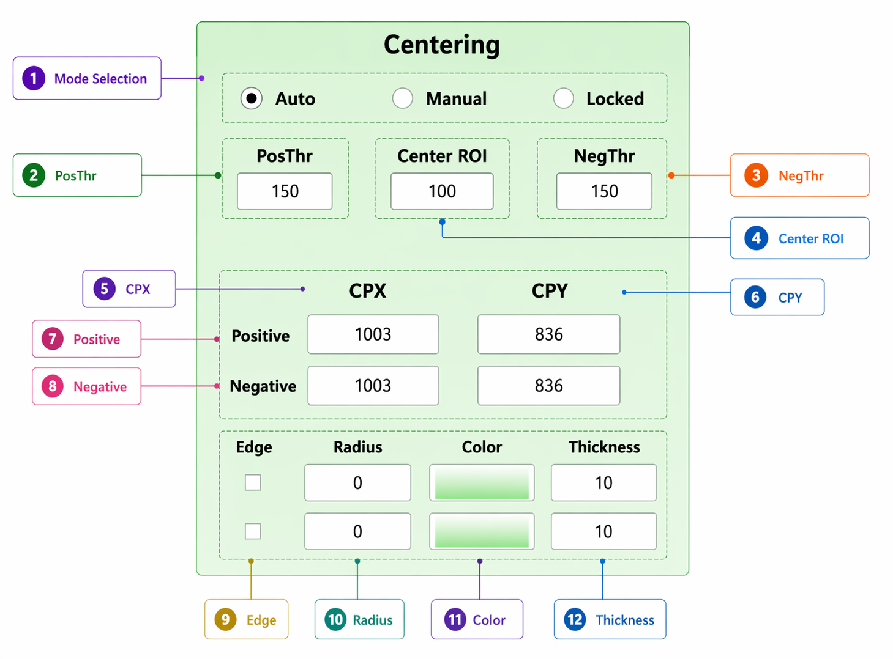
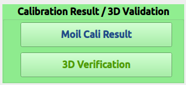
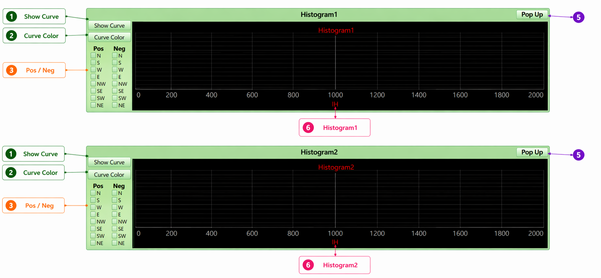

# Main Window Reference

The **Main Window** is the central interface of the calibration system. It brings hardware connectivity, 5-axis motion control, pattern display, image capture, centre-point detection, histogram analysis, and the launchers for result analysis and verification into one window.

  
📖 WHAT THIS PAGE IS

  

    This is a <strong>reference</strong>: it describes <em>what every control does</em>, panel by panel. It does <strong>not</strong> tell you when to press them. For the procedure — the order of operations during a calibration run — see <a href="/moilcalib_documentation/docs/v1.1/calibration/camera-calibration"><strong>2. Camera Calibration</strong></a>.
  

<em><a href="#fig-1"><strong>Figure 1.</strong></a> Main Window overview.</em>

---

## Panel Map

| No. | Panel | Purpose | Used during |
|---:|---|---|---|
| 1 | **Server URL Configuration** | HTTP connections to the Axis, Monitor, and Camera servers. | [Camera Calibration](/moilcalib_documentation/docs/v1.1/calibration/camera-calibration) |
| 2 | **Axis Control** | 5-axis platform movement (X, Y, Z linear; Yaw, Pitch rotational) with sensor monitoring and safety interlocks. | [Camera Calibration](/moilcalib_documentation/docs/v1.1/calibration/camera-calibration) |
| 3 | **Monitor / Pattern** | Launches the Monitor Viewer and the PCT Pattern Generator. | [1. Pattern Setup](/moilcalib_documentation/docs/v1.1/calibration/pct-pattern-generator) |
| 4 | **Camera** | Image capture from the camera server; positive / negative calibration shots. | [Camera Calibration](/moilcalib_documentation/docs/v1.1/calibration/camera-calibration) |
| 5 | **Centering** | Automatic and manual fisheye centre-point detection with ROI and edge overlays. | [Camera Calibration](/moilcalib_documentation/docs/v1.1/calibration/camera-calibration) |
| 6 | **Calibration Result / 3D Validation** | Opens the result analysis window, 3D verification, and Setup Center. | [3. Calibration Result](/moilcalib_documentation/docs/v1.1/calibration/cali-result) · [Verification](/moilcalib_documentation/docs/v1.1/verification/setup-center) |
| 7 | **Histogram** | Grey-level intensity curves extracted from the calibration images. | [Camera Calibration](/moilcalib_documentation/docs/v1.1/calibration/camera-calibration) |

---

## 1. Server URL Configuration Panel

Establishes the HTTP client connections to the three services the client depends on.

| Field | Connected service | What it drives |
|---|---|---|
| **Axis URL** | `AxisHttpClient` | All 5-axis control: sensor reads, homing, position monitoring, stops. |
| **Monitor URL** | `MonitorHttpClient` | Sends calibration patterns to the display monitors. |
| **Camera URL** | `CameraHttpClient` | Image acquisition for calibration shots. |
| **Update** | Client reconnection | Applies the URL to the client object and validates connectivity. |

Pressing **Update** next to the **Axis URL** additionally re-runs the sensor-initialisation dialog, which probes the origin state of all five axes.

  
⚠️ CONNECTION REQUIREMENTS

  

    URL validation happens only when <strong>Update</strong> is pressed. An unreachable service disables the related functionality and shows a warning dialog. The default URLs the application starts with are set in <code>ControllerMain::initUrls()</code>.
  

---

## 2. Axis Control Panel

<em><a href="#fig-2"><strong>Figure 2.</strong></a> Axis Control Panel.</em>

### 2.1 Controlled Axes

| Axis | Motion type | Unit | Role |
|---|---|---|---|
| **X-Axis** | Linear (Left / Right) | mm | Horizontal positioning |
| **Y-Axis** | Linear (Up / Down) | mm | Vertical positioning |
| **Z-Axis** | Linear (Back / Forward) | mm | Distance adjustment |
| **Yaw-Axis** | Rotational (Left / Right) | degrees | Horizontal angular positioning |
| **Pitch-Axis** | Rotational (Down / Up) | degrees | Vertical angular positioning |

### 2.2 Controls

| Control | Description |
|---|---|
| **ALL HOME** | Homes the axes in the order **Yaw → Pitch → X → Y → Z**, skipping any axis already at its origin, and writes position `0` for each axis as it completes. |
| **Position display** | Live position read from the axis. |
| **Speed** | Movement velocity for the relative move (High / Low). |
| **Relative Move** + direction button | Moves the axis by the entered amount — mm for X/Y/Z, degrees for Yaw/Pitch. |
| **Sensor indicators** | Limit, home, and movement state for that axis (see 2.3). |
| **STOP** | Stops that axis immediately, then refreshes its sensors and position. |
| **α / β** | Alpha and beta, computed live from the yaw and pitch positions. |

### 2.3 Sensor Status Indicators

| Indicator | Meaning | Behaviour when triggered |
|---|---|---|
| **L / R** | Left / right limit | Movement in that direction is blocked. |
| **D / U** | Down / up limit | Movement in that direction is blocked. |
| **B / F** | Back / forward limit | Movement in that direction is blocked. |
| **H** | Home (origin) sensor | Used by homing to zero the position. |
| **M** | Movement | Blinks while the axis is running. |

### 2.4 Safety Behaviour

| Mechanism | What it does |
|---|---|
| **Axis safety-lock** | While **any** axis is moving, every control except that axis's **STOP** button is disabled — a second command cannot be sent into a running stage. Controls unlock once the axis reports it has stopped. |
| **Limit protection** | A triggered limit sensor blocks further movement in that direction. |
| **Sensor-side lock after stopping** | When an axis stops on a sensor, the button for the sensor side that was touched stays locked. |
| **Blocking homing** | `ALL HOME` waits for a confirmed stop on each axis before starting the next, showing a progress dialog. |
| **Live axis monitor** | One background task per axis polls limit / origin / moving / position every **20 ms** and updates the LEDs, coordinates, and alpha / beta. It runs off the UI thread, so the window stays responsive, and times out after 60 s. |

  
⚠️ NEVER OVERRIDE THE LIMIT PROTECTION

  

    The interlocks exist to protect the hardware. If controls appear greyed out, an axis is still moving — wait for it to stop, or press its <strong>STOP</strong> button.
  

---

## 3. Monitor / Pattern Panel

<em><a href="#fig-3"><strong>Figure 3.</strong></a> Monitor / Pattern Panel.</em>

| Button | Opens | Documented in |
|---|---|---|
| **Monitor Viewer** | `ControllerMonitor` — per-direction pattern preview and send | [Monitor Viewer](/moilcalib_documentation/docs/v1.1/calibration/monitor-viewer) |
| **PCT (Pattern Generator)** | `ControllerPatternGenerator` — concentric and stripline pattern creation | [PCT Pattern Generator](/moilcalib_documentation/docs/v1.1/calibration/pct-pattern-generator) |

The two windows are linked: when the Pattern Generator sends **Update to Monitor**, the request is routed through the Monitor Viewer so that both the pattern *and* the brightness are applied.

---

## 4. Camera Panel

<em><a href="#fig-4"><strong>Figure 4.</strong></a> Camera Panel.</em>

### 4.1 Fields and Buttons

| Control | Description |
|---|---|
| **Pattern Mode** | Current capture state: blank, `Positive`, or `Negative`. Set automatically by the shot buttons. |
| **Img Path** | Full path of the image file that was last written. |
| **Org Res** | Resolution of the captured image, as received from the camera. **Read-only.** |
| **Cali Res** | Resolution of the scaled preview shown in the window. **Read-only.** |
| **Open Img** | **Not active in version 1.1** — the handler is still an empty stub. |
| **Image preview** | Single-click sets the centre (only in a pattern mode); double-click opens the zoomable viewer. |
| **Capture** | Takes a single frame with no pattern mode. |
| **Pos Shot** | Pushes the positive pattern, captures, auto-detects the centre. |
| **Neg Shot** | Pushes the negative pattern, captures, auto-detects the centre. |

### 4.2 Image Files

| Image | Written to |
|---|---|
| Positive calibration shot | `image_cali/capture_positive_shot.png` |
| Negative calibration shot | `image_cali/capture_negative_shot.png` |
| Single capture | `image_cali/capture_single_image.png` |

The `image_cali/` folder is resolved against the directory the application was launched from. See [Camera Calibration](/moilcalib_documentation/docs/v1.1/calibration/camera-calibration) for the full explanation and the warnings about overwriting.

### 4.3 What a Shot Button Does

**Pos Shot** and **Neg Shot** run the same sequence, differing only in which pattern is pushed:

| Step | Action |
|---:|---|
| 1 | Sets **Pattern Mode** to `Positive` / `Negative`. |
| 2 | Pushes the matching pattern to every monitor direction. |
| 3 | Waits ~300 ms so the monitors actually display it. |
| 4 | Fetches a frame from the camera server, off the UI thread. |
| 5 | Decodes and saves the PNG. |
| 6 | Auto-detects the pattern centre **from this image** and fills the matching CPX / CPY. |
| 7 | Draws the edge circle overlay. |
| 8 | Refreshes both histograms. |

### 4.4 Image Preview Interaction

| Gesture | Result |
|---|---|
| **Single click** | In **Manual** mode, sets the centre for the active pattern mode, then returns to **Auto** so the value is refined. Ignored when Pattern Mode is empty. |
| **Double click** | Opens the capture in a zoomable viewer — wheel to zoom, drag to pan, `F` or double-click to fit, `Esc` / `Q` to close. |

---

## 5. Centering Panel

<em><a href="#fig-5"><strong>Figure 5.</strong></a> Centering Panel.</em>

### 5.1 Fields

| Control | Description |
|---|---|
| **Auto / Manual / Locked** | Centre-point handling mode (see 5.2). |
| **PosThr** | Threshold used to detect the centre of the **positive** image. |
| **NegThr** | Threshold used to detect the centre of the **negative** image. |
| **Center ROI** | Radius of the ROI box drawn around the centre on the preview. |
| **CPX / CPY — Positive** | Centre coordinates of the positive image. |
| **CPX / CPY — Negative** | Centre coordinates of the negative image. |
| **Edge** (checkbox) | Draws a circle overlay at the given radius around the centre. |
| **Radius** | Edge-circle radius. |
| **Color** | Colour picker for the edge circle. |
| **Thickness** | Edge-circle line thickness. |

The positive and negative centres are **independent** — each shot detects the centre of its own image.

### 5.2 Centre Detection Modes

| Mode | Behaviour |
|---|---|
| **Auto** | The centre is refined from the current value and threshold, repeating until it stops moving (maximum 20 iterations). |
| **Manual** | A click on the preview sets CPX / CPY for the active pattern mode; the panel then returns to **Auto**. |
| **Locked** | The centre is frozen and captures no longer change it. |

### 5.3 What Triggers a Re-detection

| Event | Response |
|---|---|
| **Pos Shot** | Detects the centre from the new positive image, fills Positive CPX / CPY, redraws the edge. |
| **Neg Shot** | Same for the negative image and Negative CPX / CPY. |
| **Editing CPX / CPY / Radius / Thickness** | The overlay is redrawn immediately. |
| **Toggling Edge** | Renders or removes the circle overlay. |
| **Clicking the preview** | Converts the click to original-image pixels — accounting for the letterbox offset and the resolution ratio — and sets the centre. |

  
🎯 WHY THE CENTRE MATTERS

  

    The histogram curves are extracted radially from the centre point. A wrong CPX / CPY distorts every curve and every value computed from them. If the centre stored in the camera parameter file itself is in question, use <a href="/moilcalib_documentation/docs/v1.1/verification/setup-center">Setup Center</a>.
  

---

## 6. Calibration Result / 3D Validation Panel

<em><a href="#fig-6"><strong>Figure 6.</strong></a> Calibration Result / 3D Validation Panel. This version 1.0 screenshot shows only two buttons — version 1.1 adds <strong>Setup Center</strong>.</em>

| Button | Opens | Documented in |
|---|---|---|
| **Moil Cali Result** | `ControllerCaliResult` — result tables, plots, and the range subsystem | [3. Calibration Result](/moilcalib_documentation/docs/v1.1/calibration/cali-result) |
| **3D Verification** | `Controller3dMeasurement` — automated 3D distance measurement | [3D Verification](/moilcalib_documentation/docs/v1.1/verification/3d-verification) |
| **Setup Center** 🆕 | `ControllerCenterSetup` — camera centre (iCx / iCy) verification | [Setup Center](/moilcalib_documentation/docs/v1.1/verification/setup-center) |

**Setup Center** is new in version 1.1. Opening it seeds the tool with the current positive capture automatically, if one exists.

---

## 7. Histogram Panel

<em><a href="#fig-7"><strong>Figure 7.</strong></a> Histogram Panel.</em>

Two independent plots, **Histogram1** and **Histogram2**, both plotting grey level against IH. In version 1.1 they are drawn by a C++ `HistogramPlot` widget; version 1.0 used PyQtGraph.

### 7.1 Controls

| Control | Description |
|---|---|
| **Show Curve** | Clears the plot and redraws the curves for the selected directions. |
| **Curve Color** | Opens the curve-colour window (`ControllerCurveColor`). |
| **Direction checkboxes** | Per histogram, a **Pos** and a **Neg** column with the eight directions. |
| **Pop Up** | Opens that histogram in its own larger window. |

### 7.2 Analysis Directions

| Direction | Abbreviation | Notes |
|---|---|---|
| North | **N** | Vertical, upward from the centre |
| South | **S** | Vertical, downward from the centre |
| West | **W** | Horizontal, left from the centre |
| East | **E** | Horizontal, right from the centre |
| Northwest | **NW** | Diagonal, with √2 scaling |
| Southeast | **SE** | Diagonal, with √2 scaling |
| Southwest | **SW** | Diagonal, with √2 scaling |
| Northeast | **NE** | Diagonal, with √2 scaling |

### 7.3 Curve Rendering

| Selection | Result |
|---|---|
| **Positive only** | Curves from `capture_positive_shot.png`, using the Positive CPX / CPY. |
| **Negative only** | Curves from `capture_negative_shot.png`, using the Negative CPX / CPY. |
| **Same direction, both** | Positive and negative curves are overlaid and the intersection points are marked. |
| **Diagonal directions** | A √2 distance scaling is applied. |

  
🔍 HOW TO READ THE HISTOGRAM

  <ul>
    <li><strong>Clear swings</strong> between light and dark mean the pattern stripes are being resolved properly.</li>
    <li><strong>Flat tops</strong> mean the monitor is too bright and the edges are lost.</li>
    <li><strong>Barely any swing</strong> means it is too dark.</li>
    <li><strong>Large differences between the positive and negative curves</strong> point to a wrong centre, the wrong pattern, or a capture problem.</li>
    <li><strong>Vertical marker lines</strong> appear where positive and negative curves of the same direction intersect.</li>
  </ul>

---

## 8. Menu Bar

| Item | Description |
|---|---|
| **Reset** | Returns the application to a fresh state: clears the preview, centres, coordinates, and histograms, resets the server URLs, recreates every sub-window, and **deletes the cached images in `image_cali/`** — the three captures, `&#95;tmp_pattern_circle.png`, and every `pattern_circle_*.png`. It asks for confirmation first. Reference sample images and pattern JSON configurations are left untouched. |

---

## Where to Go Next

| If you want to… | Go to |
|---|---|
| Run a calibration, in order | [2. Camera Calibration](/moilcalib_documentation/docs/v1.1/calibration/camera-calibration) |
| Create or edit the patterns | [PCT Pattern Generator](/moilcalib_documentation/docs/v1.1/calibration/pct-pattern-generator) |
| Put patterns on the monitors | [Monitor Viewer](/moilcalib_documentation/docs/v1.1/calibration/monitor-viewer) |
| Analyse the calibration values | [3. Calibration Result](/moilcalib_documentation/docs/v1.1/calibration/cali-result) |
| Check the camera parameters | [Setup Center](/moilcalib_documentation/docs/v1.1/verification/setup-center) · [3D Verification](/moilcalib_documentation/docs/v1.1/verification/3d-verification) |

---

_Screenshots on this page are reused from version 1.0 and will be replaced with version 1.1 captures._
