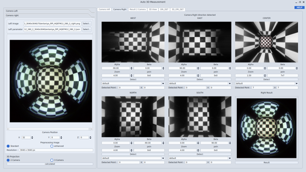
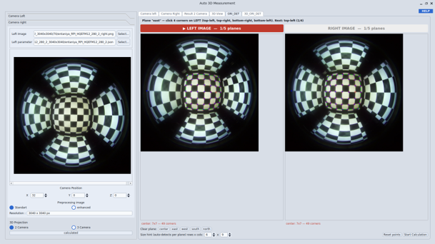

# 3D Verification

**3D Verification** — the **Auto 3D Measurement** window — checks whether a calibrated camera actually measures the world correctly. It takes a stereo pair of fisheye checkerboard images, finds the board corners in both, triangulates them into 3D points, projects those points back into each image, and reports how far each reprojection lands from the corner it started at.

That distance, in pixels, is the verdict: **a low reprojection error means the calibration parameters describe the real lens.**

Open it from the **Calibration Result / 3D Validation** panel of the [Main Window](/moilcalib_documentation/docs/v1.1/system-overview/main-window#6-calibration-result--3d-validation-panel).

---

## Two Ways to Get There

The window offers **two independent pipelines**. They differ only in *how a fisheye pixel becomes an (alpha, beta) ray angle* for each checkerboard corner — everything after that is the same code, which is exactly what makes their results comparable.

| | **Anypoint** | **ORI_DET** |
|---|---|---|
| **Corner source** | A rectified "anypoint" (rectilinear) remap of the fisheye | Directly on the original curved fisheye image |
| **Your input** | Angles and zoom per direction, or an auto-framing sweep | 4 manual corner clicks per plane, per camera |
| **Corner detection** | Chessboard detection on the undistorted view | Homography-guided corner recovery on the distorted view |
| **Cost** | One expensive dense remap per camera × direction — 10 for the default set | No remap at all, but 10 sets of manual clicks before anything runs |
| **Main risk** | Remap interpolation error; needs tuning so the board lands in view | The 4-point homography only approximates the curved fisheye |
| **Where it lives** | **Camera Left** / **Camera Right** tabs | **ORI_DET** / **3D_ORI_DET** tabs |

<div className="custom-note custom-important">
  <div className="custom-note-title">📌 BOTH PATHS END IN THE SAME NUMBERS</div>
  <div>
    Triangulation and the reprojection-error calculation are shared code. Both report a left and a right <strong>RMS in pixels</strong> for the same physical setup — so either one gives you a valid calibration analysis, and running both on one scene also shows which detection method performed better. Which of the two is better overall is <a href="#why-two-methods-exist">still being researched</a>, and a future version is expected to keep only one.
  </div>
</div>

---

## The Window

| Tab | Purpose |
|---|---|
| **Camera Left** | Anypoint detection for the left camera. |
| **Camera Right** | Anypoint detection for the right camera. |
| **Result 2 Camera** | Triangulated results from the anypoint pipeline. |
| **3D View** | 3D visualisation of the reconstructed points. |
| **ORI_DET** | Manual 4-corner picking on the original images. |
| **3D_ORI_DET** | Results of the ORI_DET pipeline. |

The left-hand column is shared by both methods:

| Control | Purpose |
|---|---|
| **Left Image / Left parameter** (and the right equivalents) | The fisheye image and its camera-parameter JSON, per camera. |
| **Fisheye preview** | The loaded image with its detected regions. |
| **Camera Position X / Y / Z** | The physical position of that camera — the baseline the triangulation depends on. |
| **Preprocesing image — Standart / enhanced** | Whether the image is pre-processed before detection. |
| **Resolution** | Read from the loaded image, for example `3040 × 3040 px`. |
| **3D Projection — 2 Camera / 3 Camera** | How many cameras take part in the reconstruction. |

<div className="custom-note custom-warning">
  <div className="custom-note-title">⚠️ CAMERA POSITION IS NOT OPTIONAL</div>
  <div>
    Triangulation measures where two rays meet, so the distance between the cameras sets the scale of every result. If <strong>Camera Position X / Y / Z</strong> does not match the physical rig, the reconstructed points — and every distance derived from them — are wrong even when the reprojection error looks acceptable.
  </div>
</div>

---

## Method 1 — Anypoint

The fisheye is remapped to a flat, rectilinear view before the checkerboard is detected, so the detector never has to cope with fisheye distortion.

<Figure id="fig-1" number="1" caption={<>Anypoint detection — the five direction views (WEST, EAST, CENTER, NORTH, SOUTH), each with its own Alpha, Beta, and Zoom, a <strong>Detect</strong> button, and a detected-point readout.</>}>



</Figure>

### How It Works

```text
For each camera × each direction (5 directions × 2 cameras = 10 views):

Remap the fisheye to a rectilinear "anypoint" view
   for the given (pitch/alpha, yaw/beta, zoom)          <- the expensive step
   |
Detect the checkerboard on that undistorted view
   |
Map the detected corners back to the source fisheye
   |
Read (alpha, beta) for each corner from the fisheye pixel
   |
(both cameras done) Triangulate matching (direction, point) pairs
```

The remap tables are **cached per camera and direction**, so the cost is paid the first time and again whenever you change that direction's angles or zoom.

### Steps

1. On **Camera Left**, load the **Left Image** and **Left parameter** JSON. Repeat on **Camera Right**.
2. Enter the **Camera Position X / Y / Z** for each camera.
3. For each direction — **CENTER, NORTH, SOUTH, EAST, WEST** — set **Alpha**, **Beta**, and **Zoom** so the checkerboard is fully inside that view, then press **Detect**.
4. Check the **Detected Point** readout for each direction. A direction that detects nothing contributes no 3D points.
5. Press **Start Calculation**, then read the **RMS** values for left and right.

<div className="custom-note custom-tip">
  <div className="custom-note-title">💡 AUTO DETECT SAVES THE MANUAL TUNING</div>
  <div>
    Rather than hand-tuning every direction, the auto-framing sweep varies zoom with small pitch and yaw nudges on a low-resolution anypoint until the board is found, then runs the full-resolution detection at that framing. It costs extra compute but removes most of the trial and error.
  </div>
</div>

---

## Method 2 — ORI_DET

Nothing is remapped. You mark each plane by hand on the original fisheye image, and the corner grid is recovered from those four points.

<Figure id="fig-2" number="2" caption="ORI_DET — the instruction bar names the plane and the exact corner to click next, with the LEFT and RIGHT original fisheye images side by side.">



</Figure>

### How It Works

```text
For each plane (center/east/west/south/north) x each camera:

Click the 4 outermost-inner corners
   in the order top-left -> top-right -> bottom-right -> bottom-left
   |
Rectify that quad to a homography
   |
Detect the board to discover the grid size and its corners
   |
Assign canonical (row, column) indices
   |
Refine: coarse pass -> RANSAC re-fit of the homography -> fine pass
   |
Pair left and right corners by (row, column)
   |
Read (alpha, beta) straight from the original pixel — no remap round-trip
   |
Triangulate the paired corners
```

The repeated refinement exists because a flat 4-point homography only *approximates* the curved fisheye surface — a single lookup would not be accurate enough.

### Steps

1. Open the **ORI_DET** tab. The instruction bar names the plane and the corner it wants next, for example *"Plane 'east' — click 4 corners on LEFT (top-left, top-right, bottom-right, bottom-left). Next: top-left (1/4)"*.
2. Click the four corners on the **LEFT** image in that exact order, then the same four physical corners on the **RIGHT** image.
3. Repeat for all five planes. The status line under each image reports what was recovered, for example `center 7x7 — 49 corners`.
4. Use **Clear plane** to redo a single plane, or **Reset points** to start over.
5. Press **Start Calculation** and read the results on **3D_ORI_DET**, under **Mean reprojection error / RMS**.

<div className="custom-note custom-tip">
  <div className="custom-note-title">💡 IF A PLANE RECOVERS THE WRONG GRID</div>
  <div>
    The board size is auto-detected per plane. If it guesses wrong, enter the expected size in the <strong>Size hint</strong> rows × cols fields (for example <code>6x5</code>) and pick that plane's corners again. <strong>Auto Detect</strong> attempts a plane without manual clicks.
  </div>
</div>

<div className="custom-note custom-warning">
  <div className="custom-note-title">⚠️ CLICK THE SAME PHYSICAL CORNERS IN BOTH IMAGES</div>
  <div>
    Corners are paired between the cameras by their <strong>(row, column)</strong> position in the recovered grid. If the left and right quads do not enclose the same physical region of the board, the pairing is wrong and the triangulated points are meaningless — even though the calculation still completes and still prints an RMS.
  </div>
</div>

---

## Reading the Results

Both pipelines report the same two quantities per camera:

| Value | Meaning |
|---|---|
| **Mean** | Average reprojection error over all points, in pixels. |
| **RMS** | Root-mean-square of the same errors — punishes large individual errors more than the mean does. |

The window also reports the **shortest inter-ray distance** (the mean gap between the two camera rays at their closest approach), per-direction mean distances such as **CENTER Mean Dist**, and inter-plane angles such as **CENTER vs NORTH**.

<div className="custom-note custom-important">
  <div className="custom-note-title">📌 HOW TO JUDGE</div>
  <div>
    <ul>
      <li><strong>Lower RMS is better</strong> — it measures directly how well the calibration predicts where a known 3D point lands in the image.</li>
      <li><strong>RMS much larger than the mean</strong> means a few corners are badly wrong rather than everything being slightly off. Look for a mis-detected direction or a mis-clicked plane before blaming the calibration.</li>
      <li><strong>A large inter-ray gap</strong> points at the camera positions or the corner pairing, not at the corner detection.</li>
    </ul>
  </div>
</div>

---

## Why Two Methods Exist

This dialog's actual job is to **analyse a calibration result**: triangulate a checkerboard into 3D space and report the reprojection error (mean / RMS) for that calibration. That is the core purpose — not comparing methods.

It simply happens that, to obtain the corner detections that feed the analysis, there are two different ways to find the checkerboard: through the **Anypoint** remap, or **directly on the original fisheye image** (ORI_DET). Because both detection paths feed the *same* triangulation and RMS code, running a calibration analysis with both tabs on one scene produces the calibration result **and**, as a by-product, a data point on which detection method gives the better input.

### The Two-Way Setup Serves Double Duty

1. Capture one stereo scene, run **Anypoint** (**Start Calculation** on the Camera Left / Camera Right tabs) and note the left and right RMS. **This is the calibration analysis result for that scene, via Anypoint detection.**
2. Click the same physical corners under **ORI_DET** (**Start Calculation**) and note the RMS shown on **3D_ORI_DET**. **This is the same calibration analysis, via original-image detection.**
3. Comparing the two RMS and timing figures tells you, *for this calibration setup*, which detection method currently performs better.

Each method pays a different price to get to the same analysis:

| | **Anypoint** | **ORI_DET** |
|---|---|---|
| **Compute** | Dense remaps — cached, but expensive the first time and again after any parameter change — plus detection or auto-framing. | No remap at all; a homography fit and refinement passes per plane. |
| **Manual effort** | Tune angles and zoom per direction, or run the auto-framing sweep. | Click accurately: 4 corners × 5 planes × 2 cameras. |
| **Known weak point** | Remap interpolation error, and framing that must be tuned. | A flat 4-point homography only approximates the curved fisheye. |

<div className="custom-note custom-important">
  <div className="custom-note-title">📌 WHICH METHOD IS BETTER IS STILL AN OPEN QUESTION</div>
  <div>
    We do not yet know which detection method wins — the code alone does not answer it, and neither pipeline logs its own timing, so the speed side has to be judged in practice. Both methods stay in the application precisely so this comparison keeps happening naturally as part of normal calibration analysis.
    <br /><br />
    Once enough practical results point to a clear winner, the plan is to <strong>drop the other detection path and standardise on a single 3D method</strong> — so a future version is expected to ship with only one.
  </div>
</div>

<div className="custom-note custom-tip">
  <div className="custom-note-title">💡 IF YOU RUN BOTH, RECORD THE NUMBERS</div>
  <div>
    Every scene you analyse with both tabs is a usable data point in that decision. Note the left and right RMS from each method together with the camera setup, so the comparison is built on real calibration work rather than a separate benchmark exercise.
  </div>
</div>

---

## Troubleshooting

| Problem | Cause | Solution |
|---|---|---|
| *"Load an image + parameter JSON first."* | A camera has no image or no parameter file. | Load both, for both cameras, before detecting. |
| *"Triangulation produced no points."* | No corner was matched between the two cameras. | Check that both cameras detected the same directions or planes, and that the pairing is consistent. |
| A direction reports no detected points | The board is outside that anypoint view, or the framing is unusable. | Adjust Alpha / Beta / Zoom until the board is fully visible, or use the auto-framing sweep. |
| *"Invalid board size. Example: 6x5"* | The size hint is not in `rows x cols` form. | Enter it as two numbers separated by `x`. |
| A plane recovers far fewer corners than expected | The four clicked corners do not enclose the whole board, or the auto size guess is wrong. | Reset that plane, click the outermost-inner corners, and set the size hint. |
| RMS is high with **both** methods | Suspect the calibration itself rather than the detection. | Re-check the centre with [Setup Center](/moilcalib_documentation/docs/v1.1/verification/setup-center), then review the calibration result. |
| Distances are wrong but the RMS looks fine | Reprojection error does not validate scale. | Verify **Camera Position X / Y / Z** against the physical rig. |

---

## Summary

3D Verification reconstructs checkerboard corners in 3D from a stereo fisheye pair and reports how far they land from the original pixels when projected back. A low **RMS in pixels**, on a rig whose camera positions are correct, is the evidence that the calibration is good — that analysis is what this window is for.

Getting the corners can happen two ways: **Anypoint**, from a rectified remap and largely automatic, or **ORI_DET**, from four manual clicks per plane on the untouched fisheye. They share the triangulation and error calculation, so either produces a valid result and the two can be compared directly. Which detection method is better is still an open question, kept open on purpose — every scene analysed with both is a data point, and once a winner is clear a future version will keep only one.
