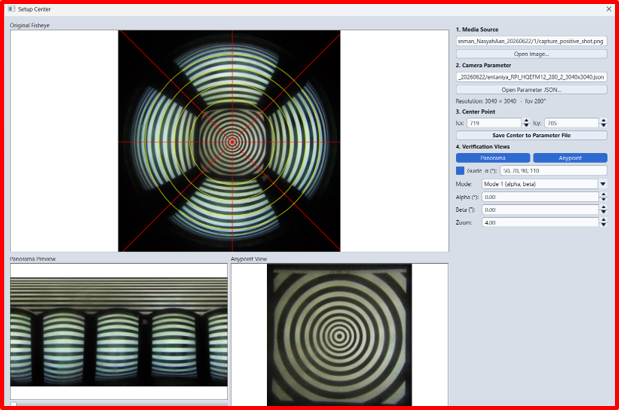

# Setup Center

  
🆕 NEW IN VERSION 1.1

  

    <strong>Setup Center</strong> did not exist in version 1.0. It is opened from the <strong>Calibration Result / 3D Validation</strong> panel of the main window, next to <strong>Moil Cali Result</strong> and <strong>3D Verification</strong>.
  

**Setup Center** is a verification tool. It answers one question: **is the camera centre (`iCx`, `iCy`) in the parameter file correct for this camera?**

A wrong centre point makes every later result wrong — the panorama bends, the anypoint view drifts, and the calibration numbers inherit the error. This tool lets you check the centre visually and correct it before you trust the parameters.

---

## When to Use It

| Situation | Use Setup Center? |
|---|---|
| After calibration, before accepting the camera parameters | ✅ Yes — this is the normal use |
| The panorama or anypoint view looks tilted or off-centre | ✅ Yes |
| A camera parameter JSON came from another source and is unverified | ✅ Yes |
| You want to measure real distances on the pattern | ➡️ Use [3D Verification](/moilcalib_documentation/docs/v1.1/verification/3d-verification) instead |

---

## What It Needs

Setup Center works on **still images only** — there is no live camera or video input here.

| Input | Description |
|---|---|
| **Fisheye image** | A captured fisheye image (`.png`, `.jpg`, `.jpeg`, `.bmp`). When you open the tool from the main window, the current **positive capture** is loaded automatically. |
| **Camera parameter JSON** | The Moildev camera-parameter file that contains `iCx` / `iCy` and the camera's calibration resolution. |

---

## The Window

The left side shows the image views; the right side is a control panel with four numbered sections.

<Figure id="fig-1" number="1" caption="The Setup Center window — Original Fisheye with the guide rings and crosslines (left), Panorama Preview and Anypoint View (bottom), and the four-section control panel (right).">

</Figure>

### Views

| View | Purpose |
|---|---|
| **Original Fisheye** | The source image. Click anywhere on it to move the centre or to aim the anypoint view. |
| **Panorama Preview** | The unwrapped panorama. A centre error shows up here as a wave or tilt in what should be a straight horizon. |
| **Anypoint View** | A rectified view of the direction you clicked. Use it to confirm that straight lines in the scene really look straight. |

### Control Panel

| Section | Contents |
|---|---|
| **1. Media Source** | `Open Image…` — load a fisheye image. The path of the loaded file is shown above the button. |
| **2. Camera Parameter** | `Open Parameter JSON…` — load the camera file. A readout confirms what was read, for example `Resolution: 3040 × 3040 · fov 200°`. |
| **3. Center Point** | `Icx` and `Icy` spin boxes, and `Save Center to Parameter File`. |
| **4. Verification Views** | `Panorama` / `Anypoint` toggles, the **Guide α (°)** checkbox with its angle list (e.g. `50, 70, 90, 110`), the **Mode** selector, the aiming spin boxes, and **Zoom**. |

---

## How to Verify a Centre

1. **Load the image and the parameter JSON** (sections 1 and 2). The resolution line confirms the file was read.
2. **Turn on the guide rings** — tick **Guide α (°)** and enter the alpha angles you want drawn. The rings are drawn around the current centre, so if the fisheye circle and the rings are not concentric, the centre is wrong.
3. **Adjust the centre** — either click the correct centre directly on the **Original Fisheye** view, or fine-tune with the **Icx** / **Icy** spin boxes. The previews rebuild as you change it.
4. **Confirm with the previews** — a correct centre gives a panorama with a level horizon and an anypoint view without skew. Use the panorama slider to sweep around, and click different directions to re-aim the anypoint view.
5. **Save** — press **Save Center to Parameter File**. The new `iCx` / `iCy` are written back into the JSON, and a confirmation shows the saved values and the file path.

  
⚠️ SAVING EDITS THE PARAMETER FILE

  

    <strong>Save Center to Parameter File</strong> writes into the JSON you loaded. Keep a copy of the original file if you want to be able to go back.
  

---

## Anypoint Aiming Modes

The anypoint view can be aimed in two ways, chosen with the **Mode** selector:

| Mode | Parameters |
|---|---|
| **Mode 1** | **Alpha** and **Beta** (degrees) |
| **Mode 2** | **Pitch** and **Yaw** (degrees) |

A **Zoom** control is available in both modes. Clicking on the Original Fisheye view sets the aim directly.

---

  
💡 PERFORMANCE NOTE

  

    The panorama and anypoint maps are built at a reduced working resolution, and rebuilds are debounced while you drag or type. This is why the centre can be nudged continuously without the window freezing.
  

---

## Reading Figure 1

The screenshot above shows a correctly centred example, and is a useful reference for what "good" looks like:

| What to look at | In the example |
|---|---|
| **Guide rings on the Original Fisheye** | Drawn at `50, 70, 90, 110°`, concentric with the pattern — the crosslines meet at the pattern centre. |
| **Centre values** | `Icx 719`, `Icy 705` for a `3040 × 3040`, 200° fov camera. |
| **Panorama Preview** | The stripe pattern runs straight and level; a wrong centre would bend or tilt it. |
| **Anypoint View** | The concentric rings stay circular and centred at `Zoom 4.00`; a wrong centre pushes them off to one side. |
